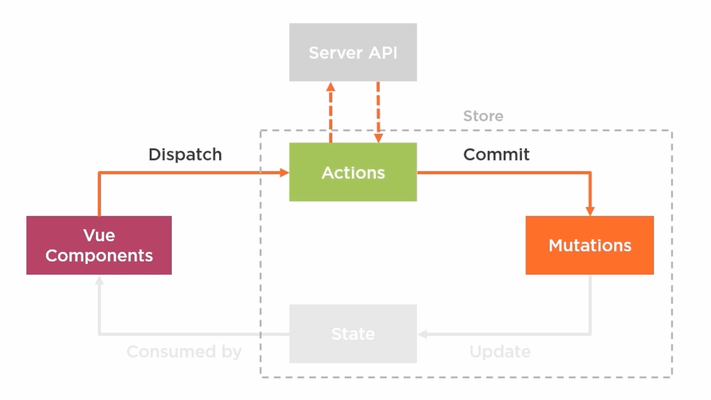
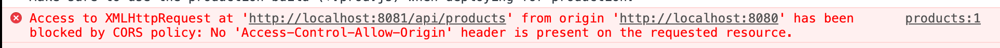

# 02 `actions`



Les `actions` sont l'endroit d'où sont effectué les appelles asynchrone à l'`API` .


## Différence entre `mutations` et `actions`


## Pourquoi avoir séparé `actions`  et `mutations` en deux concepts différents ??

Cela rend plus facile la traçabilité des changements du `state` effectués.

Ne pas modifier le `state` dans la partie asynchrone, permet de plus facilement suivre le `state`.

#### ! les `mutations` sont toujours synchrone


## `API` server

Un serveur `express` va servir pour la demo :

```js
const express = require('express');
const bodyParser = require('body-parser');
const uuid = require('uuid').v4;

const app = express();
const users = {};

app.use(bodyParser.json());

app.get('/api/products', (req, res) => res.send( [/* all products */] ));

app.post('/api/register', (req, res) => setTimeout(() => {
  const user = req.body;
  if (user.firstName && user.lastName && user.email && user.password) {
    user.userId = uuid();
    users[user.email] = user;
    res.status(201).send({
      userId: user.userId,
      firstName: user.firstName,
      lastName: user.lastName,
      email: user.email,
    });
  } else {
    res.status(500).send('Invalid user info');
  }
}, 800));
 
app.post('/api/sign-in', (req, res) => {
  const user = users[req.body.email];
  if (user && user.password === req.body.password) {
    res.status(200).send({
      userId: user.userId,
      firstName: user.firstName,
      lastName: user.lastName,
      email: user.email,
    });
  } else { res.status(401).send('Invalid user credentials.'); }
});

app.listen(8081, () => console.log('API Server listening on port 8081!'));

```


## `API`

On fait tourner le front sur le port `8080` et l'`API` sur le port `8081`, on va avoir un problème de `CORS : cross origin ressource sharing`.

On peut résoudre ce problème en créant un `proxy`.

### `proxy`

On va créer à la racine de notre projet un fichier `vue.config.js`.

C'est une configuration pour `webpack`.

`webpack` permet de définir un `proxy` pour son `API`.

```js
module.exports = {
    devServer: {
        proxy: {
            '/api' : {
                target: 'http://localhost:8081'
            }
        }
    }
}
```

Ainsi la redirection évite les problèmes de `CORS`.


## Utilisation d'`Axios`

```bash
npm i axios
```

Dans le `store`

```js
import axios from 'axios'

mutations: {
    // ...
    ADD_PRODUCTS(state, products) {
        state.products = products
    }
},
actions: {
    fetchProducts({ commit }) {
        axios
            .get("http://localhost:8081/api/products")
            .then(response => commit('ADD_PRODUCTS', response.data))            
    }
}
```

Dans `Products.vue`

Le `hook` `created` est le plus approprié pour les appelles asynchrone.

```js
created() {
    this.$store.dispatch('fetchProducts')
},
```

On a l'erreur `CORS` :



On doit ajouter le fichier vu ci-dessus de `proxy` et modifier `axios.get('/api/products')`.

## Ajouter un utilisateur

On ne veut pas garder de données sensibles dans le client, c'est pourquoi une fois le `user` envoyé avec son mot de passe, on récupère une version sans mot de passe envoyée par le serveur (l'`API`).

```js
actions: {
    registerUser({ commit }) {
        axios
            .post("/api/register", user)
            .then(response => commit('ADD_USER', response.data))
    },
    signIn({ commit }, userLogin) {
        axios
            .post("/api/sign-in", userLogin)
            .then(response => commit('ADD_USER', response.data))
    }    
}
```

```js
mutations: {
    ADD_USER(state, newUser) {
        state.user = newUser
    },
},
```

### Dans `Register.vue`

```js
methods: {
    registerUser() {
        this.saving = true;
        const user = { 
            firstName: this.firstName, 
            lastName: this.lastName, 
            email: this.email,
            password: this.password, 
        }
        this.$store.dispatch('registerUser', user)
        this.$router.push({name: 'Products'})
    },
```


### Dans `Signin.vue`

```js
methods: {
    signIn() {
      const userLogin = {
          email: this.email,
          password: this.password,
      }
      this.$store.dispatch('signIn', userLogin)
      this.$router.push({ name: 'Products' })
    },
```

Mais on ne veut pas aller sur la page `Products` sans être sûr du `login`.

#### ! retourner une `promise` depuis une action n'est pas conseiller, sauf pour gérer les erreurs

Ici les données sont bien gérée dans l'action mais la gestion de l'erreur est renvoyée vers le composant.

`store`

```js
actions: {
    signIn({ commit }, userLogin) {
        return axios
            .post("/api/sign-in", userLogin)
            .then(response => commit('ADD_USER', response.data))
    }
}
```

Dans `Signin.vue` on va gérer l'erreur :

```js
methods: {
    signIn() {
        this.signInError = false
      const userLogin = {
          email: this.email,
          password: this.password,
      }
   
    this.$store.dispatch('signIn', userLogin)
        .then(() => this.$router.push({ name: 'Products' }))
        .catch(error => {
            console.log(error)
            this.signInError = true
        })   
    },
    cancel() {
      this.router.navigate(['/']);
    },
```

`this.signInError` permet d'afficher une boite d'erreur dans le `template` :

```html
<div v-if="signInError" class="failed">
    Login Failed
</div>
```


