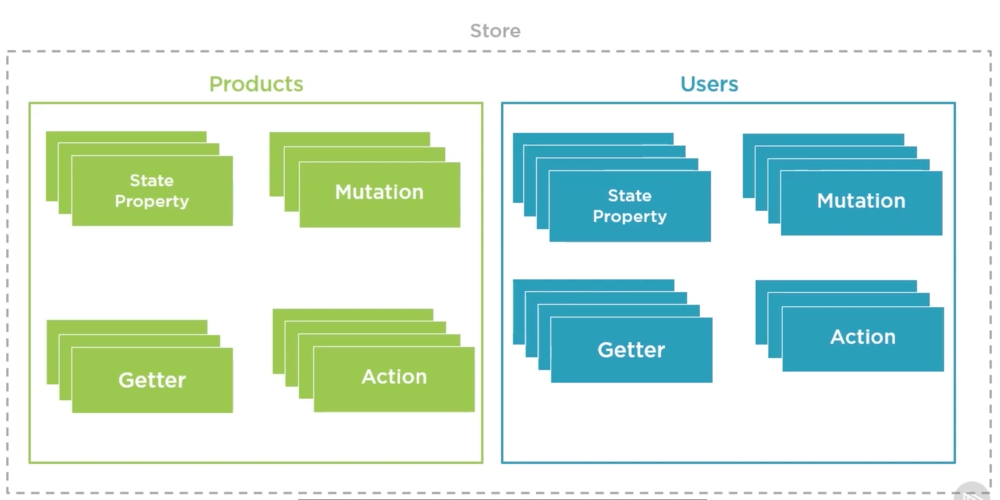
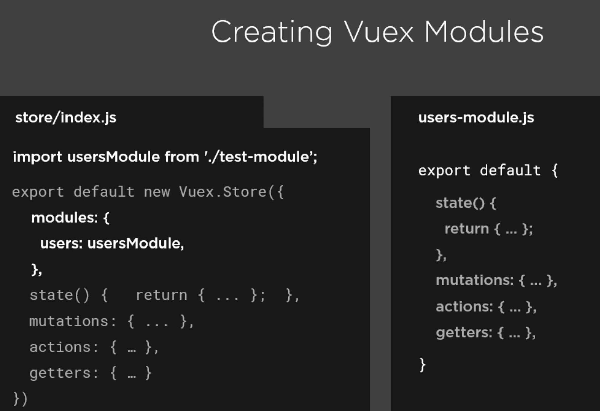
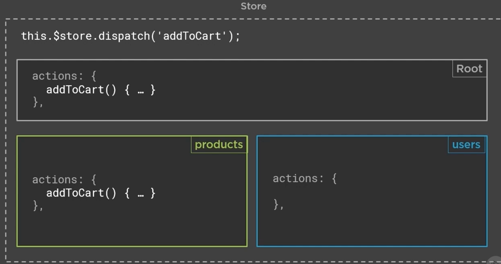
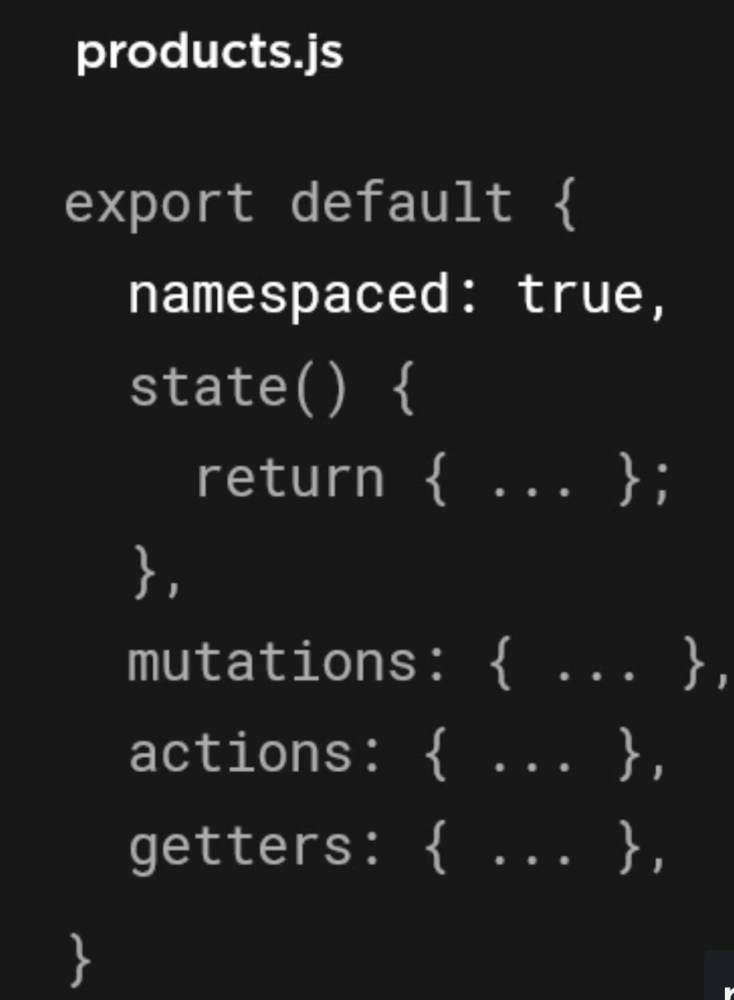
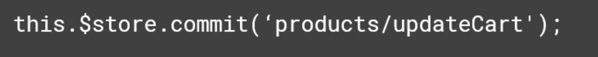
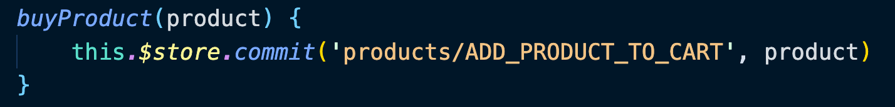
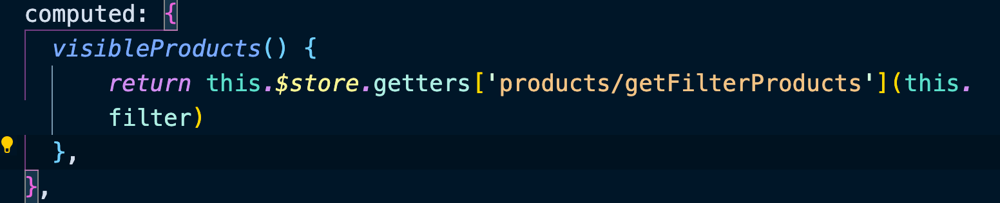
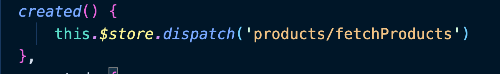

# 03 Organiser son `store` en `modules`

## On crée des groupes logiques dans notre `store`



On crée un fichier `x-modules.js` puis on l'importe en tant que `module` dans le `store` général :




## le `state` est dans un espace de nom `namespaced`

Pour accéder à un state, il faut introduire le nom du `module` dans son chemin :


#### ! Le `state` est toujours dans un espace de nom


## Les `actions` ne sont pas dans des espaces de nom

Que ce passe t-il alors si deux `actions` ont le même nom dans deux modules différents ?



En fait c'est pour cela que les `actions` n'ont pas d'espace de nom, les deux sont appelé, ce qui permet de lancer une logique particulière dans chaque module en appelant un seul nom d'`action`.

Les `mutations` et les `getters` ne sont pas `name spaced` par défaut non plus.

Cependant deux `getters` dans deux `modules` différents vont générer une erreur à l'appelle.

## Forcer un `module` à être totalement `name spaced`

Pour éviter des pièges de la tolérance aux même noms d'`actions`, on peut forcer les modules à être entièrement dans un espace de noms.



Il suffit d'ajouter la propriété `namespaced: true`.

### Appeler les `getters` dans un module `namespaced`

#### `this.$store.getters['products/something']`


### Appeler les `actions namespaced`


### Appeler les `mutations namespaced`




## Création des modules

On va créer un dossier `modules` dans notre `store` et dans `modules` deux fichiers `products.js` et  `users.js` :

```js
// store/index.js

import { createStore } from 'vuex'

import products from './modules/products'
import users from './modules/users'

const store = createStore({
    modules: {
        products,
        users,
    },
    state() { return { } },
    mutations: { },
    getters: { },
    actions: { }
})

export default store
```

```js
// store/modules/products.js

import axios from 'axios'

export default {
    state() {
        return {
            products: null,
            cart: []
        }
    },
    mutations: {
        ADD_PRODUCT_TO_CART(state, product) {
            const productIndex = state.cart.findIndex(cartProduct => cartProduct.id == product.id)
            if(productIndex == -1) {
                const copyProduct = { ...product } 
                copyProduct.quantity = 1
                state.cart.push(copyProduct)
            } else {
                state.cart[productIndex].quantity++
            }
        },
        DELETE_PRODUCT_TO_CART(state, cartItem) {
            if (cartItem.quantity > 1) {
                cartItem.quantity--
            } else {
                state.cart = state.cart.filter(product => cartItem.id != product.id)
            }
        },
        ADD_PRODUCTS(state, products) {
            state.products = products
        }
    },
    getters: {
        getFilterProducts: state =>  filter => {
                if(!filter) {
                    return state.products
                }
                return state.products.filter(product => product.category === filter)
        },
        getTotalPrice: state => {
            state.cart.reduce(
                (acc, item) => acc = acc + item.price * item.quantity,
                0)
        }
    },
    actions: {
        fetchProducts({ commit }) {
            axios
                .get("/api/products")
                .then(response => commit('ADD_PRODUCTS', response.data))
        },
    }
}
```

```js
// store/modules/users.js

import axios from 'axios'

export default {
    state() {
        return {
            user: null,
        }
    },
    mutations: {
        ADD_USER(state, newUser) {
            state.user = newUser
        },
    },
    actions: {
        registerUser({ commit }, user) {
            return axios
                .post("/api/register", user)
                .then(response => commit('ADD_USER', response.data))
        },
        signIn({ commit }, userLogin) {
            return axios
                .post("/api/sign-in", userLogin)
                .then(response => commit('ADD_USER', response.data))
        }
    }
}
```

Le `root module` ne sert plus qu'à référencer les `modules`, mais il pourrait gérer des infos globales à l'application.

Tout fonctionne sauf le `user` dont le `state` est utilisé directement dans un composant.

#### ! le `state` est toujours `namespaced`

### Modification de `AccountMenu.vue`

```js
// on transforme
computed: {
    user() {
        return this.$store.state.user
    }
}

// en :
computed: {
      user() {
          return this.$store.state.users.user
      }
  }
```


## `namespaced` ses modules

### `namespaced: true`

```js
export default {
    namespaced: true,
    state() {
        return {
            //...
        }
    }
}
```


### Différentes syntaxes

Avec `payload`



`getters` dynamique



Simple `dispatch`




## Accès au `rootState` et au `rootGetters` dans un `getters`

### `myGetter(state, getters, rootState, rootGetters) { ... }`


## Accès aux éléments `root` dans une `action`

```js
actions: {
    myAction({ commit, dispatch, getters, rootGetters}) {
        // accéder à un autre module
        commit('users/SET_USER', payload, { root: true })
        
        // accéder au root
        commit('setBrand', payload, { root: true })
        
        // idem pour dispatch
        dispatch('users/loadUser', payload, { root: true })
    }
}
```

