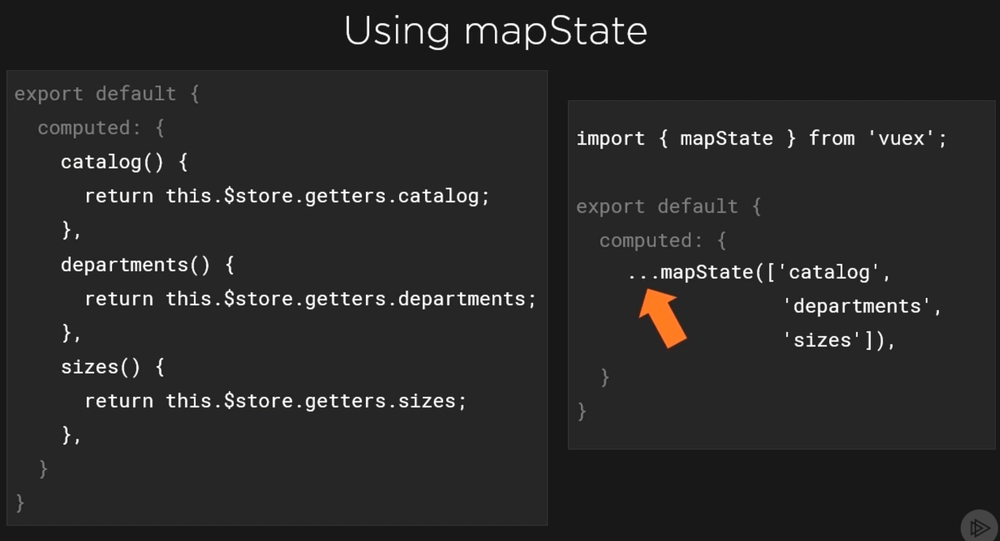
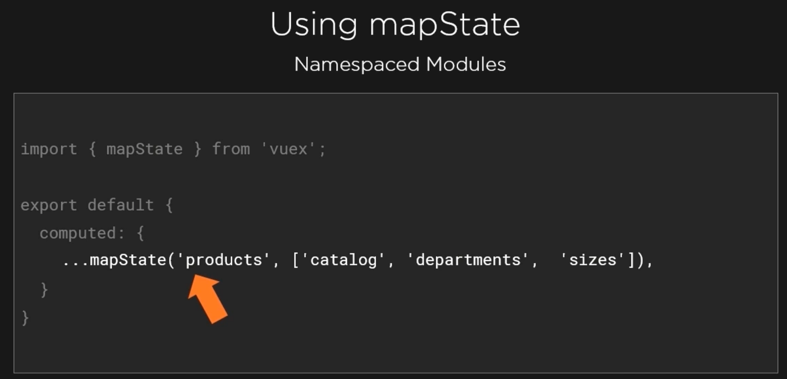
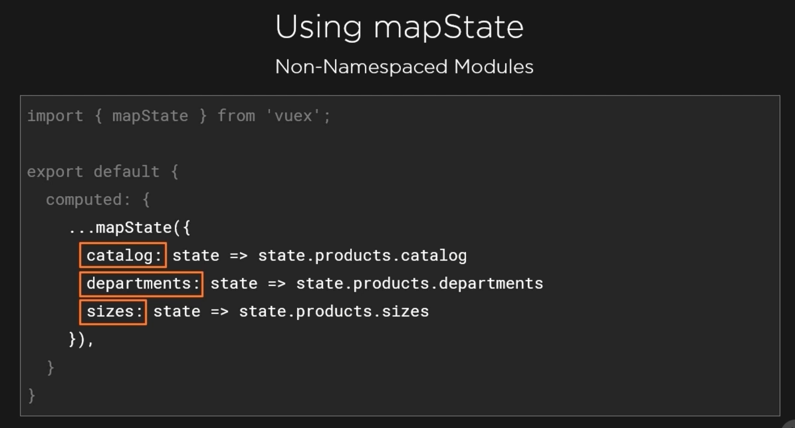
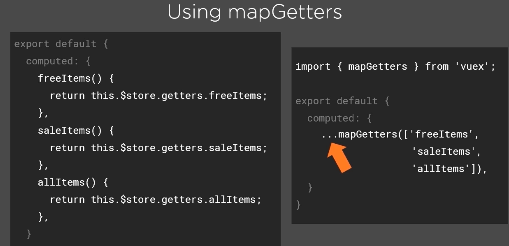
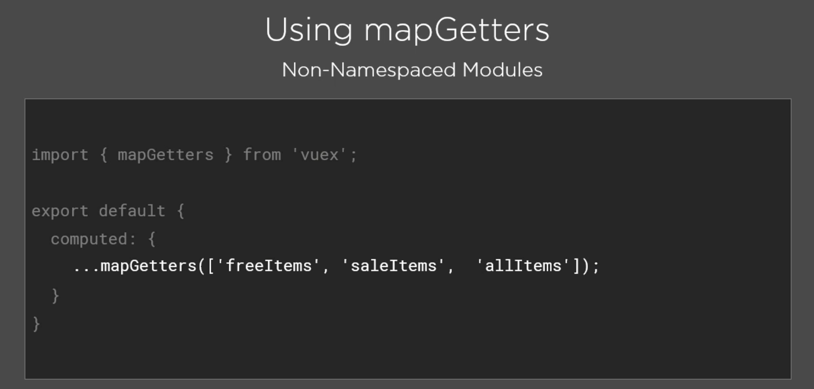
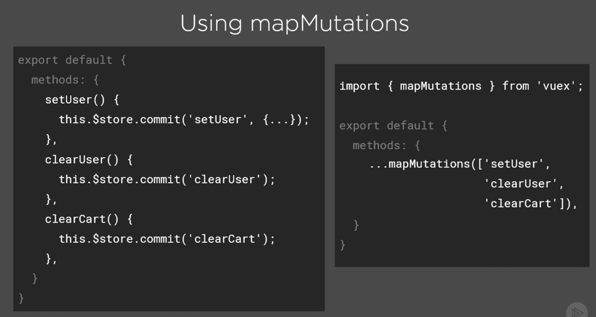
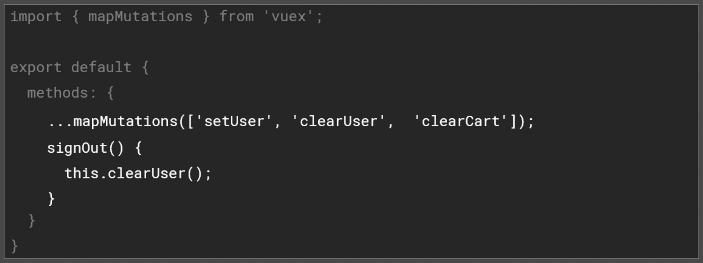
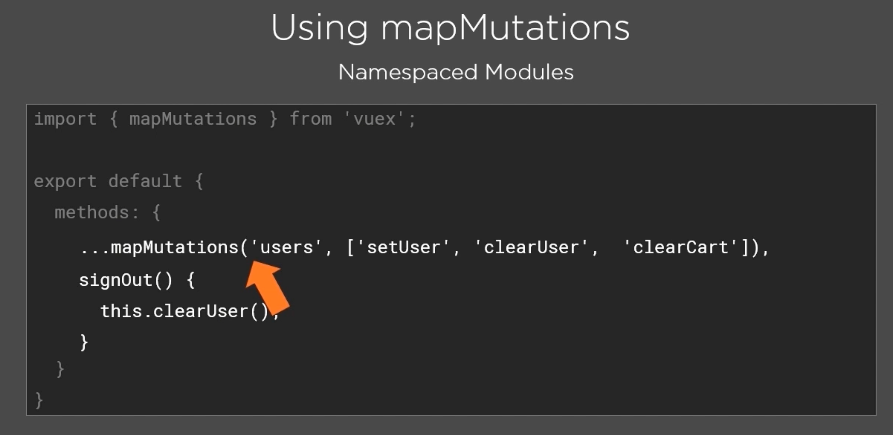
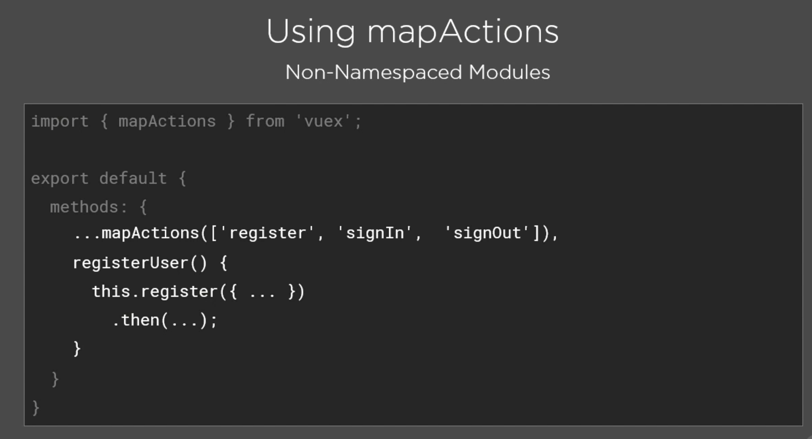
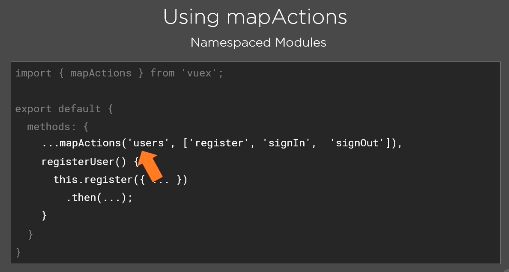

# 04 Vuex `map helpers`

Ce sont des raccourcies syntaxiques.

## `mapState`



#### ! à l'utilisation du spread operator `...`

### `namespaced modules`



### `non-namespaced modules`



On passe un objet comme option.

On peut choisir le nom de *mappage* comme bon nous semble.

### exemple

```js
import { mapState } from 'vuex'

// ...

computed: {
    ...mapState('users', ['user']),
        //   user() {
        //       return this.$store.state.users.user
        //   }
}
```


## `mapGetters`




### `non-namespaced`



Il n'y a plus les `arrow function`.

C'est la même syntaxe que pour le `root store`.

### `namespaced`


### exemple

```js
import { mapGetters } from 'vuex'

// ...

computed: {
    ...mapGetters('products', ['getFilterProducts']),
        visibleProducts() {
        return this.getFilterProducts(this.filter)
    },
        // visibleProducts() {
        //     return this.$store.getters['products/getFilterProducts'](this.filter)
        // },
},
```

C'est peut être pas intéressant dans ce cas mais cela montre :

- qu'on peut mélanger les `computed property` avec les `mapGetters`
- On peut utiliser les `mapGetters` comme n'importe quelle `computed property` et les appeler n'importe où dans le composant.


## `mapMutations`

`mapMutations` et `mapActions` fonctionnent comme `mapGetters` à la différence qu'ils se placent dans `methods` au lieu de `computed`.



On peut les utiliser dans d'autres méthodes :



La syntaxe reste la même pour les `modules` `non-namespaced`.

### `namespaced modules`



### exemple

```js
import { mapState, mapMutations } from 'vuex'

// ...

methods: {
        ...mapMutations('users', ['ADD_USER']),
        signOut() {
        this.showMenu = false;
        //   this.$store.commit('users/ADD_USER', null)
        this.ADD_USER(null)
    },
},
```


## `mapActions`



Si l'action renvoie une `promise`, on la traiter dans la méthode (exemple des erreurs).




### Exemple

```js
import { mapActions } from 'vuex'

// ...

methods: {
    ...mapActions('users', ['registerUser']),
    registerUser() {
        this.registerError = false
        this.saving = true;
        const user = { 
            firstName: this.firstName, 
            lastName: this.lastName, 
            email: this.email,
            password: this.password, 
        }
        
        // this.$store.dispatch('users/registerUser', user)
        this.registerUser(user)
            .then(() => this.$router.push({name: 'Products'}))
            .catch(() => this.registerError = true)
```

#### ! il y a conflit de nom

Je vais utiliser la syntaxe permettant de renommer son `action` :

```js
...mapActions({
    register: 'users/registerUser'
}),
registerUser() {
// ...
    this.register(user)
        .then(() => this.$router.push({name: 'Products'}))
        .catch(() => this.registerError = true)
```

