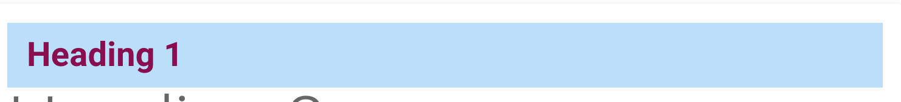
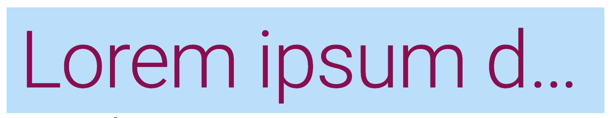

# 01 Typo et espacement

## Classes utilitaires

`color` => colorie le `background-color`

`lighten-{1-5}`

`darken-{1-5}` modifie la couleur

`color--text` et `text--darken-{1-5}` modifie la couleur du texte

`pa-4` gére le `padding` : `padding all`

```html
<h1
    class="font pink--text text--darken-4 blue lighten-4 pa-4"
    >
    Heading 1
</h1>
```



### `text-truncate`

Pour ne pas dépasser du conteneur :

```html
<h1
    class="display-4 pink--text text--darken-4 blue lighten-4 pa-4 text-truncate"
    >
```



On a des classe avec un seul `-` et d'autre avec deux `--`

`text--secondary` 

`text-uppercase`

## `margin ` et `padding`

De `1` à `12`.

Un incrément vaut `4px`.

`ml-n12` une marge négative `n{1-12}`

### centrer un élément `mx-auto`

### Utiliser les `breakpoint` : `ml-sm-12`


## Texte responsive `text-breakpoint-value`

Les valeurs sont `h1-h6` `subtitle-1 et -2` `body-1 et -2` `button` `caption` `overline`.

`text-h1` équivautt à `text-xs-h1`

### `.text-xl-h4`

```html
<h1 class="text-md-h1 text-sm-h3">
    Welcome to Awesome Shop
</h1>
```

