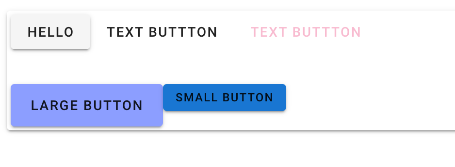
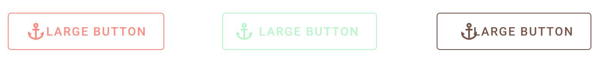
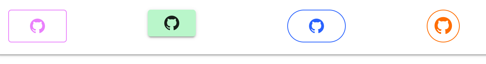
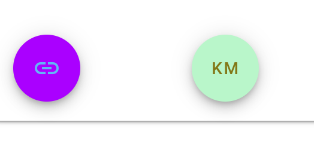

# 02 Button : `v-btn`

## Les boutons : `<v-btn>`

```html
<v-row>
    <v-btn>Hello</v-btn>
    <v-btn text>text buttton</v-btn>
    <v-btn text color="pink lighten-4"
           >text buttton</v-btn
        >
</v-row>
<v-row class="mt-12">
    <v-btn large color="indigo accent-1"
           >Large Button</v-btn
        >
    <v-btn small color="blue darken-2"
           >small button</v-btn
        >
</v-row>
```



`rounded`, `outlined`, `block`

### Avec icônes : `v-icon`

On peut ajouter un mini déplacement avec `left` et `right`:

```html
<v-row class="mt-12">
    <v-col>
        <v-btn large outlined color="red accent-1">
            <v-icon>mdi-anchor</v-icon>
            Large Button</v-btn
            >
    </v-col>
    <v-col>
        <v-btn large outlined color="green accent-1">
            <v-icon left>mdi-anchor</v-icon>
            Large Button</v-btn
            >
    </v-col>
    <v-col>
        <v-btn large outlined color="brown accent-1">
            <v-icon right>mdi-anchor</v-icon>
            Large Button</v-btn
            >
    </v-col>
</v-row>
```



```html
<v-col>
    <v-btn large outlined color="purple accent-1">
        <v-icon>mdi-github</v-icon>
    </v-btn>
</v-col>
<v-col>
    <v-btn color="green accent-1">
        <v-icon>mdi-github</v-icon>
    </v-btn>
</v-col>
<v-col>
    <v-btn
           large
           outlined
           color="blue accent-4"
           rounded
           >
        <v-icon>mdi-github</v-icon>
    </v-btn>
</v-col>
<v-col>
    <v-btn
           large
           outlined
           color="orange accent-4"
           icon
           >
        <v-icon>mdi-github</v-icon>
    </v-btn>
</v-col>
```



On voit que l'attribut `icon` est nécessaire pour avoir un rond parait.

### FAB Floating Action Buton

```html
<v-col>
    <v-btn
           fab
           color="purple accent-4 blue--text text--lighten-2"
           >
        <v-icon>mdi-link</v-icon>
    </v-btn>
</v-col>
<v-col>
    <v-btn
           fab
           color="green accent-1 lime--text text--darken-4"
           >
        KM
    </v-btn>
</v-col>
```



### Créer son `custom button` avec les classes

`class="elevation-{1-12}"` ajoute une ombre portée.

`v-ripple` vague au click.

```html
<button
        v-ripple
        class="elevation-6 indigo accent-3 py-2 px-4 white--text rounded"
        >
    My Button
</button>
```

