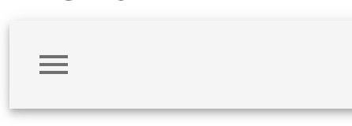
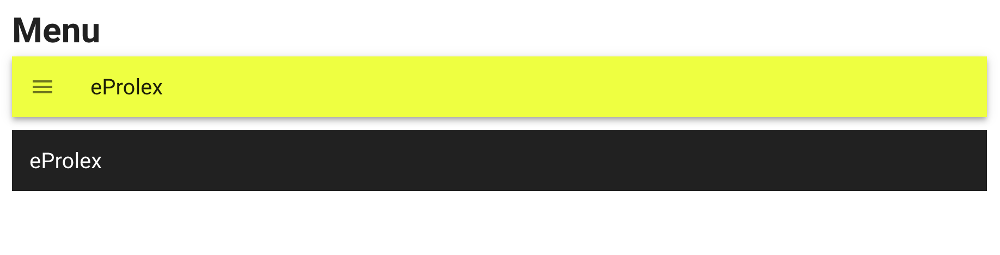
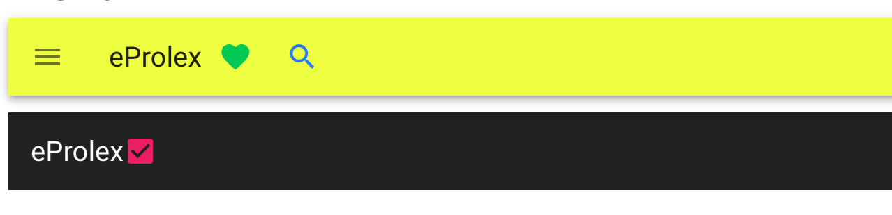
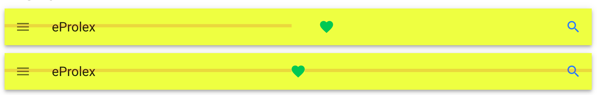

# 03 navigation bar

## `<v-app-bar>`

Différence avec `v-toolbar` : `v-app-bar` est la navigation principale et a des utilitaires dans ce sens.

`v-toolbar` sera plutôt utilisé pour des tâches secondaires : outils d'éditeur de texte par exemple.


### `<v-app-bar-nav-icon></v-app-bar-nav-icon>`



C'est le menu hamburger.

### `<v-toolbar-title>Page title</v-toolbar-title>`

C'est le titre :



L'attribut `dark` fait passer le texte en blanc.

### `<v-spacer>`

Permet d'espacer les éléments dans la `v-app-bar`, avant :



après :


### Centrer précisément

Il faut ajouter un `css` pour centrer précisément  l'icône en cœur.

```css
<style scoped>
.center-me {
    position: absolute;
    left: 50%;
    transform: translateX(-50%);
}

.relative {
    position: relative;
}
</style>
```

```html
<v-app-bar color="lime accent-2">
    <v-app-bar-nav-icon></v-app-bar-nav-icon>
    <v-toolbar-title>eProlex</v-toolbar-title>
    <v-spacer></v-spacer>
    <v-btn icon color="green accent-4">
        <v-icon>mdi-heart</v-icon>
    </v-btn>
    <v-spacer></v-spacer>
    <v-btn icon color="blue accent-3">
        <v-icon>mdi-magnify</v-icon>
    </v-btn>
</v-app-bar>

<v-app-bar color="lime accent-2" class="relative">
    <v-app-bar-nav-icon></v-app-bar-nav-icon>
    <v-toolbar-title>eProlex</v-toolbar-title>

    <v-btn icon color="green accent-4" class="center-me">
        <v-icon>mdi-heart</v-icon>
    </v-btn>
    <v-spacer></v-spacer>
    <v-btn icon color="blue accent-3">
        <v-icon>mdi-magnify</v-icon>
    </v-btn>
```

Le premier est centré avec `<v-spacer>`, le deuxième avec `css` :



