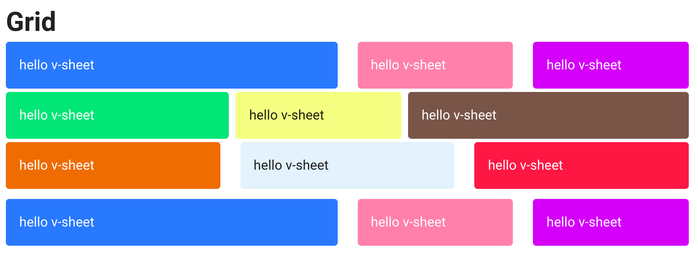
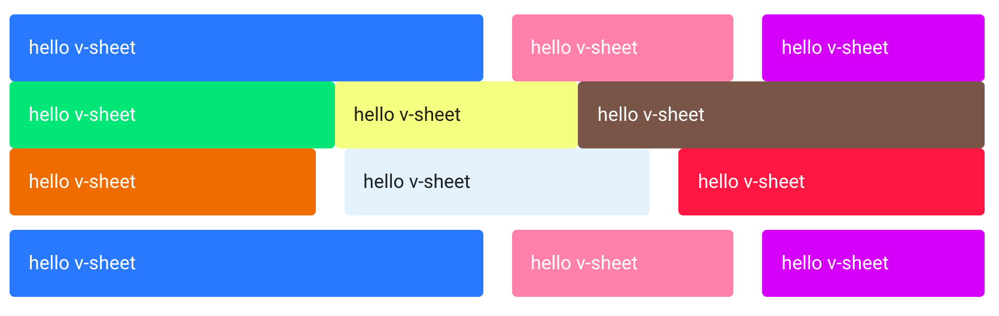
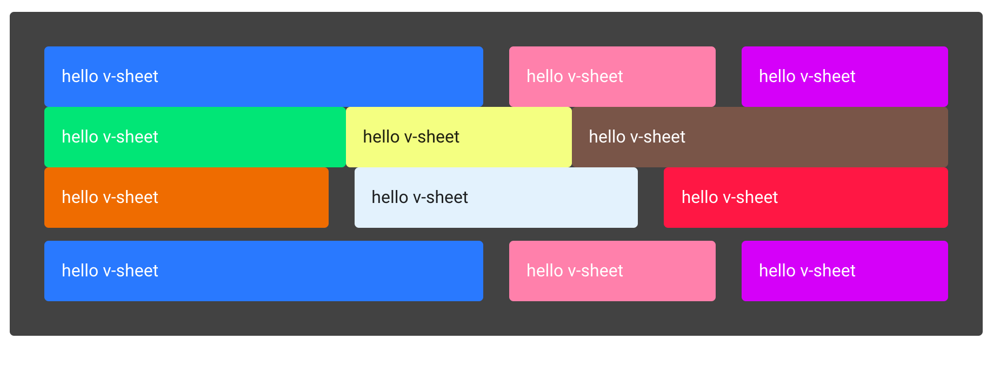
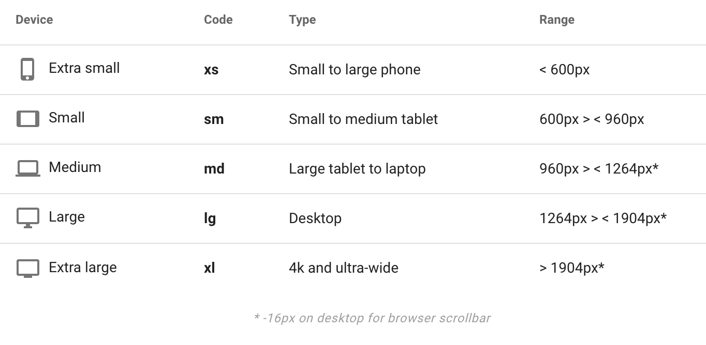
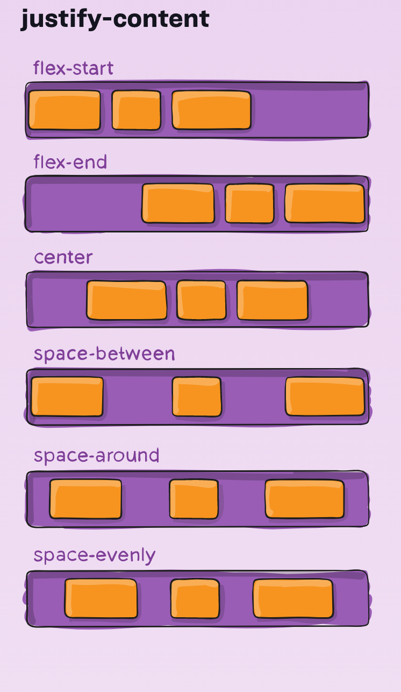

# 04 Grid

## `dense`

réduis les marges :

```html
<v-row dense>
    <v-col cols="4">
        <v-sheet color="green accent-3" class="pa-4" rounded dark>
            hello v-sheet
        </v-sheet>
    </v-col>
    <v-col cols="3">
        <v-sheet color="lime accent-1" class="pa-4" rounded>
            hello v-sheet
        </v-sheet>
    </v-col>
    <v-col cols="5">
        <v-sheet color="brown accent-3" class="pa-4" rounded dark>
            hello v-sheet
        </v-sheet>
    </v-col>
</v-row>
```

`v-sheet` est un papier élémentaire.

`cols` largeur de la colonne proportionnellement à `12`.



## `no-gutters`

retire toutes les gouttières :

```html
<v-row no-gutters>
```



## `v-container`

On peut lui passer des classes utilitaires comme attribut.

```html
<v-container grey darken-3 pa-8 rounded mx-auto>
```



## breakpoint

On peut utiliser les breakpoints `sm` `md` `lg` et ` xl`.

la valeur par défaut avec `cols` est `xs`



```html
<v-col cols="6" sm="9" offset-sm="3">
    <v-sheet color="blue accent-3" class="pa-4" rounded dark>
        hello v-sheet
    </v-sheet>
</v-col>
```


`offset-sm` permet un `offset` à partir de `600px` de large.


## Les attributs de `flexbox`

```html
<v-row>
    <v-col cols="4">
        <v-sheet color="blue accent-3" class="pa-4" rounded dark>
            hello v-sheet
        </v-sheet>
    </v-col>
    <v-col cols="4">
        <v-sheet color="pink accent-1" class="pa-4" rounded dark>
            hello v-sheet
        </v-sheet>
    </v-col>
</v-row>
```


```html
<v-row justify="space-between">
```





## `v-col`

> Les colonnes occupent automatiquement tout l'espace disponible dans leur conteneur parent, sauf si vous avez spécifié la largeur qu'elles doivent occuper au préalable. Les colonnes occuperont automatiquement une quantité égale d'espace dans leur conteneur parent. Cela peut être modifié à l'aide de l'atribut `cols`. Vous pouvez également utiliser les attributs `sm`, `md`, `lg` et `xl` pour définir plus précisément comment la colonne sera dimensionnée dans différentes tailles de fenêtre.

Ce qui fait que sans rien spécifié la colonne prendra la taille de `12`.

`xs` n'existe pas, il faut utiliser `cols="6"` par exemple.