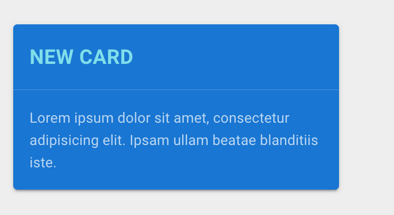

# 05 Card

C'est un élément de base ayant des composants internes.

`v-card-title`

`v-card-subtitle`

`v-card-text`

`v-card-actions`

```html
<v-card 
    color="blue darken-2" 
    dark 
    max-width="320"
>
    <v-card-title 
        class="cyan--text text--lighten-3 font-weight-bold text-uppercase" 
    >
        New Card
    </v-card-title>
    <v-divider></v-divider>
    <v-card-text>
        Lorem ipsum dolor sit amet, consectetur adipisicing
        elit. Ipsam ullam beatae blanditiis iste.
    </v-card-text>
</v-card>
```



`v-divider` permet d'ajouter une ligne de séparation.


## `v-card` complete


```html
<v-card 
        color="blue darken-1" 
        dark 
        max-width="320"
        >
    <v-card-title 
                  class="blue-grey--text text--darken-3" 
                  >
        New Card
    </v-card-title>
    <v-card-subtitle
                     class="deep-orange--text text--accent-1" 
                     >
        A new card for you
    </v-card-subtitle>
    <v-divider></v-divider>
    <v-card-text>
        Lorem ipsum dolor sit amet, consectetur adipisicing
        elit. Ipsam ullam beatae blanditiis iste.
    </v-card-text>
    <v-card-actions>
        <v-btn 
               class="blue--text" 
               color="blue-grey darken-1" 
               block 
               tile 
               elevation="0"
               >
            Go to the future
        </v-btn>
    </v-card-actions>
    <v-card-actions>
        <v-btn text color="blue-grey darken-3"><<</v-btn>
        <v-spacer></v-spacer>
        <v-btn text color="blue-grey darken-3">>></v-btn>
    </v-card-actions>
</v-card>
```

`v-spacer` crée un espace uniforme entre les éléments.

`elevation="0"` pour aplatir un bouton.

`tile` enlève les coins arrondis.

`block` fait prendre toute la largeur au bouton.

