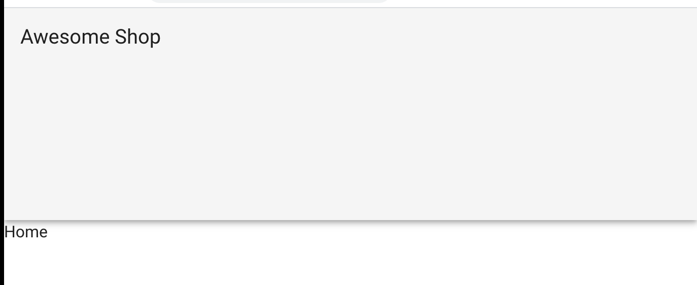
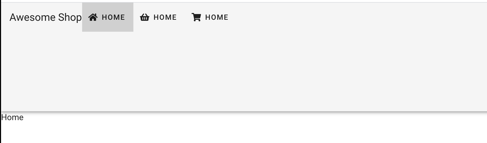
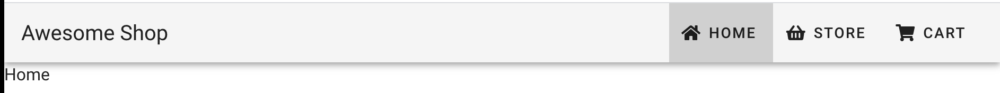
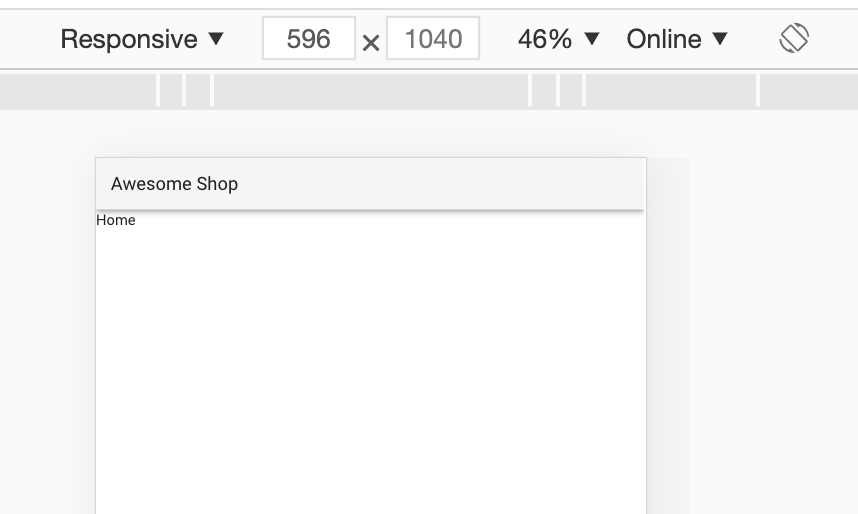
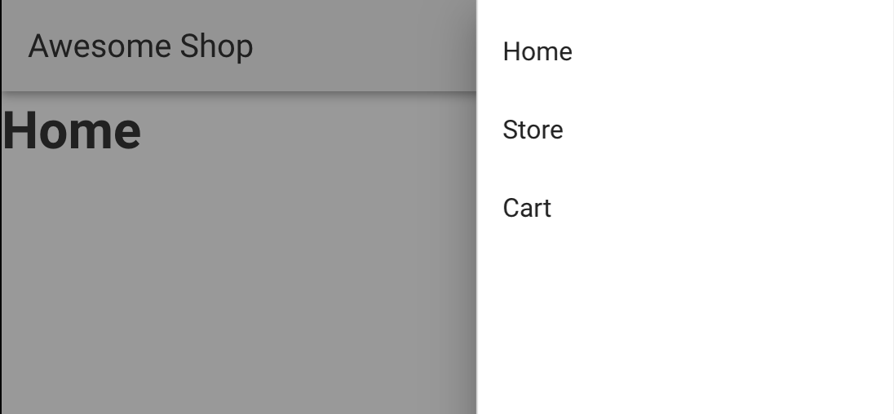
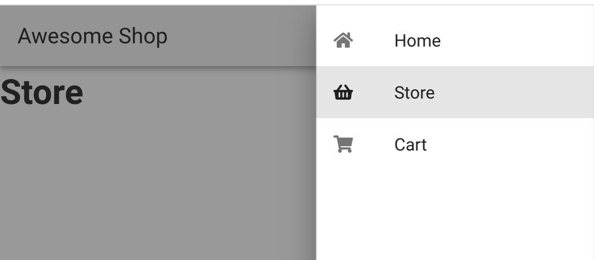

# 06 Top-Nav

#### ! `v-content` est déprécié il faut utiliser `v-main`

## `<v-toolbar-title>`

```html
<v-app-bar>
    <v-toolbar-title>
        Awesome Shop
    </v-toolbar-title>
</v-app-bar>
```




## `<v-toolbar-items>`

### Ajouter `fontawesome`

```bash
npm i @fortawesome/fontawesome-free -D
```

ajouter à `@/plugins/vuetify.js`

```js
import '@fortawesome/fontawesome-free/css/all.css'

import Vue from 'vue';
import Vuetify from 'vuetify/lib/framework';

Vue.use(Vuetify);

export default new Vuetify({
});
```

On ajoute des `v-btn text`

`to` permet de gérer la navigation, appelle des routes du `router` de `vuejs`.

```html
<v-toolbar-items>
            <v-btn to="/" text>
                <v-icon small left >fa-home</v-icon>
                Home
            </v-btn>
            <v-btn to="basket" text>
                <v-icon small left >fa-shopping-basket</v-icon>
                Home
            </v-btn>
            <v-btn to="cart" text>
                <v-icon small left >fa-shopping-cart</v-icon>
                Home
            </v-btn>
        </v-toolbar-items>
```


On doit *wrapper* notre `v-app-bar` dans une `div` pour ajuster sa taille.

```html
<template>
    <div>
        <v-app-bar>
            <v-toolbar-title>
                Awesome Shop
            </v-toolbar-title>
    
            <v-spacer></v-spacer>
            
            <v-toolbar-items>
                <!-- ... -->
            </v-toolbar-items>
        </v-app-bar>
    </div>
</template>
```



`v-spacer` permet de mettre les boutons de navigation à droite.


## Montrer et cacher des éléments

On veut pouvoir montrer ou cacher des éléments suivant la largeur d'affichage.

#### `hidden-{breakpoint}-{condition}`

`only` seulement pour cette taille

`and-down` pour cette taille et les plus petites

`and-up` pour cette taille et les plus grandes

#### Deux `media type`

`hidden-screen-only`

`hidden-print-only`

```html
<v-toolbar-items class="hidden-xs-only">
```



### `v-navigation-drawer`

On ajoute un bouton pour un menu responsive :

 ```html
<v-navigation-drawer 
      v-model="drawer"
      right
      absolute
      temporary
>
    <v-list>
        <v-list-item v-for="item in items" :key="item.title">
            {{item.title}}
        </v-list-item>
    </v-list>
</v-navigation-drawer>
 ```



`v-list` et `v-list-item` pour organiser son `navigation-drawer`.

On va utiliser les attributs `link` et `to` pour finaliser notre menu et ajouter une icône.

On va mettre en forme les éléments de la liste avec :

`v-list-item-content`

`v-list-item-title`

`v-list-item-icon`

```html
<v-list>
    <v-list-item
		v-for="item in items"
        :key="item.title"
        link
        :to="item.link"
     >         
        <v-list-item-icon>
            <v-icon small>fa-{{ item.icon }}</v-icon>
        </v-list-item-icon>
        <v-list-item-content>
            <v-list-item-title>
                {{ item.title }}
            </v-list-item-title>
        </v-list-item-content>
    </v-list-item>
</v-list>         
```



