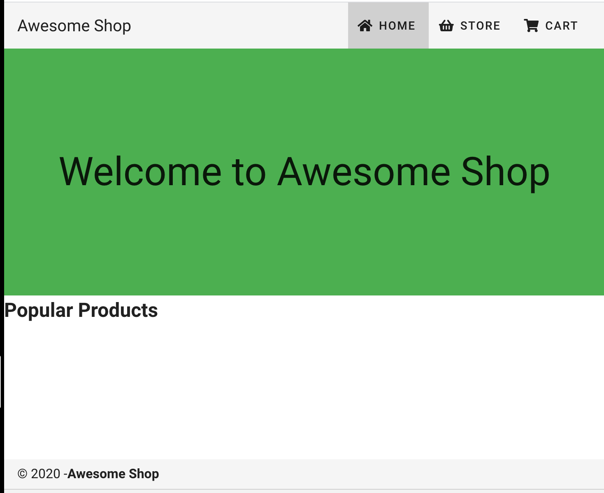
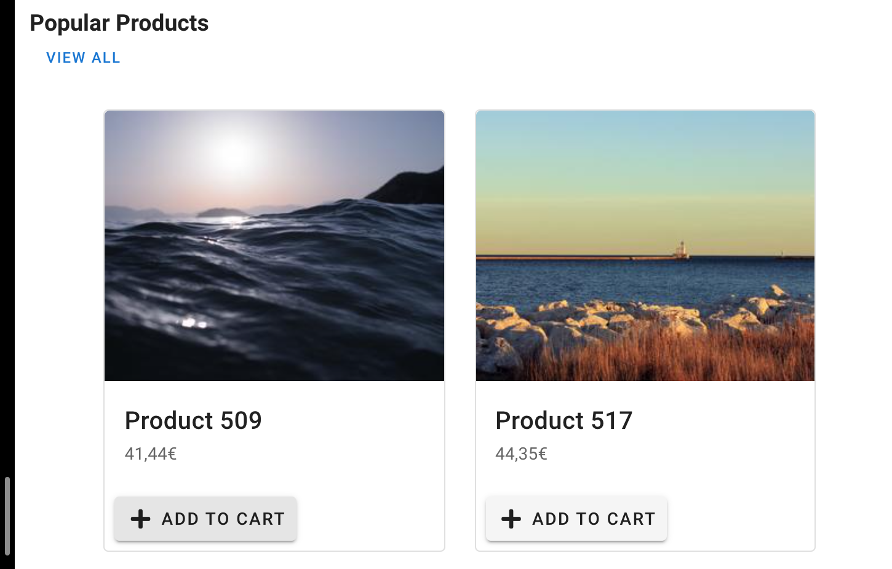

# 07 Home Page


## Header

`v-sheet` permet d'utiliser *une feuille de papier*.

L'objet `$vuetify` permet de récupérer des infos dynamiquement.

`this.$vuetify.breakpoint.name` permet de récupérer le nom du `breakpoint` en cours.

```vue
<template>
  <v-sheet :height="sheetHeight" color="green">
      <h1 class="text-center display-1">
          Welcome to Awesome Shop
      </h1>
  </v-sheet>
</template>

<script>
export default {
    computed: {
        sheetHeight() {
            let height = '0px '
            console.log(this.$vuetify)
            switch(this.$vuetify.breakpoint.name) {
                case 'xs': height = '200px'
                    break
                case 'sm': height = '300px'
                    break
                case 'md': height = '300px'
                    break
                case 'lg': height = '300px'
                    break
                case 'xl': height = '360px'
            }

            return height
        }
    }
}
</script>
```

Pour mettre le titre au milieu on peut utiliser les classes utilitaires `flexbox` :

```html
<v-sheet :height="sheetHeight" color="green" class="d-flex justify-center align-center ">
      <h1 class="display-1">
          Welcome to Awesome Shop
      </h1>
  </v-sheet>
```

On va utiliser des classes *responsives* pour le texte :

```html
<h1 class="text-md-h1 text-sm-h3">
    Welcome to Awesome Shop
</h1>
```

### `text-sm-h3` et `text-md-h1`


## Footer

on veut que le `footer` soit toujours collé en bas de la web-page :



```html
<template>
  <v-footer absolute>
      &copy; {{ new Date().getFullYear() }} - <strong>Awesome Shop</strong>
  </v-footer>
</template>
```

### `absolute`

## Centrer proprement et de manière *responsive* les produits affichés

```html
<v-row>
    <v-col sm="10" offset-sm="1" md="8" offset-md="2">
        
        <v-row>
            <v-col
                   sm="6"
                   md="4"
                   v-for="product in products"
                   :key="product.title"
                   >
                <v-card outlined>
```

On insère une ligne dans une colonne qui elle sera centrée de manière *responsive*




## On organise en composant

### `VerticalCard.vue`

```vue
<template>
    <v-card outlined>
        <v-img :src="product.src" height="220px"></v-img>
        <v-card-title>
            {{ product.title }}
        </v-card-title>
        <v-card-subtitle>
            {{ product.price }}
        </v-card-subtitle>
        <v-card-actions>
            <v-btn color="success" outlined>
                <v-icon left small>fa-plus</v-icon>
                Add to cart
            </v-btn>
        </v-card-actions>
    </v-card>
</template>

<script>
export default {
    props: {
        product: {
            type: Object,
            required: true
        }
    }
}
</script>
```

Dans `PopularProducts.vue`

```html
<v-row>
    <v-col
           sm="6"
           md="4"
           v-for="product in products"
           :key="product.title"
           >
        <vertical-card :product="product"></vertical-card>
    </v-col>
</v-row>
```


## Création d'un `snackbar`

On le met dans `App.vue`, dans `v-app`.


