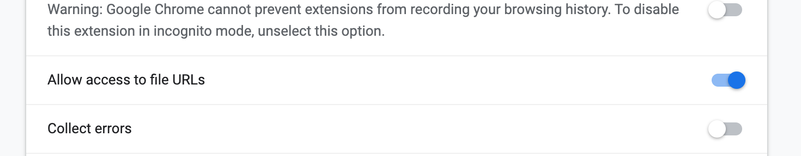
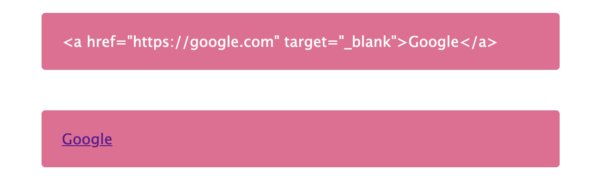
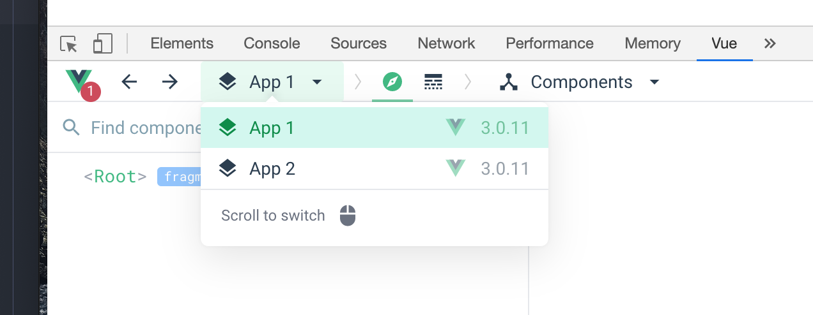
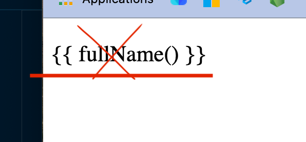

# 01 Refresh 1

`CDN` Content Delivery Network 

Un ensemble de serveurs à travers le monde hébergeant des fichiers statiques.

En cas de demande d'un client le réseau propose un chemin court pour accéder à la ressource.

## Simple squelette

```html
<!DOCTYPE html>
<html>
  <head>
    <title>VueJS Course</title>
    <link rel="stylesheet" type="text/css" href="main.css" />
  </head>
  <body>
    <div id="app">Hey you !</div>
    
    <script src="https://unpkg.com/vue@next"></script>
    <script src="app.js"></script>
  </body>
</html>
```

`app.js`

```js
Vue.createApp({}).mount("#app")  // setting object
```

> ## ! Extension Vue Chrome
>
> Pour que l'extension fonctionne, il est impératif d'autoriser l'accès aux fichiers du `file system`.
>
> Click droit sur l'icône grisée, puis `manage extension` :
>
> 

Une fonction `data` retourne un objet de données pour la vue.

```js
Vue.createApp({
    data() {
        return {
            hello: "hello Koko 🐵"
        }
    }
}).mount('#app')
```

### `expression` 

une unique ligne de code pouvant être évalué comme `string`, `number` ou `boolean`.

**Vue** permet d'utiliser les expressions entre doubles accolades :

```vue
<p>
    {{ 5 + 8 }}
</p>
```

Affiche aussi les tableaux ou les objets de manière littérale :

```js
data() {
        return {
            hello: "hello Koko 🐵",
            a: [],
            b: {
                name: "coco",
                age: 6,
                "fruit": true
            }
        }
    }
```

```vue
<div id="app">
    <p>{{ a.push(6, 8, 9) }}</p>
    <p>{{ a.map(v => v + 8) }}</p>
    <p>{{ b }}</p>
</div>
```


#### Affichage
```
3

[ 14, 16, 17 ]

{ "name": "coco", "age": 6, "fruit": true }
```


### `Raw HTML`

Pour afficher du `HTML` et qu'il soit interpréter comme tel, on utilise la directive `v-html` :

```js
data() {
    return {
        rawHtml: '<span style="color: red">This should be red.</span>'
    }
}
```

```vue
<p>Using v-html directive: <span v-html="rawHtml"></span></p>
```

> ## Cross Site Scripting : XSS
>
> Cela se produit quand du `HTML` malicieux ou nuisible est injecté dans notre page par une source extérieur et cause un comportement non-souhaité dans le navigateur.
>
> Cela arrive lorsque les données viennent d'une `api` externe et ne peuvent être toutes vérifiées.

```js
data() {
        return {
            rawUrl: '<a href="https://google.com" target="_blank">Google</a>',
        }
    },
```


```html
<div class="pink">{{ rawUrl }}</div>
<div class="pink" v-html="rawUrl"></div>
```



## Multiple `Vue` instance

L'instance de `Vue` ne peut avoir qu'un seul `root element`.

Si plusieurs sont défini (par exemple avec une `class`), seul le premier est prit en compte et les autres sont ignorés.

On peut par contre créer plusieurs instances de `Vue` :

```js
Vue.createApp({
    data() {
        return {
            hello: "hello Koko 🐵",
        }
    }
}).mount('#app1')
Vue.createApp({
    data() {
        return {
            hello: "hello Kiki 🐵",
        }
    }
}).mount('#app2')
```



On a alors deux `application Vue`.


## Accéder aux données de l'instance

```js
const vm = Vue.createApp({
    data() {
        return {
            firstName: "Bob",
            lastName: "Ricard",
        }
    }
}).mount('#app1')

setTimeout(() => {
    vm.$data.firstName = "Pol"
    vm.lastName = "O'Ralph Loren"
}, 2000)
```

On assigne l'instance à une référence `vm` (`View` `Model`).

Deux façon d'accéder aux données :

```js
vm.$data.maDonne
```

Ou plus simplement

```js
vm.maDonnee
```

`VUe` utilise un procédé de `Proxying` pour simplifier la syntaxe.


## `Methods`

Il n'est pas conseillé de mettre trop de logique dans le template :

```vue
<p>{{ `${firstName} ${lastName.toUpperCase()}` }}</p>
```

On va plutôt créer une `Method` :

```js
methods: {
    fullName() {
        return `${this.firstName} ${this.lastName.toUpperCase()}`
    }
}
```

```vue
<p>{{ fullName() }}</p>
```


## `Directive`

Les `directives` sont des `attribut` qui changent le comportement des élément sur lesquels elles sont appliquées.

Dans le `HTML` c'est un `attribut`.

Pour `Vue` c'est une `directive`.

Les directives sont donc sélectionnable via les `CSS` comme des `attributs` :

```css
[v-my-directive] {
    display: none;
}
```

Les `directives` reçoivent comme valeur une `expression` :

```html
<div v-directive="expression">
  
</div>
```

ou rien si la valeur est un `boolean` :

```html
<div v-directive>
  <!-- v-directive="true" -->
</div>
```


### `v-cloak`

Cette directive est retirée lorsque l'élément est `mounted` par `Vue`.

En associant un `css`, on fait disparaître l'élément tant qu'il n'est pas monté.

```css
[v-cloak] {
    display: none;
}
```

Utile pour les template brut ne s'affichent pas avant que l'élément soit `mounted` :



## `Two Way Data Binding` : `v-model`

```html
<div class="pink">{{fullName()}}</div>
<hr />
<div class="blue">
  <p>
    <label for="first-name"
           >First Name :
      <input id="firstName" type="text" v-model="firstName"
             /></label>
    <label for="last-name"
           >Last Name :
      <input id="last-name" type="text" v-model="lastName"
             /></label>
  </p>
</div>
```

```js
Vue.createApp({
    data() {
        return {
            firstName: 'koko 🐹',
            lastName: 'Mitchou',
        }
    },
    methods: {
        fullName() {
            return `${this.firstName} ${this.lastName}`
        },
    },
}).mount('#app')
```

#### `Reactivity`

C'est quand un changement des données est immédiatement reflété sur la page.


## Binding Attribure `v-bind:`

```js
Vue.createApp({
    data() {
        return {
            url: 'https://google.com',
        }
    },
```

```html
<a v-bind:href="url">{{url}}</a>
```

ou

```html
<a :href="url">{{url}}</a>
```

