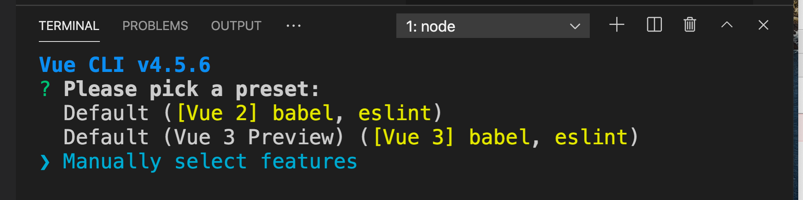
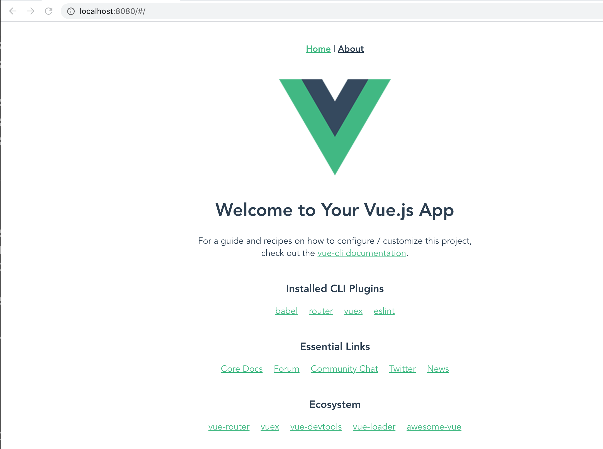
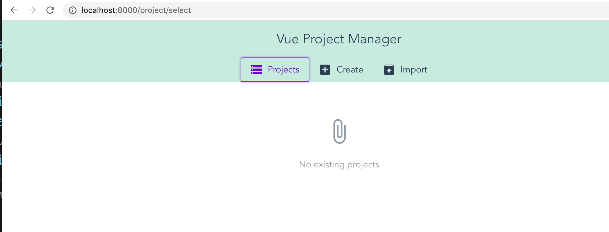
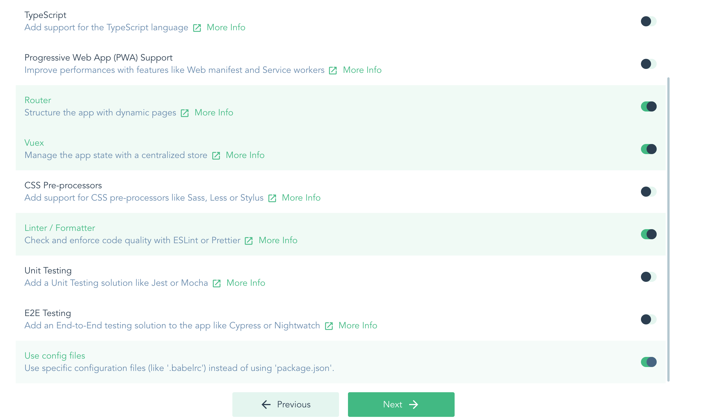
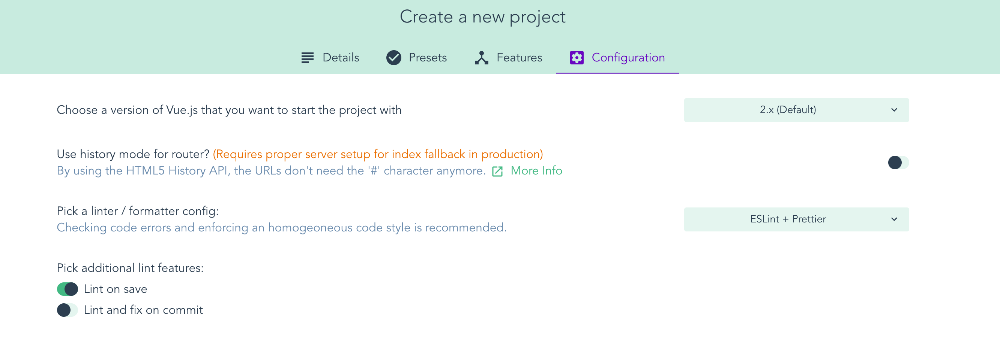
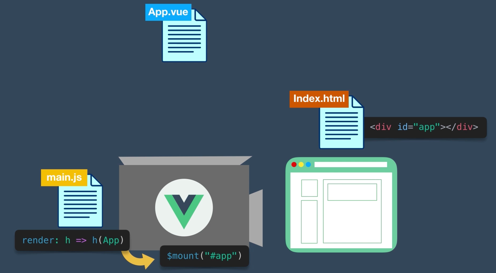
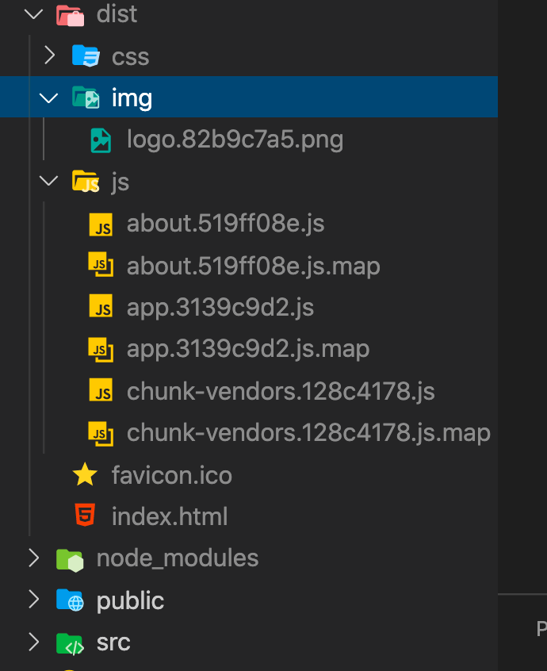

#  01 Vue CLI

```bash
npm i -g @vue/cli

vue create my-new-vue-project
```




```bash
npm run serve
```



## `Vue UI`

On peut faire ça aussi avec l'interface graphique `Vue UI`.

```bash
vue ui
```







## arborescence

`public` image, fichiers ne devant pas être calculé par `webpack`.

`src` le code spécifique à l'application.

 `assets` images, polices, etc.

 `components` blocs de construction de l'application `Vue`.

 `views` différentes pages (ou vue) de l'application.

 `App.vue` le composant `root`.

 `main.js` rendue de l'application, les composants sont montés dans le DOM.

 `router.js` le routeur de `Vue`.

 `store.js` pour `Vuex`.

L'application est montée dans `public/index.html` :

```html
	<!-- ... -->
	<div id="app"></div>
    <!-- built files will be auto injected -->
  </body>
</html>
```

`src/main.js`

```js
import Vue from "vue";
import App from "./App.vue";
import router from "./router";
import store from "./store";

Vue.config.productionTip = false;

new Vue({
  router,
  store,
  render: (h) => h(App),
}).$mount("#app");
```



`App.vue` est un conteneur pour les composants.

## Build

On a dans `index.html` ce message : `<!-- built files will be auto injected -->`

Lançons un `build` :

```bash
npm run build
```



Un dossier `dist` est construit (`distribution`), c'est l'application pour la production (pour le déploiement).

`dist/index.html`

```html
        <div id="app"></div>
        <script src="/js/chunk-vendors.128c4178.js"></script>
        <script src="/js/app.3139c9d2.js"></script>
	</body>
</html>
```

`<script src="/js/chunk-vendors.128c4178.js"></script>` contient les dépendances.

`<script src="/js/app.3139c9d2.js"></script>` contient l'application depuis `main.js`.
