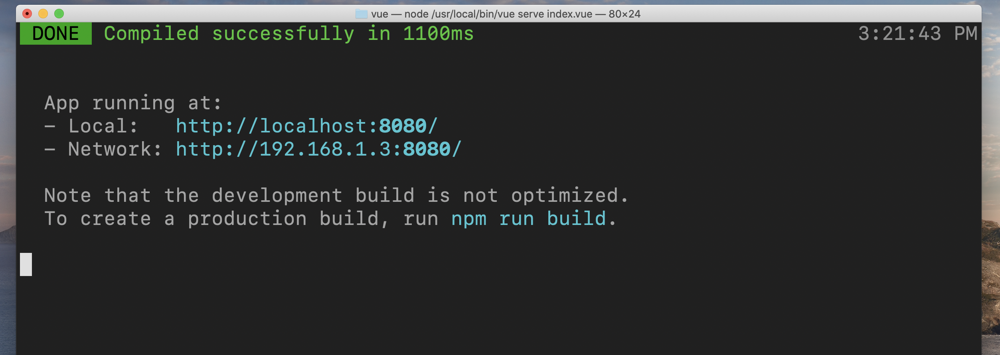

# 01.5 Vue `CLI`

## Ajout du cours Pluralsight : `Developing Faster with the Vue CLI` John Papa

## Zero Configuration Project

`@vue/cli-service-global` : zéro configuration.

```bash
cd Desktop/

mkdir vue
cd vue

cat << END >> index.vue
<template>
<h1> Hello Hukar </h1>
<template>
END

vue serve index.vue
```




Cela permet de tester facilement des idées.

## Projet par défaut

```bash
vue create hello-vue -d
```

`-d` configuration par défaut


### Faire tourner un serveur dans le dossier

```bash
npx http-server
```

```bash
🦄 vue ls
App.vue		node_modules

🦄 vue vue build
# il faut un fichier App.vue ou app.vue (main.js ou index.js) comme point d'entrée

⠦  Building for production...
```

```bash
🦄 vue ls
App.vue		dist		node_modules
🦄 vue cd dist
🦄 dist ls
index.html	js
```

```bash
🦄 dist npx http-server
npx: installed 23 in 2.378s
Starting up http-server, serving ./
Available on:
  http://127.0.0.1:8080
  http://192.168.1.3:8080
```


On peut ainsi facilement tester des solutions.

## Un projet nu `-b` bare

```bash
vue create foo -db
```
