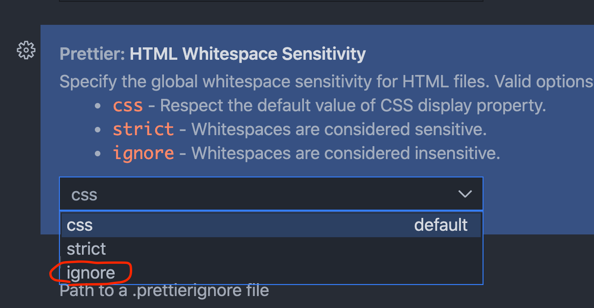
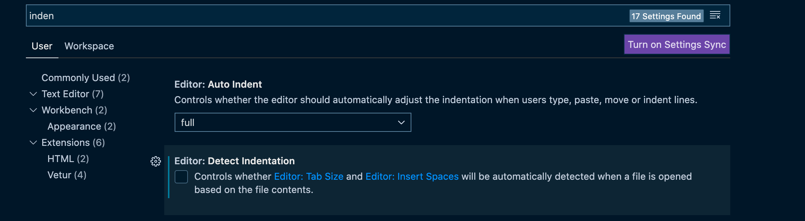
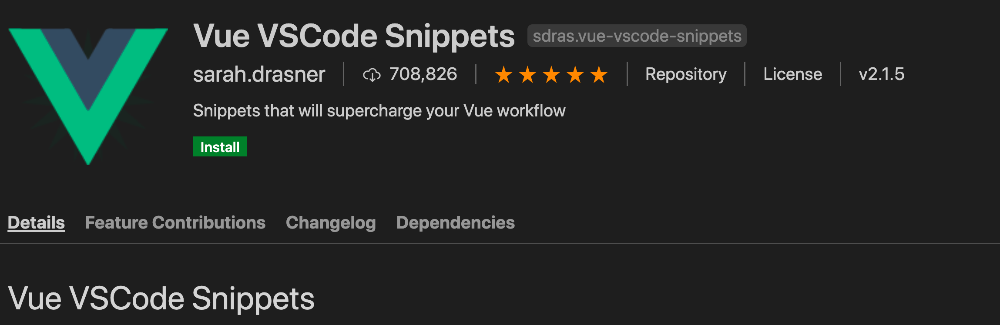
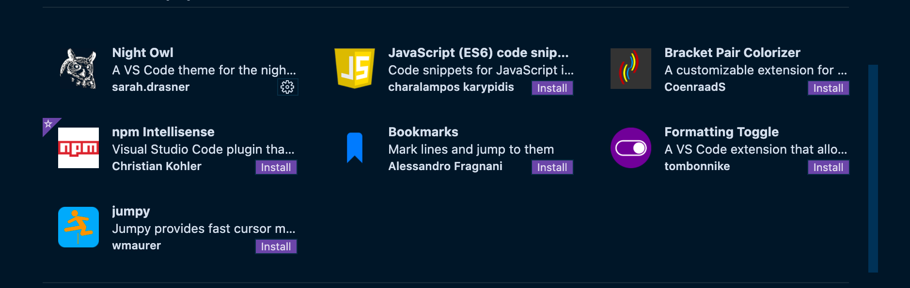

# 02 Optimiser son éditeur

## Extension VSCode

### `Vetur` de Pine Yu

- syntax highlighting

- snippets `ctrl + space`
  - vue -> squelette de composant

### `eslint` et `prettier`

Pour éviter les conflits il y a une dépendance importante dans `package.json` :

```json
"@vue/eslint-config-prettier": "^6.0.0",
```

Dans `.eslintrc.js` :

```js
extends: ["plugin:vue/essential","plugin:prettier/recommended", "@vue/prettier"],
```

Un autre (quelle différence ?? => le javascript est _linté_ prendre plutôt celui plus bas)

```js
extends: [
  "plugin:vue/recommended",  // vue/recommended sont des règles plus strict que /essential
  "@vue/prettier", // ADD
  "eslint:recommended" // ici le javacsript est linté
],
```

Si besoin pour éviter les conflits :

```js
"prettier/vue"; // de eslint-config-prettier mais déjà injecté grace à @vue/prettier

```

Créer un fichier de configuration pour `prettier`

`.prettierrc.js`

```js
module.exports = {
  trailingComma: "es5", // mettre une virgule à la fin des attributs d'un objets
  tabWidth: 4,
  semi: false,
  singleQuote: true,
  htmlWhitespaceSensitivity: "ignore", // pour éviter des chose bizarre dans le html
};
```

### Problème d'affichage des `tags` avec `Prettier`

On a parfois un `html` qui ressemble à ça :

```html
<a href="https://vuejs.org" target="_blank" rel="noopener"
   >Core Docs</a
  >
```

alors que l'on voudrait ça :

```html
<a href="https://vuejs.org" target="_blank" rel="noopener">
  Core Docs
</a>
```

Il faut juste régler `HTML Whitespace Sensitivity` à `ignore` :




## User Settings

Pour éviter les conflits avec `eslint` on met `vetur validation template` à `false`.

```json
"vetur.validation.template": false
```

### Auto Fix On Save

```json
"editor.codeActionsOnSave": {
        // "source.fixAll.eslint": true
    	"source.fixAll": true  // fonctionne pour moi
    }
```

Décocher `Editor detect indentation` si nécessaire :



## Additional Snippets

Sarah Drasner



`vdata`

```js
data() {
    return {
        key: value
    }
},
```

`von` : un `event handler`

```html
<div @click="handler(arg, event)"></div>
```

`vimport-lib`

```js
import { libName } from 'libName';
```


## Bonus

`live share` pour coder à distance ensemble.


## Bien avoir `LF` comme fin de ligne


## Par `Sarah Drasner` : `Vue VS Code Extension Pack`




## Exemple de `settings.json` pour `VSCode`


`Window.zoomLevel` niveau de zoom de la fenêtre, intéressant de le faire par projet.

`"editor.defaultFormater":"esbenp.prettier-vscode` permet la précédence de `Prettier` comme formateur.

### Ne pas *commiter* les `settings` dans `git` !

