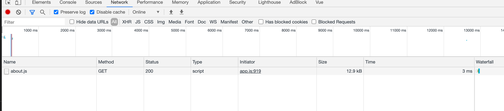
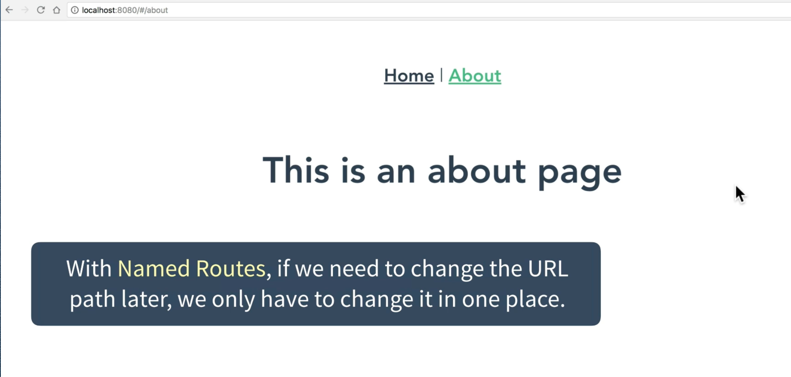
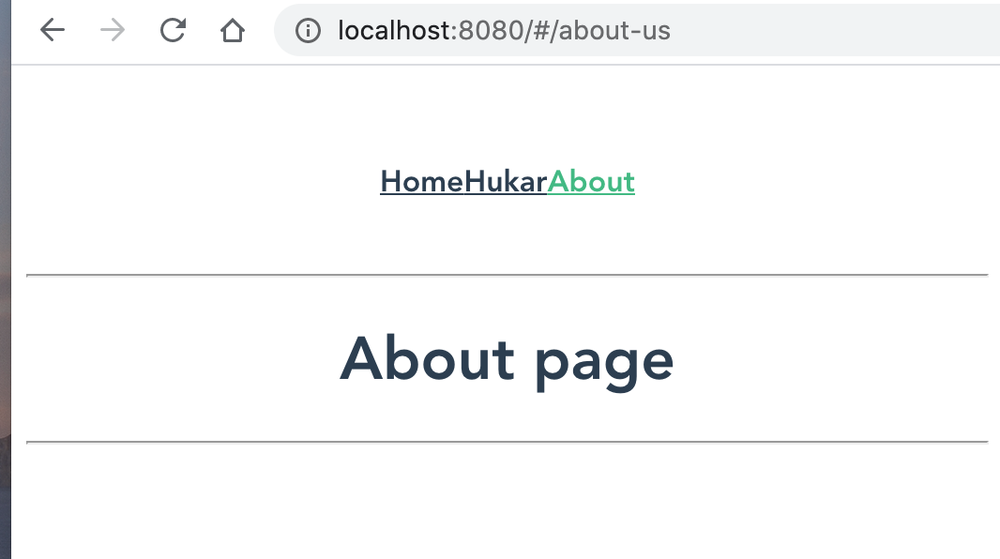

# 03 Router

## anatomie


Le fichier `router.js` permet de configurer les routes.


Les composants utilisé par le routeur sont mis dans un dossier `views` mais il reste des composants.

Si un composant est chargé par le routeur alors on le met dans `views`. (Bonne pratique)

On pourrait aussi appeler ce dossier `pages` par exemple.

## `<router-link to="Route" >`

 

`<router-link>` crée un lien pour naviguer vers une page.

`<router-view>` est l'endroit où la vue sera rendue.

## Création d'une route dans le routeur

```js
import Vue from "vue";
import VueRouter from "vue-router";
import Home from "../views/Home.vue";
import Custom from "../views/Custom.vue";

Vue.use(VueRouter);

const routes = [
  {
    path: "/",
    name: "Home",
    component: Home,
  },
  {
    path: "/custom",
    name: "Custom",
    component: Custom,
  },
];

const router = new VueRouter({
  routes,
});

export default router;
```

Dans le template :

```html
<div id="nav">
  <router-link to="/">Home</router-link> |
  <router-link to="/about">About</router-link> |
  <router-link to="/custom">Custom</router-link>
</div>

<router-view />
<!-- endroit ou le composant est chargé -->
```

Avec l'extension `Vue` des `Developer tools` :


### lazy loading

Génère un morceau de code séparé au `build` :


Dans `router/index.js`

```js
{
    path: '/about',
    name: 'About',
    // route level code-splitting
    // this generates a separate chunk (about.[hash].js) for this route
    // which is lazy-loaded when the route is visited.
    component: () =>
        import(/* webpackChunkName: "about" */ '../views/About.vue')
}
```

Du coup on a une requête supplémentaire :



Mais cette requête n'intervient qu'une seule fois.

- Si la page n'est jamais demandée, on télécharge moins de code.

- Si la page est demandé, la première fois un fichier complémentaire est téléchargé, puis plus de téléchargement par la suite.

## Navigation avec le `name`

On voit qu'un attribut `name` est renseigné, on peut l'utiliser à la place du `path` :

```html
<div id="app">
  <div id="nav">
    <router-link :to="{ name: 'Home' }">Home</router-link> |
    <router-link :to="{ name: 'About' }">About</router-link> |
    <router-link :to="{ name: 'Custom' }">Custom</router-link>
  </div>
  <router-view />
</div>
```

Cela permet si le `path` change, de ne pas changer les liens du `template`.



## Redirection : `redirect`

```js
const routes = [
    {
        path: '/',
        name: 'Home',
        component: Home
    },
    {
        path: '/custom',
        name: 'Custom',
        component: Custom
    },
    {
        path: '/product-unknow',
        redirect: { name: 'Custom' }
    },
```

ou bien :

```js
	{
        path: '/product-unknow',
        redirect: '/custom'
    },
```

### `alias`

On peut aussi utiliser un alias :

```js
const routes = [
  {
    path: "/",
    name: "Home",
    component: Home,
  },
  {
    path: "/about-us",
    name: "About",
    component: About,
    alias: "/about",
  },
];
```

Mais ici on a deux `url` qui pointent vers la même page :



