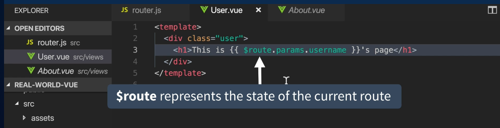
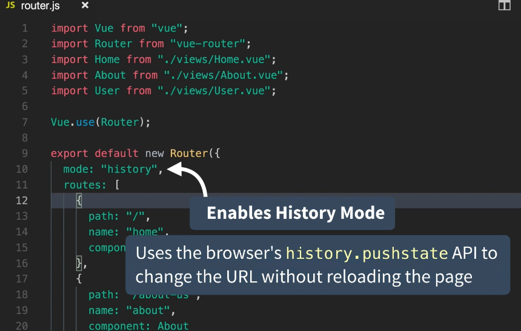

# 04 `Dynamic routing` et `history mode`

## Dynamic Route


dans `router/index.js`

```js
const routes = [
    {
        path: '/user/:name',
        name: 'user',
        component: User,
    },
```

`:name` paramètre dynamique.

Dans `views/User.vue`

```vue
<template>
  <h1>User : {{ $route.params.name }}</h1>
</template>
```

`$route.params.nom_du_paramètre`

Dans `App.vue` :

#### ! On doit avoir un `v-bind` devant l'attribut `to` => `v-bind:to` ou `:to`.

```vue
<router-link :to="{ name: 'user', params: { name: 'Hukar' } }">
  User
</router-link>
```



### Passer le paramètre dans les `props`

```js
// router/inde.js
{
  path: '/user/:name',
  name: 'user',
  component: User,
  props: true, // passe $route.params aux props
},
```

```vue
// App.vue
<router-link :to="{ name: 'user', params: { name: 'Hukar' } }">
  User
</router-link>
```

```vue
// views/User.js
<template>
  <h1>User : {{ name }}</h1>
</template>

<script>
export default {
  props: ["name"],
};
</script>
```

Écriture corrigée par le **linter** :

```vue
<template>
  <h1>Hello {{ username }}</h1>
</template>
<script>
export default {
  props: {
    username: { type: String, required: true },
  },
};
</script>
```

`require-prop-types` donner un type aux propriétés.

`require-default-prop` Donner une valeur par défaut ou les mettre à `required: true`.

## Retirer le `#` des routes




```js
const routes = [
  {
    path: "/user/:name",
    name: "user",
    component: User,
    props: true,
  },
];

const router = new VueRouter({
  mode: "history",
  routes,
});

export default router;
```


Plus de `#` dans l'`URL`.


#### ! attention maintenant le serveur renvoie les erreurs 404 vers index.html

On doit implémenter les erreurs dans le routeur de `Vue.js`

```js
const router = new VueRouter({
  mode: "history",
  routes: [...{ path: "*", component: NotFoundComponent }],
});
```

Cette route `catch them all` doit être à la fin du tableau `routes`.

Le serveur doit être configuré pour renvoyer toutes les demandes vers `index.html`.


## Exercice

Mon `router`

```cs
import Vue from 'vue'
import VueRouter from 'vue-router'

Vue.use(VueRouter)

const routes = [
    {
        path: '/',
        name: 'event-list',
        component: () => import(/* webpackChunkName: "event-list" */ '../views/EventList.vue'),
    },
    {
        path: '/event/:id',
        name: 'event-show',
        component: () => import(/* webpackChunkName: "event-show" */ '../views/EventShow.vue'),
        props: true,
    },
    {
        path: '/create',
        name: 'create-event',
        component: () => import(/* webpackChunkName: "create-event" */ '../views/CreateEvent.vue'),
    },
]

const router = new VueRouter({
    mode: 'history',
    routes,
})

export default router

```

Le `lazy-loading` est plutôt un bon choix.

On voit que le paramètre d'`url` est passé par les `props`.

On passe le `mode: 'history'` au `router` pour ne plus avoir le `#` dans les `urls`.

```
http://localhost:8080/event/6
```

au lieu de 

```
http://localhost:8080/#/event/6
```


Les `router-link` dans `App.vue`

```html
<router-link :to="{ name: 'event-list' }">List Event</router-link>|
<router-link :to="{ name: 'event-show', params: { id: 6 } }">Show Event</router-link> |
<router-link :to="{ name: 'create-event' }">Create Event</router-link>
```

On utilise le nom des routes, plus robuste en cas de modification des `urls`.

Le paramètre de route est passé grâce à `params: { paramName: paramValue }`.

On le récupère dans le composant `View` comme une `prop` normale :

```vue
<template>
    <div>Event Show #{{ id }}</div>
</template>

<script>
export default {
    props: ['id'],
}
</script>
```

on pourrait avoir aussi :

```vue
<template>
    <div>Event Show #{{ $route.params.id }}</div>
</template>
```

