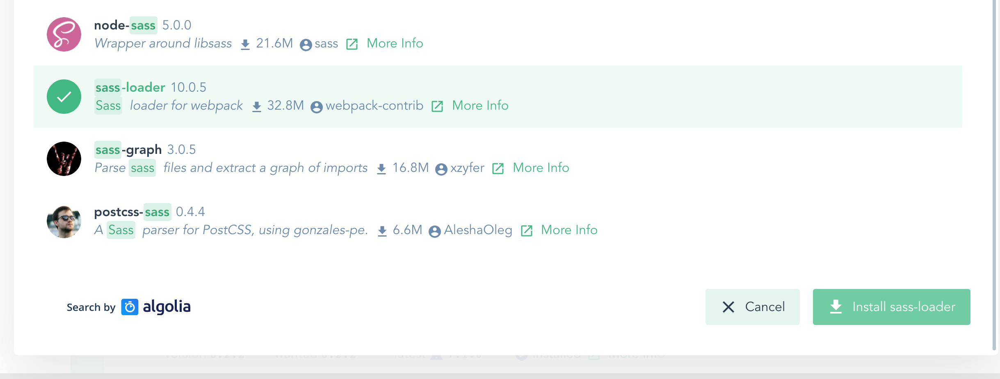
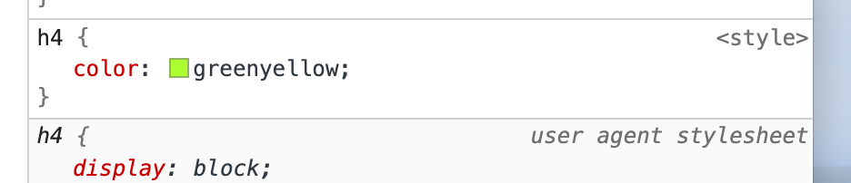

# 05. File Component

## Anatomie

On utilise le snippet `vbase` :


## Préprocesseur


On peut définir des processeur de langage comme `Typescript`, `plug` ou `Scss`.

### Ajoutons `scss`

```vue
<style lang="scss" scoped></style>
```

On utilise l'interface graphique de `vue-cli` :

```bash
vue ui
```


On a deux package à installer : `sass-loader` et `node-sass`



Ces informations se trouvent sur ce site :

https://vue-loader.vuejs.org/


## définir des datas

snippet : `vdata`.

```vue
<template>
  <div>
    <h4>{{ title }}</h4>
  </div>
</template>

<script>
export default {
  data() {
    return {
      title: "Park Cleanup",
    };
  },
};
</script>
```

Le `template` doit avoir un élément `root` ici `div`.

## Style

Le style est `scoped` :

```vue
<style lang="scss" scoped>
h4 {
  color: greenyellow;
}
</style>
```


Si on retire le mot `scoped` on a :



La règle devient générale, elle n'est plus _scopée_.

## Composants imbriqués : `nested components`

snippet `vimport`, `vcomponent`.

```vue
        <EventCard />
    </div>
</template>

<script>
import EventCard from '@/components/EventCard.vue'

export default {
    components: {
        EventCard,
    },
}
</script>
```

`@` représente le dossier `src`.

## Style Global

Dans la balise `<style>` de `App.vue`, sans le mot `scoped`.

## Composant et `router-link`

On peut entourer un composant avec la balise `<router-link>` pour le rendre cliquable et navigable.

```vue
<template>
  <router-link class="event-link" :to="{ name: 'Show', params: { id: '1' } }">
    <div class="event-card -shadow">
      <span class="eyebrow">@{{ event.time }} on {{ event.date }}</span>
      <h4 class="title">{{ event.title }}</h4>
      <span>{{ event.attendees.length }} attending</span>
    </div>
  </router-link>
</template>
```


## Exercice

```vue
<template>
<router-link
             class="event-link"
             :to="{ name: 'event-show', params: { id: event.id } }"
             >
  <div class="event-card -shadow">
    <span class="eyebrow">@{{ event.time }} on {{ event.date }}</span>
    <h4 class="title">
      {{ event.title }}
  </h4>
    <span>{{ event.attendees.length }}</span>
  </div>
  </router-link>
</template>

<script>
  export default {
    data() {
      return {
        event: {
          id: '1',
          title: 'Park Cleanup',
          date: 'Tes Aug 19, 2022',
          time: '6:00',
          attendees: [
            {
              id: 'abc001',
              name: 'John Nicolito',
            },
            {
              id: 'abc002',
              name: 'Rocka Bill',
            },
            {
              id: 'abc003',
              name: 'Michel Norman',
            },
          ],
        },
      }
    },
  }
</script>

<style scoped>
  .event-card {
    padding: 20px;
    margin-bottom: 24px;
    transition: all 0.2s linear;
    cursor: pointer;
  }
  .event-card:hover {
    transform: scale(1.01);
    box-shadow: 0 3px 12px 0 rgba(0, 0, 0, 0.2), 0 1px 15px 0 rgba(0, 0, 0, 0.19);
  }
  .event-card > .title {
    margin: 0;
  }

  .event-link {
    color: black;
    text-decoration: none;
    font-weight: 100;
  }
</style>

```


### Création de `NavBar.vue`

```vue
<template>
<div id="nav" class="nav">
  <router-link to="/" class="brand">Real World Event</router-link>

  <nav>
    <router-link :to="{ name: 'event-list' }">Event List</router-link> |
    <router-link :to="{ name: 'create-event' }">Create Event</router-link>
  </nav>
  </div>
</template>

<style scoped>
  .nav {
    display: flex;
    justify-content: space-between;
    align-items: center;
    height: 60px;
  }
  .nav > .brand {
    font-family: 'Montserrat', sans-serif;
    font-weight: 700;
    font-size: 1.5em;
    color: #39b982;
    text-decoration: none;
  }
  .nav .nav-item {
    box-sizing: border-box;
    margin: 0 5px;
    color: rgba(0, 0, 0, 0.5);
    text-decoration: none;
  }
  .nav .nav-item.router-link-exact-active {
    color: #39b982;
    border-bottom: solid 2px #39b982;
  }
</style>
```

Et maintenant dans `App.vue` :

```vue
<template>
    <div id="app">
        <nav-bar />
        <router-view />
    </div>
</template>

<script>
import NavBar from '@/components/NavBar.vue'

export default {
    components: {
        NavBar,
    },
}
</script>
```


