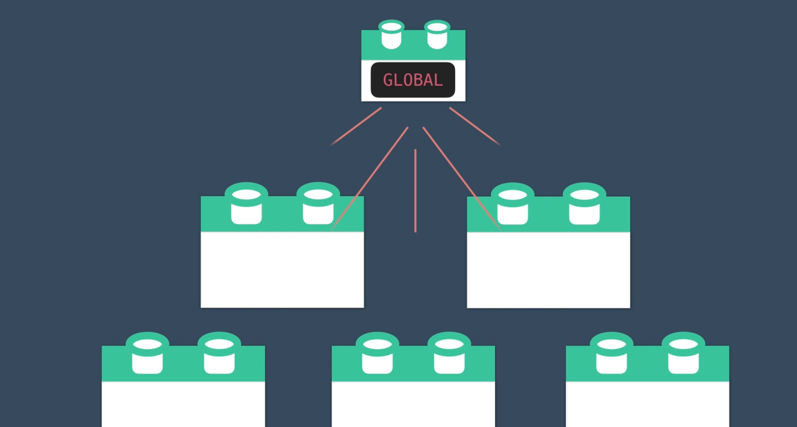
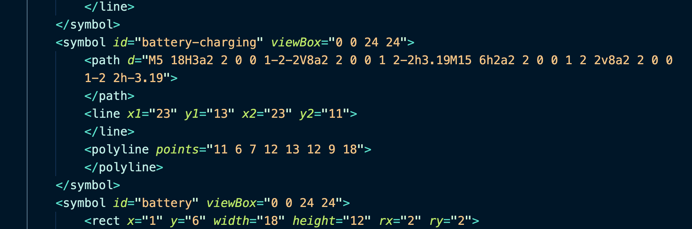

# 06. Composants globaux

## Import locale


## accès global

Il peut être intéressant de rendre l'accès à un composant global, si celui-ci est utilisé par plusieurs autres composants.



Les icône et les boutons sont de bon candidat à être globaux.

## Enregistrer globalement un composant

Dans `main.js` :

```js
import Vue from "vue";
import App from "./App.vue";
import router from "./router";
import store from "./store";
import BaseIcon from "@/components/BaseIcon"; // on ajoute le composant

Vue.component("BaseIcon", BaseIcon); // on l'injecte dans les composants globaux

Vue.config.productionTip = false;
new Vue({
  router,
  store,
  render: (h) => h(App),
}).$mount("#app");
```

Si on doit enregistrer plusieurs composant, on répète la même opération :

```js
import BaseIcon from "@/components/BaseIcon"
import BaseInput from "@/components/BaseInput"
import BaseSelect from "@/components/BaseSelect"

Vue.component("BaseIcon", BaseIcon)
Vue.component("BaseInput", BaseInput)
Vue.component("BaseSelect", BaseSelect)
```


## Enregistrement automatique des composants

Il faut installer `Lodash` :


`main.js`

```js
import Vue from 'vue'
import upperFirst from 'lodash/upperFirst'
import camelCase from 'lodash/camelCase'

const requireComponent = require.context(
  // Le chemin relatif du dossier composants
  './components',
  // Suivre ou non les sous-dossiers
  false,
  // L'expression régulière utilisée pour faire concorder les noms de fichiers de composant de base
  /Base[A-Z]\w+\.(vue|js)$/
)

requireComponent.keys().forEach(fileName => {
  // Récupérer la configuration du composant
  const componentConfig = requireComponent(fileName)

  // Récupérer le nom du composant en PascalCase
  const componentName = upperFirst(
    camelCase(
      // Retrouver le nom du fichier indépendemment de la profondeur de dossier
      fileName
        .split('/')
        .pop()
        .replace(/\.\w+$/, '')
    )
  )

  // Créer un composant global
  Vue.component(
    componentName,
    // Chercher les options du composant dans `.default`, qui
    // existera si le composant a été exporté avec `export default`,
    // sinon revenez à la racine du module.
    componentConfig.default || componentConfig
  )
})
```

`require.context` est fourni par `Webpack`.


## Créer un `BaseComponent` : `BaseIcon`

D'abord installer `feather-sprite.svg`

```bash
npm install feather-icons
```

On trouvera dans `node_modules` le fichier `feather-sprite.svg` qu'on copiera dans `public`.

`BaseIcon.vue`

```vue
<template>
    <div class="icon-wrapper" v-html="svg">Icon</div>
</template>

<script>
import feather from 'feather-icons'

export default {
    props: {
        name: String,
        width: {
            type: [Number, String],
            default: 24,
        },
        height: {
            type: [Number, String],
            default: 24,
        },
    },
    computed: {
        svg() {
            return feather.icons[this.name].toSvg({
                class: 'icon',
                width: this.width,
                height: this.height,
            })
        },
    },
}
</script>

<style scoped>
.icon-wrapper {
    display: inline-flex;
    align-items: center;
    color: rgba(0, 0, 0, 0.4);
    font-size: 1rem;
    font-weight: 600;
    margin-right: 6px;
}
.icon {
    stroke: currentColor;
    stroke-width: 2;
    stroke-linecap: round;
    stroke-linejoin: round;
    fill: none;
}
</style>

```

Dans le composant parent il n'est plus utile d'importer `BaseIcon`, on peut l'utiliser directement.

```html
<div class="event-card -shadow">
  <span class="eyebrow">@{{ event.time }} on {{ event.date }}</span>
  <h4 class="title">
    {{ event.title }}
  </h4>
  <base-icon name="users" />
  <span>{{ event.attendees.length }}</span> attending
</div>
```



