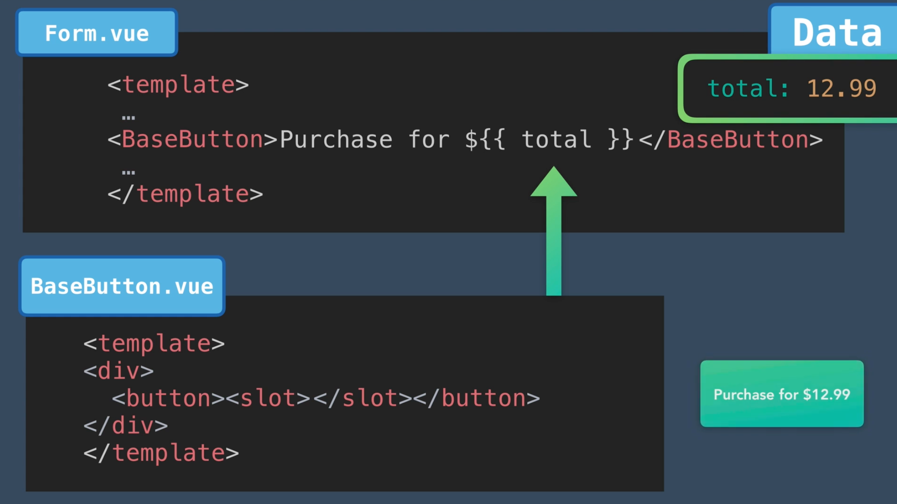
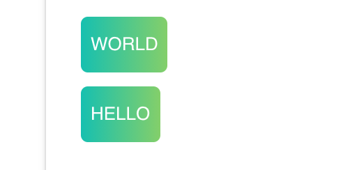
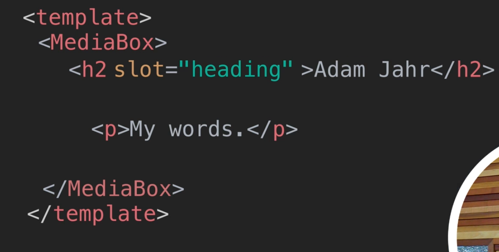
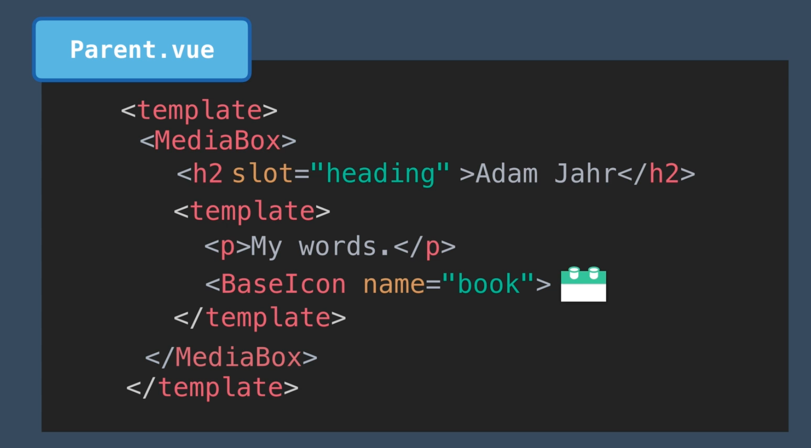

# 07. `Slots`

Parfois on voudrait pouvoir personnaliser un composant à chaque usage.

Les `slots` permettent d'insérer un template à l'intérieur d'un composant :


Le `slot` a accès aux `data` du parent comme le montre l'exemple ci-dessous.



On peut ajouter une valeur par défaut qui sera écrasée si le `template` la redéfinie :

```html
<template>
    <div>
        <button><slot>WORLD</slot></button>
    </div>
</template>
```

`WORLD` est la valeur par défaut.

Dans un composant parent :

```html
<p>
  <base-button></base-button>
  <base-button>HELLO</base-button>
</p>
```




## Modification de `BaseIcon` pour utiliser un `slot`

On voudrait que le texte après l'icone fasse parti du composant, on va utiliser un `slot` :

```html
<template>
    <div>
        <span class="icon-wrapper" v-html="svg">Icon</span>
        <slot></slot>
    </div>
</template>
```

Et dans le composant parent :

```html
<base-icon name="users">
  {{ event.attendees.length }} attending
</base-icon>
```


## `Named Slot`

ON peut avoir plusieurs `slots` dans un composant.

Pour que `Vue` puisse les différencier, il faut leur donner un nom.


On est pas obligé de nommé le deuxième `slot` car il devient évident.



Pour passer plusieurs éléments à un `slot`, on utilise le tag `<template>` :



Après tout un composant est simplement un code de `template`.

Le `<template>` évite de surcharger le `DOM` avec des `<div>` ou des `span` inutiles.
