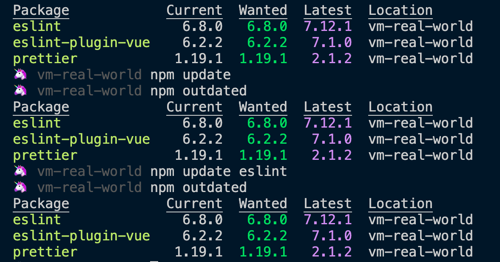
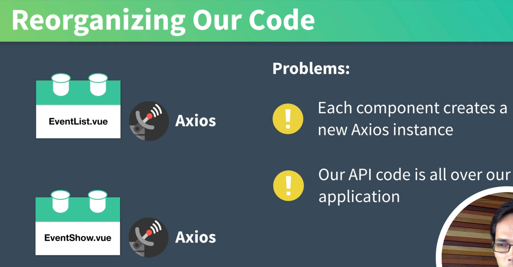

# 08. Appelle d'`API` avec `Axios`

## Installer `json-server`

```bash
sudo npm i -g json-server
```

## Démarrer `json-server`

```bash
json-server --watch db.json
```

## Vérifier les mise à jour des dépendances `npm outdated`



Rien ne change car dans `package.json` on a un `^` devant :

```json
	"eslint": "^6.7.2",
    "eslint-plugin-prettier": "^3.1.3",
    "eslint-plugin-vue": "^6.2.2",
    "prettier": "^1.19.1",
    "vue-template-compiler": "^2.6.11"
  }
```

`^` n'accepte les changement qui ne modifie pas le chiffre le plus à gauche différent de zéro `[ major, minor, patch]`

`"^6.7.2"` := `>=6.7.2 <7.0.0`

**exemple avec zéro :** `^0.3.2` := `>0.3.0 =<0.3.2`

## Mise à jour avec `vue ui`


Il suffit de cliquer sur **⤓** .

## Installer `axios`

```bash
npm i axios
```

## Utiliser `axios` : `EventList.vue`

On utilise le `hook` `created`.

`EventList.vue`

```vue
<template>
  <div>
    <h1>Event List</h1>
    <EventCard v-for="event in events" :key="event.id" :event="event" />
  </div>
</template>

<script>
import EventCard from "@/components/EventCard.vue";
import axios from "axios";

export default {
  components: {
    EventCard,
  },
  data() {
    return {
      events: [],
    };
  },
  created() {
    axios
      .get("http://localhost:3000/events")
      .then((response) => (this.events = response.data))
      .catch((error) => console.log(error.response));
  },
};
</script>
```

### `<EventCard v-for="event in events" :key="event.id" :event="event" />`

Avec `v-for` on doit utiliser un `key` dans ce cas `:key="event.id"`.

On passe ensuite le résultat de chaque itération à une propriété `:event="event"`.

### avec `async/await`

```js
async created() {
    try {
        const response = await axios.get('http://localhost:3000/events')
        this.events = response.data
    } catch (error) {
        console.log(error)
    }
},
```

On a aussi un appelle dans `EventShow.vue` pour récupérer un `Event` :

```vue
<template>
  <div>
    <h1>Showing event {{ id }}</h1>
    <h2>{{ event.title }}</h2>
  </div>
</template>

<script>
import axios from "axios";
export default {
  props: {
    id: {
      type: [String, Number],
      required: true,
    },
  },
  data() {
    return {
      event: {},
    };
  },
  async created() {
    try {
      const response = await axios.get(
        `http://localhost:3000/events/${this.id}`
      );
      this.event = response.data;
    } catch (error) {
      console.log(error);
    }
  },
};
</script>
```

## Réorganiser son code : `services`

Les appelle `Axios` sont éparpillés dans le code, en plus on crée deux instances d'axios.

On veut réorganiser le code pour centraliser le service `Axios`.



## Création de `EventService.js`

On va créer un dossier `src/services`.

On ajoute un service : `EventService.js`

```js
import axios from "axios";

const apiClient = axios.create({
  baseURL: "http://localhost:3000",
  withCredentials: false,
  headers: {
    Accept: "application/json",
    "Content-Type": "application/json",
  },
});

export default {
  getEvents: async () => await apiClient.get("/events"),
  getEvent: async (id) => await apiClient.get(`/events/${id}`),
};
```

Et on peut simplifier `EventList.vue`

```js
async created() {
    try {
        const response = await eventService.getEvents()
        this.events = response.data
    } catch (error) {
        console.log(error)
    }
},
```

et aussi ``EventShow.vue`

```js
async created() {
    try {
        const response = await eventService.getEvent(this.id)
        this.event = response.data
    } catch (error) {
        console.log(error)
    }
},
```
