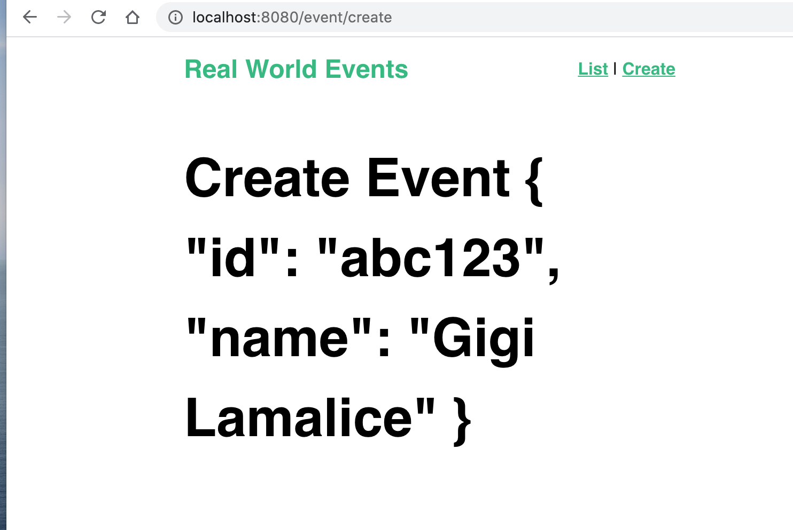
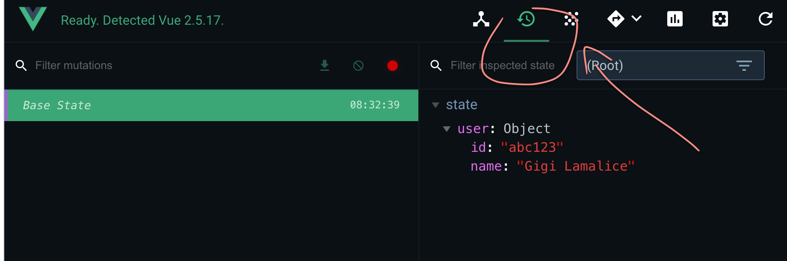

# 02 `state` et `getters`

## Accès au `store`

Dans `main.js`

```js
// ...
import store from "./store";

// ...

new Vue({
  router,
  store,
  render: (h) => h(App),
}).$mount("#app");
```

Cela rend le store accessible dans tous les composants.

## Le fichier `src/store.js`

```js
import Vue from "vue";
import Vuex from "vuex";

Vue.use(Vuex);

export default new Vuex.Store({
  state: {
    user: {
      id: "abc123",
      name: "Gigi Lamalice",
    },
  },
  mutations: {},
  actions: {},
});
```

Le `state` est accessible dans tous les composants : `$store` :

Regardons dans `EventCreate.vue`

```vue
<template>
  <h1>Create Event {{ $store.state.user }}</h1>
</template>
```



On peut utiliser les outils de développement `vuex` :



## Utiliser une propriété calculée : `computed`

Si une propriété apparaît plusieurs fois dans le template, il vaut mieux utiliser une propriété `computed`.

Cela simplifie l'écriture et met en cache le résultat.

`EventCreate.vue`

```vue
<template>
  <div>
    <h1>create an Evet, {{ userName }}</h1>
    <p>This event is created by {{ userName }}</p>
  </div>
</template>

<script>
export default {
  computed: {
    userName() {
      return this.$store.state.user.name;
    },
  },
};
</script>
```

## `mapState`

```js
import { mapState } from "vuex";

export default {
  computed: mapState({
    userName: (state) => state.user.name,
    userId: (state) => state.user.id,
    categories: (state) => state.categories,
  }),
};
```

On peut simplifier cette écriture en passant seulement le nom des propriétés du `state` en chaine de caractères :

```js
export default {
  computed: mapState({
    user: "user",
    categories: "categories",
  }),
};
```

Plus haut dans `EventCreate.vue` :

```vue
<template>
  <div>
    <h1>create an Event, {{ user.name }}</h1>
    <p>This event is created by {{ user.id }}</p>
    <ul>
      <li v-for="category in categories" :key="category">
        {{ category }}
      </li>
    </ul>
  </div>
</template>
```

Si on ne renomme pas les propriétés du `state` on peut encore simplifier en passant juste un tableau à `mapState` :

```vue
<script>
import { mapState } from "vuex";

export default {
  computed: mapState(["user", "categories"]),
};
</script>
```

Si on a d'autres propriétés calculées, on peut utiliser le `spread operator` :

```vue
<script>
import { mapState } from "vuex";

export default {
  computed: {
    categoriesLength() {
      return this.$store.categories.length;
    },
    ...mapState(["user", "categories"]),
  },
};
</script>
```

## `Getters`

Si on veut récupérer le nombre de catégories n'importe où dans l'application, on a besoin de créer un `getters`.

`store.js`

```js
import Vue from "vue";
import Vuex from "vuex";

Vue.use(Vuex);

export default new Vuex.Store({
  state: {
    user: {
      id: "abc123",
      name: "Gigi Lamalice",
    },
    categories: [
      /* ... */
    ],
  },
  mutations: {},
  actions: {},
  getters: {
    categoriesLength: (state) => state.categories.length,
  },
});
```

`EventCreate.vue`

```vue
<template>
  <div>
    <h1>create an Event, {{ user.name }}</h1>
    <p>This event is created by {{ user.id }}</p>
    <p>Ther are {{ categoriesLength }} categories</p>
  </div>
</template>

<script>
import { mapState } from "vuex";

export default {
  computed: {
    categoriesLength() {
      return this.$store.getters.categoriesLength;
    },
    ...mapState(["user", "categories"]),
  },
};
</script>
```

## Passer `getters` à un `getter`

```js
import Vue from "vue";
import Vuex from "vuex";

Vue.use(Vuex);

export default new Vuex.Store({
  state: {
    todos: [
      { id: 1, text: "...", done: true },
      { id: 2, text: "...", done: false },
      { id: 3, text: "...", done: true },
      { id: 4, text: "...", done: false },
    ],
  },
  mutations: {},
  actions: {},
  getters: {
    todosDone: (state) => state.todos.filter((todo) => todo.done),
    activeTodosLength: (state, getters) =>
      state.todos.length - getters.todosDone.length,
  },
});
```

## `Dynamic getters`

On veut parfois pouvoir passer un argument à un `getters`.

On va retourner une fonction qui prendra un `id` et retournera l'`event` :

```js
import Vue from "vue";
import Vuex from "vuex";

Vue.use(Vuex);

export default new Vuex.Store({
  state: {
    events: [
      { id: 1, title: "..." },
      { id: 2, title: "..." },
      { id: 3, title: "..." },
      { id: 4, title: "..." },
    ],
  },
  mutations: {},
  actions: {},
  getters: {
    getEventById: (state) => (id) =>
      state.events.find((event) => event.id === id),
  },
});
```

Dans `EventCreate.vue`

```vue
<template>
  <div>
    <p>event id = 2 : {{ getEvent(2) }}</p>
  </div>
</template>

<script>
import { mapState } from "vuex";

export default {
  computed: {
    getEvent() {
      return this.$store.getters.getEventById;
    },
  },
};
</script>

<style scoped></style>
```

## `mapGetters`

On peut utiliser `mapGetters` pour simplifier la syntaxe :

```vue
<template>
  <div>
    <h1>create an Event, {{ user.name }}</h1>
    <p>This event is created by {{ user.id }}</p>
    <p>Ther are {{ categoriesLength }} categories</p>
    <p>active todos length : {{ activeTodosLength }}</p>
    <p>event id = 3 : {{ getEventById(3) }}</p>
  </div>
</template>

<script>
import { mapState, mapGetters } from "vuex";

export default {
  computed: {
    ...mapGetters(["categoriesLength", "getEventById", "activeTodosLength"]),
    ...mapState(["user", "categories"]),
  },
};
</script>
```
