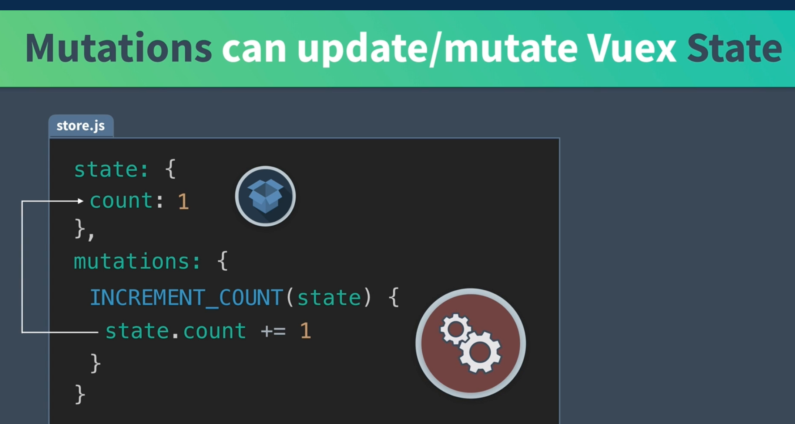
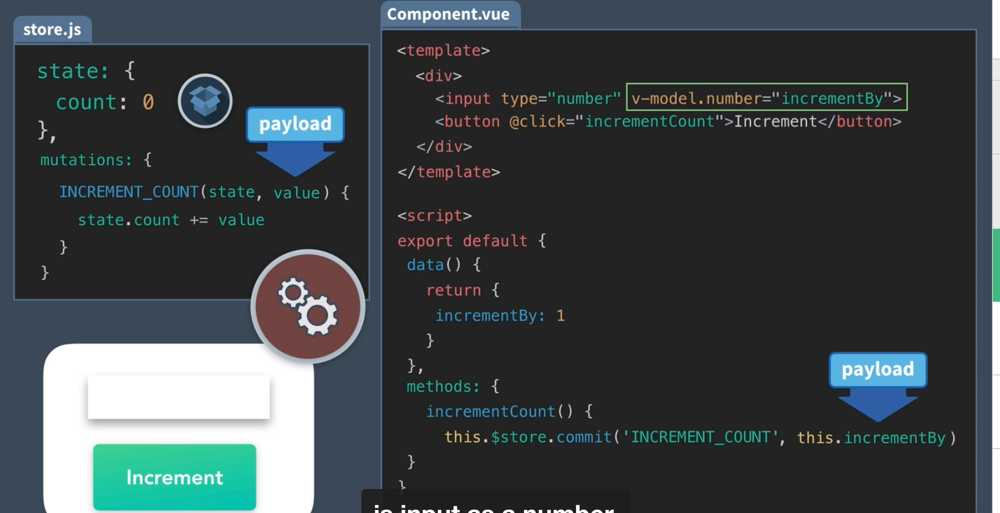
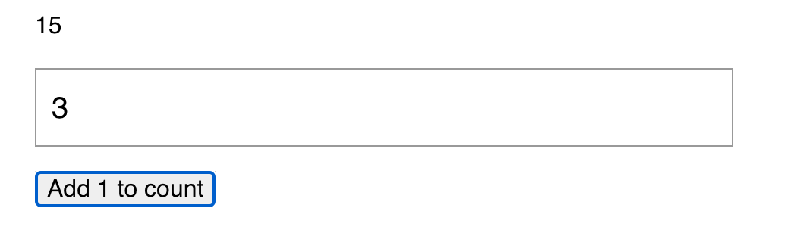
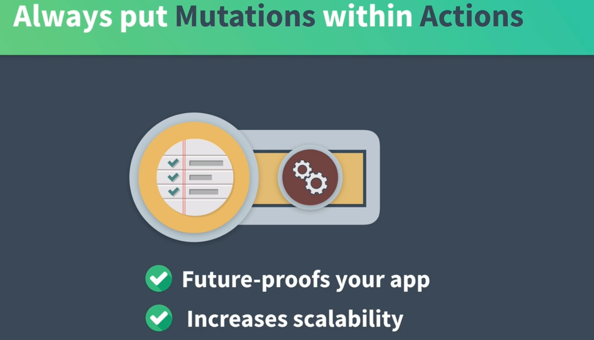
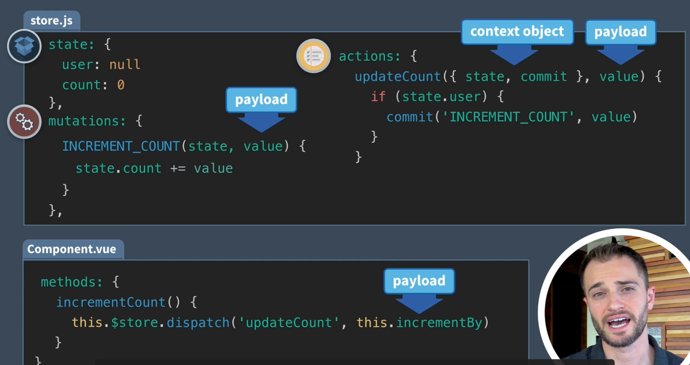
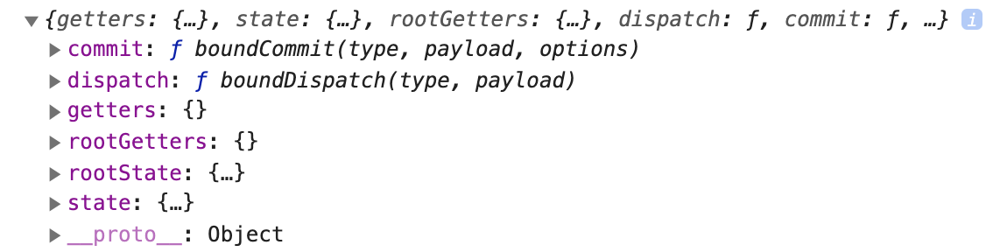

# 03 `mutation` et `action` partie 1

## `mutations` : `commit('MUTATION_NAME')`



Les `mutations` peuvent mettre à jour ou transformer le `state`.

`store.js`

```js
import Vue from "vue";
import Vuex from "vuex";

Vue.use(Vuex);

export default new Vuex.Store({
  state: {
    count: 0,
  },
  mutations: {
    INCREMENT_COUNT(state) {
      state.count += 1;
    },
  },
  actions: {},
  getters: {},
});
```

`Component.vue`

```vue
<template>
  <div>
    <p>{{ $store.state.count }}</p>
    <p><button @click="incrementOne">Add 1 to count</button></p>
  </div>
</template>

<script>
export default {
  methods: {
    incrementOne() {
      this.$store.commit("INCREMENT_COUNT");
    },
  },
};
</script>
```

## Dynamic `mutations` : `commit('MUTATION_NAME', payload)`



On peut passer un paramètre à `commit`.



Dans les `devtools` de `Vue`, il y a un historique des mutations :


## `actions` : `dispatch('actionName', payload)`

Les `mutations` sont synchrones tandis que les `actions` sont asynchrones.

#### On relie `toujours` une `mutation` à une `action`.





On appelle une `mutation` depuis une `action`.

On utilise l'objet `context`.



`dispatch` est utilisé à la place de `commit` dans le composant.

`store.js`

```js
import Vue from "vue";
import Vuex from "vuex";

Vue.use(Vuex);

export default new Vuex.Store({
  state: {
    count: 0,
  },
  mutations: {
    INCREMENT_COUNT(state, value) {
      state.count += value;
    },
  },
  actions: {
    updateCount({ commit }, value) {
      commit("INCREMENT_COUNT", value);
    },
  },
});
```

Dans le composant :

```js
// ...
methods: {
        incrementOne() {
            this.$store.dispatch('updateCount', this.incrementBy)
        },
    },
}
```

## Exemple

On installe `vuejs-datepicker` :

```bash
npm i vuejs-datepicker
```

### `store.js`

```js
import Vue from "vue";
import Vuex from "vuex";
import EventService from "@/services/EventService";

Vue.use(Vuex);

export default new Vuex.Store({
  state: {
    user: {
      id: "abc123",
      name: "Gigi Lamalice",
    },
    categories: [
      /* ... */
    ],
    events: [],
  },
  mutations: {
    ADD_EVENT(state, event) {
      state.events.push(event);
    },
  },
  actions: {
    createEvent({ commit }, event) {
      return EventService.postEvent(event).then(() =>
        commit("ADD_EVENT", event)
      );
    },
  },
  getters: {
    getEventById: (state) => (id) =>
      state.events.find((event) => event.id === id),
  },
});
```

`actions` : `createEvent` prend l'objet `context` et un `event` en paramètre,

appelle `EventService.postEvent`

puis appelle de manière asynchrone une `mutation` : `ADD_EVENT`.

`mutations` : `ADD_EVENT` prend le `state` et un `event` en paramètre, puis ajoute l'`event` à `state.events`.

### `EventService.js`

```js
import axios from "axios";

const apiClient = axios.create({
  baseURL: `http://localhost:3000`,
  withCredentials: false, // This is the default
  headers: {
    Accept: "application/json",
    "Content-Type": "application/json",
  },
});

export default {
  getEvents() {
    return apiClient.get("/events");
  },
  getEvent(id) {
    return apiClient.get("/events/" + id);
  },
  postEvent(event) {
    return apiClient.post("/events", event);
  },
};
```

`postEvent` prend un event et retourne l'appelle asynchrone à l'`API`.

### `EventCreate.vue`

```vue
<template>
  <div>
    <h1>create an Event</h1>

    <form @submit.prevent="createEvent">
      <label>Select a category</label>
      <select v-model="event.category">
        <option v-for="cat in categories" :key="cat">{{ cat }}</option>
      </select>
      <h3>Name & describe your event</h3>
      <div class="field">
        <label>Title</label>
        <input
          v-model="event.title"
          type="text"
          placeholder="Add an event title"
        />
      </div>
      <div class="field">
        <label>Description</label>
        <input
          v-model="event.description"
          type="text"
          placeholder="Add a description"
        />
      </div>
      <h3>Where is your event?</h3>
      <div class="field">
        <label>Location</label>
        <input
          v-model="event.location"
          type="text"
          placeholder="Add a location"
        />
      </div>
      <h3>When is your event?</h3>
      <div class="field">
        <label>Date</label>
        <datepicker v-model="event.date" placeholder="Select a date" />
      </div>
      <div class="field">
        <label>Select a time</label>
        <select v-model="event.time">
          <option v-for="time in times" :key="time">
            {{ time }}
          </option>
        </select>
      </div>
      <input type="submit" class="button -fill-gradient" value="Submit" />
    </form>
  </div>
</template>

<script>
import Datepicker from "vuejs-datepicker";

export default {
  components: {
    Datepicker,
  },
  data() {
    const times = [];
    for (let i = 1; i < 24; i++) {
      times.push(`${i}:00`);
    }
    return {
      times,
      categories: this.$store.state.categories,
      event: this.createFreshEvent(),
    };
  },
  methods: {
    createEvent() {
      this.$store
        .dispatch("createEvent", this.event) // appelle l'action createEvent
        .then(() => {
          // route vers la page de l'event
          this.$router.push({
            name: "event-show",
            params: {
              id: this.event.id,
            },
          });
          // remet le formulaire à zéro (après le routage pour avoir event.id)
          this.event = this.createFreshEvent();
        })
        // gestion des erreurs
        .catch(() => console.log("There was a problem creating your event !!"));
    },
    // crée un event vierge
    createFreshEvent() {
      const user = this.$store.state.user;
      const id = Math.floor(Math.random() * 10000000);

      return {
        id: id,
        user: user,
        category: "",
        organizer: user,
        title: "",
        description: "",
        location: "",
        date: "",
        time: "",
        attendees: [],
      };
    },
  },
};
</script>
<style scoped>
.field {
  margin-bottom: 24px;
}
</style>
```

Appel d'une `action` : `this.$store.dispatch('actionName', payload)`

Routage : `this.$router.push`.

https://router.vuejs.org/fr/guide/essentials/navigation.html

> Navigation programmatique :
>
> En complément du l'utilisation de `<router-link>` pour créer des balises ancres pour la navigation déclarative, nous pouvons le faire de manière programmatique en utilisant les méthodes de l'instance du routeur.
>
> #### [#](https://router.vuejs.org/fr/guide/essentials/navigation.html#router-push-location-oncomplete-onabort)`router.push(location, onComplete?, onAbort?)`
>
> **Note : Dans une instance Vue, vous pouvez accéder à l'instance du routeur via `$router`. Vous pouvez donc appeler `this.$router.push`.**
>
> Pour naviguer vers un URL différent, utilisez `router.push`. Cette méthode ajoute une nouvelle entrée dans la pile de l'historique. Ainsi quand un utilisateur clique sur le bouton retour de son navigateur, il retournera à l'URL précédent.
>
> Cette méthode est appelée en interne quand vous cliquez sur `<router-link>`, donc cliquer sur `<router-link :to="...">` est équivalent à appeler `router.push(...)`.
>
> | Déclarative               | Programmatique     |
> | ------------------------- | ------------------ |
> | `<router-link :to="...">` | `router.push(...)` |
>
> L'argument peut être une chaine de caractère représentant un chemin, ou un objet de description de destination. Des exemples :
>
> ```js
> // chaine de caractère représentant un chemin
> router.push("home");
>
> // objet
> router.push({ path: "home" });
>
> // route nommée
> router.push({ name: "user", params: { userId: 123 } });
>
> // avec une requête « query » résultant de `/register?plan=private`
> router.push({ path: "register", query: { plan: "private" } });
> ```
