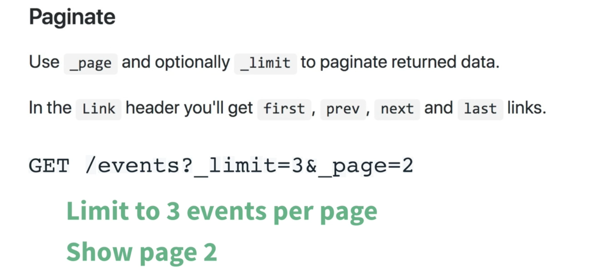
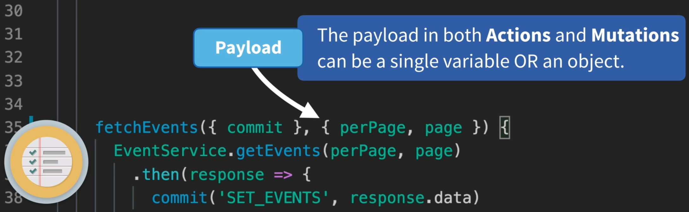
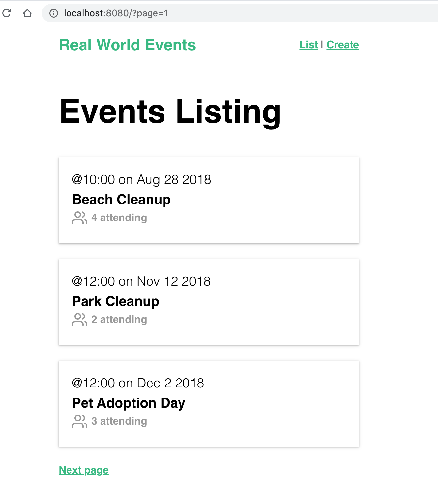
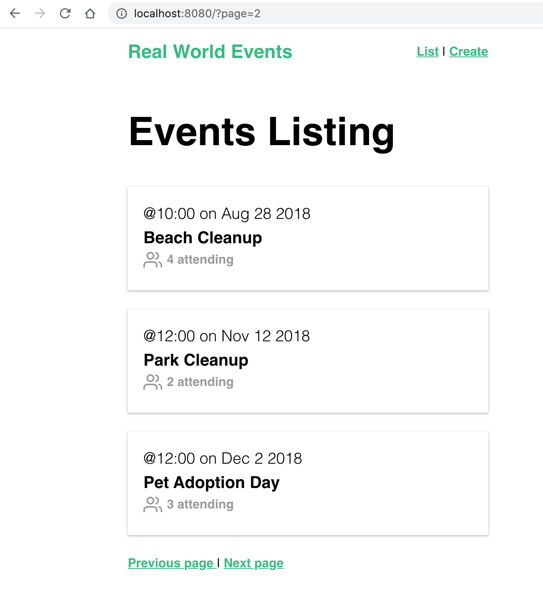
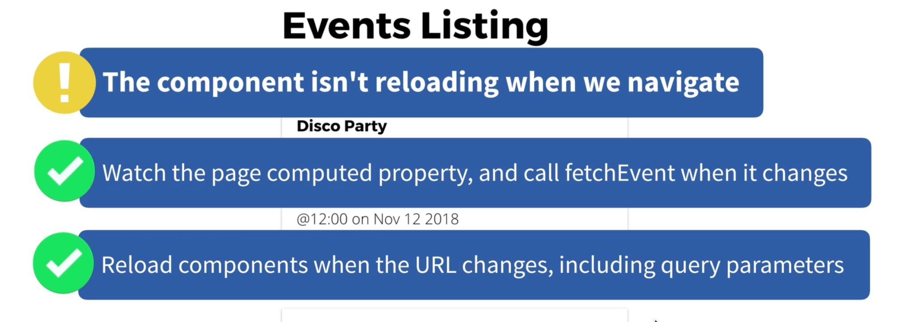

# 04 `Mutations` et `actions` partie 2

## Utilisation de `vuex` dans `EventList`

On n'appelle `EventService` dans le `store` et non plus dans le composant.

`store.js`

```js
import Vue from "vue";
import Vuex from "vuex";
import EventService from "@/services/EventService";

Vue.use(Vuex);

export default new Vuex.Store({
  state: {
    // ...
    events: [],
  },
  mutations: {
    // ...
    SET_EVENTS(state, events) {
      state.events = events;
    },
  },
  actions: {
    // ...
    fetchEvents({ commit }) {
      // ici on appelle EventService
      EventService.getEvents()
        .then((response) => {
          commit("SET_EVENTS", response.data);
        })
        .catch((error) => {
          console.log("There was an error:", error.response);
        });
    },
  },
  // ...
});
```

`EventList.vue`

```vue
<template>
  <div>
    <h1>Events Listing</h1>
    <EventCard v-for="event in events" :key="event.id" :event="event" />
  </div>
</template>

<script>
import EventCard from "@/components/EventCard.vue";
import { mapState } from "vuex";

export default {
  components: {
    EventCard,
  },
  created() {
    this.$store.dispatch("fetchEvents");
  },
  computed: mapState(["events"]),
};
</script>
```

On importe `mapState` pour avoir facilement `events` _mapper_ dans le scope du composant.

Dans le `hook` `created` on utilise maintenant `$store.dispatch` plutôt que d'appeler directement `EventService.js`.


## Pagination

Dans `json-server` on a :



#### `/events?_limit=5&_page=2`



Le `payload` ne peut être qu'une variable simple ou un objet, si on a deux variables, on les empaquette dans un objet.

Dans `store.js`

```js
actions: {
        // ...
        fetchEvents({ commit }, { perPage, page }) {
            EventService.getEvents(perPage, page)
                .then(response => {
                    commit('SET_EVENTS', response.data)
                })
                .catch(error => {
                    console.log('There was an error:', error.response)
                })
        },
    },
```

Ensuite dans `EventService.js`

```js
export default {
    getEvents(perPage, page) {
        return apiClient.get(`/events?_limit=${perPage}&_page=${page}`)
    },
    // ...
```

Dans le composant `EventList.vue`

```vue
<template>
  <div>
    <h1>Events Listing</h1>
    <EventCard v-for="event in events" :key="event.id" :event="event" />
    <template v-if="page > 1">
      <router-link
        :to="{ name: 'event-list', query: { page: page - 1 } }"
        rel="prev"
      >
        Previous page
      </router-link>
      |
    </template>
    <router-link
      :to="{ name: 'event-list', query: { page: page + 1 } }"
      rel="next"
    >
      Next page
    </router-link>
  </div>
</template>

<script>
import EventCard from "@/components/EventCard.vue";
import { mapState } from "vuex";

export default {
  components: {
    EventCard,
  },
  created() {
    // on envoie la page ici, perPage est une constante
    this.$store.dispatch("fetchEvents", {
      perPage: 3,
      page: this.page,
    });
  },
  computed: {
    // on récupère la page avec la requête de la route /?page=3
    page() {
      return parseInt(this.$route.query.page) || 1;
    },
    ...mapState(["events"]),
  },
};
</script>
```

À ce stade on voie que le numéro de page change mais pas le contenu de la page :





`Vuejs` ne recharge pas le composant car on clique sur le même lien, seul le paramètre de requête change.

Deux solutions :



On va utiliser la deuxième solution :

#### On doit modifier `<router-view>` en `<router-view :key="$route.fullPath" />`.

`json-server` renvoie le nombre total d'`events` dans le header, on peut le récupérer pour rendre l'affichage du bouton `next` conditionnel.

Modification dans `store.js`

```js
// ...

export default new Vuex.Store({
  state: {
    eventsCount: 0,
    // ...
  },
  mutations: {
    // ...
    SET_EVENTS_COUNT(state, count) {
      state.eventsCount = count;
    },
  },
  actions: {
    // ...
    fetchEvents({ commit }, { perPage, page }) {
      EventService.getEvents(perPage, page)
        .then((response) => {
          commit("SET_EVENTS", response.data);
          // ici on récupère la valeur du header
          commit("SET_EVENTS_COUNT", response.headers["x-total-count"]);
        })
        .catch((error) => {
          console.log("There was an error:", error.response);
        });
    },
  },
  // ...
});
```

#### `response.headers['x-total-count']`

Dans le composant :

```vue
<template v-if="page * perPage < eventsCount">
  <router-link
    :to="{ name: 'event-list', query: { page: page + 1 } }"
    rel="next"
  >
    Next page
  </router-link>
</template>
```

J'ai aussi mis `perPage` dans les `data` du composant.

## Charger un `event`

Pour ne pas créer une requête `ajax` pour un `event` déjà reçu dans la liste on va utiliser le `getters` :

`store.js`

```js
// ...
export default new Vuex.Store({
  state: {
    // ...
    events: [],
    event: {},
  },
  mutations: {
    // ...
    SET_EVENT(state, event) {
      state.event = event;
    },
  },
  actions: {
    // ...
    // l'objet context possède les getters
    fetchEvent({ commit, getters }, id) {
      // on utilise notre getter
      const event = getters.getEventById(id);

      // si on en a déjà un pas de requête ajax
      if (event) {
        commit("SET_EVENT", event);
      } else {
        EventService.getEvent(id)
          .then((response) => {
            commit("SET_EVENT", response.data);
          })
          .catch((error) => {
            console.log("There was an error:", error.response);
          });
      }
    },
  },
  getters: {
    getEventById: (state) => (id) =>
      state.events.find((event) => event.id === id),
  },
});
```

l'objet `context` peut utiliser les `getters` : `fetchEvent({ commit, getters}, id)`.

`EventShow.vue`

```vue
// ...
<script>
import { mapState } from "vuex";

export default {
  props: ["id"],
  created() {
    this.$store.dispatch("fetchEvent", this.id);
  },
  computed: mapState(["event"]),
};
</script>
```

C'est dans le `hook` `created` que l'on utilise `$store.dispatch`.

On _map_ la valeur de `event` avec `mapState` dans les propriétés calculées `computed`.
