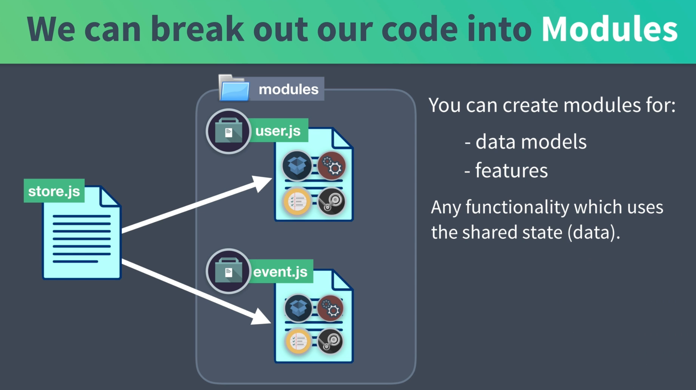
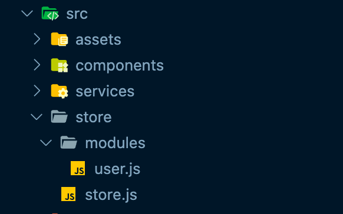
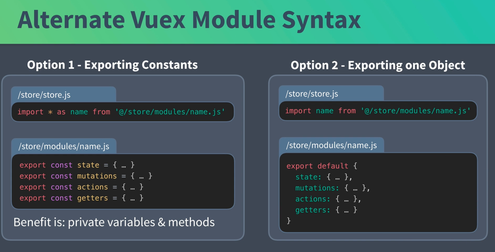
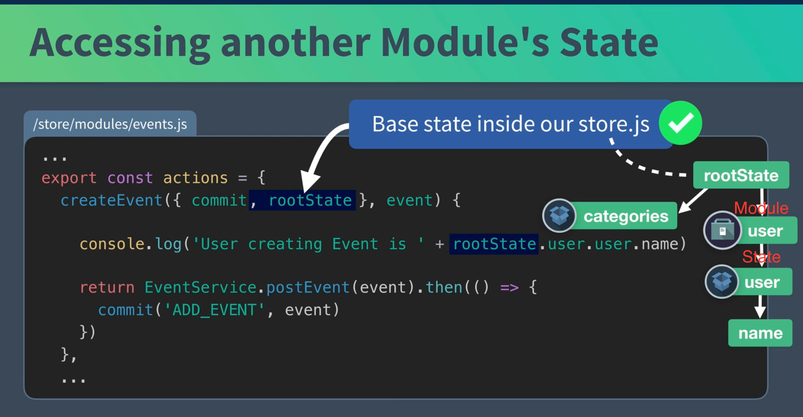
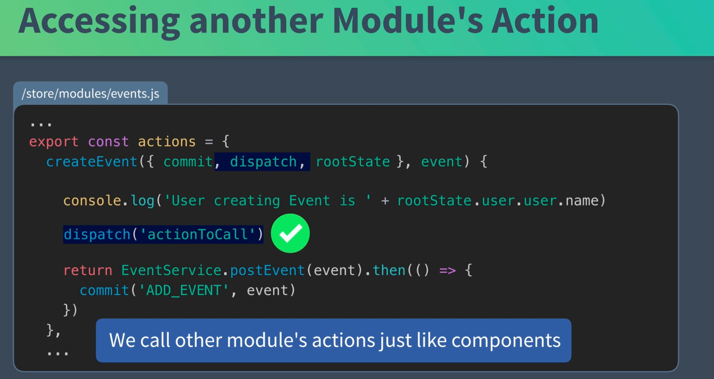
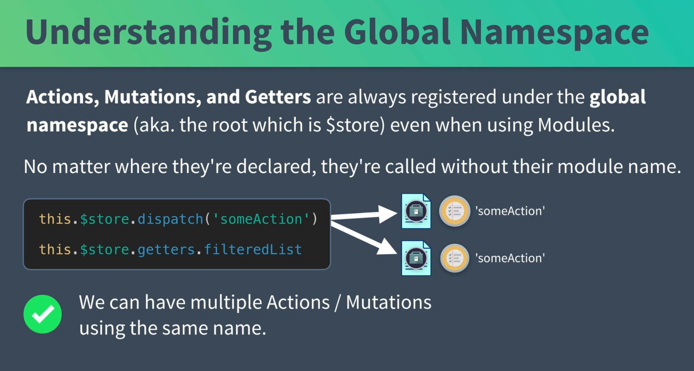
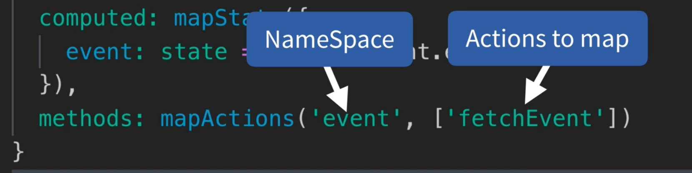
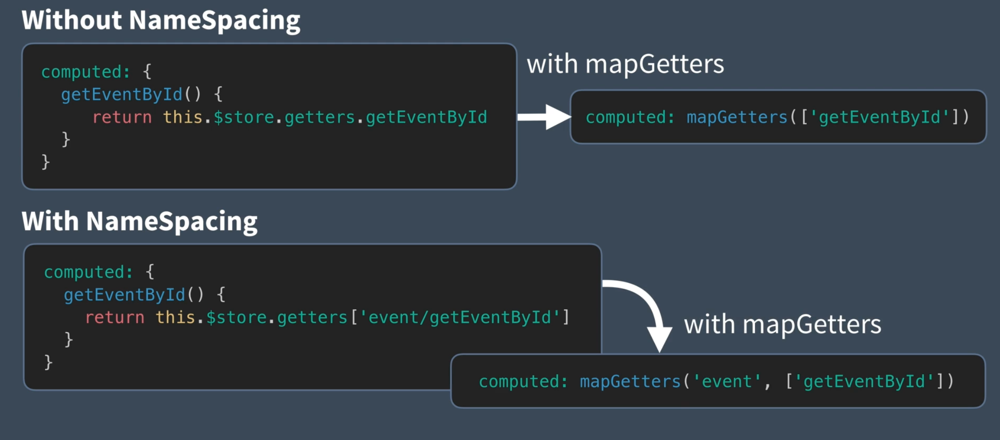
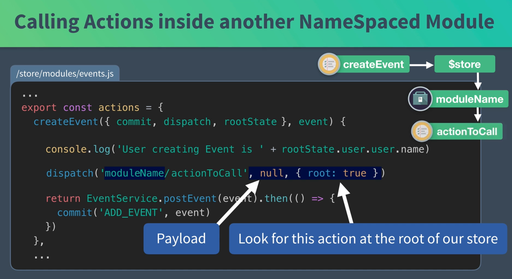

# 05 `Modules`



On peut ré-organiser son code grace aux modules.

## `module` `user`

On crée un dossier `store` dans lequel on met `store.js` et dedans on crée un dossier `modules`:



`user.js` sera le `module` gérant les `user`.

```js
export const state = {
  user: {
    id: "abc123",
    name: "Gigi",
  },
};
```

On l'importe dans notre `store`

```js
import Vue from 'vue'
import Vuex from 'vuex'
import EventService from '@/services/EventService'
import * as user from '@/store/modules/user'

Vue.use(Vuex)

export default new Vuex.Store({
    modules: {
        user,
    },
    // ...
```

Dans le `template` on utilise maintenant :

```vue
<template>
  <div>
    <h1>Events Listing for {{ user.user.name }}</h1>
  </div>
</template>
```

Pour ne pas avoir à écrire `event.event.machin` dans `EventShow`, on va utiliser un objet à la place d'un tableau comme argument de `mapState` :

`EventShow.vue`

```js
import { mapState } from "vuex";

export default {
  props: ["id"],
  created() {
    this.$store.dispatch("fetchEvent", this.id);
  },
  computed: mapState({
    event: (state) => state.event.event,
  }),
};
```

Plus besoin de modifier le `template`.

## Deux syntaxes pour les `modules`



## Communication entre `modules`

Le `state` est limité au `module` lui-même, impossible donc de récupérer le `store` du `user` dans le `module` de l'`event`.

Sauf avec `rootState` :



Le `rootState` a accès aux `modules` et à son propre `state` comme pour `categories`.

### Appeler une `action` d'un autre module



Les `actions` font partie du `namespace` global et peuvent être appelée de n'importe où.

`actions`, `mutations` et `getters` sont toujours enregistrés dans le `global namespace`.

Quelque soit l'endroit où ils sont déclarés, il peuvent être appelés sans le nom de leur `module` :

```js
this.$store.dispatch("someAction");
this.$store.getters.filteredList;
```



Utiliser le même nom pour plusieurs `actions` permet par exemple de lancer tous les logs en même temps.

#### On peut finir avec des collisions de nom !

## `Vuex` `module` namespacing : collision de noms

### `export const namespaced = true`

Dans le fichier `modules/event.js` on ajoute la ligne de code ci-dessus.

```js
import EventService from '@/services/EventService'

export const namespaced = true

export const state = {
    eventsCount: 0,
    events: [],
    // ...
```

Il faut maintenant préfixer les noms de `mutation`, `action` et `getter` en dehors du `module`.

Dans les différents composant on a :

```js
// EventCreate
methods: {
        createEvent() {
            this.$store
                .dispatch('event/createEvent', this.event)

// EventShow
export default {
    props: ['id'],
    created() {
        this.$store.dispatch('event/fetchEvent', this.id)
    },

// EventList
    components: {
        EventCard,
    },
    created() {
        this.$store.dispatch('event/fetchEvents', {
            perPage: this.perPage,
            page: this.page,
        })
```

Cela permet d'éviter les collisions de noms.

## `mapActions`



Exemple dans `EventShow`

```js
import { mapState, mapActions } from "vuex";

export default {
  props: ["id"],
  created() {
    // this.$store.dispatch('event/fetchEvent', this.id) : ligne remplacée
    this.fetchEvent(this.id);
  },
  computed: mapState({
    event: (state) => state.event.event,
  }),
  methods: mapActions("event", ["fetchEvent"]),
};
```

## Syntaxe de `namespacing` avec les `getters`



## Changement dans le `module` `event.js`

Pas de changement avec le `namespacing` car celui-ci ne concerne pas l'intérieur du module.

#### les mutations ne devraient jamais être appelée en dehors de leur propre `module`.


## Appeler une `action` depuis un autre `module` `namespaced`


