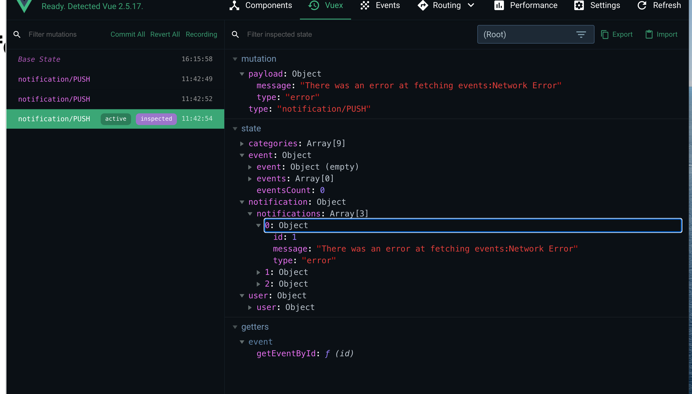
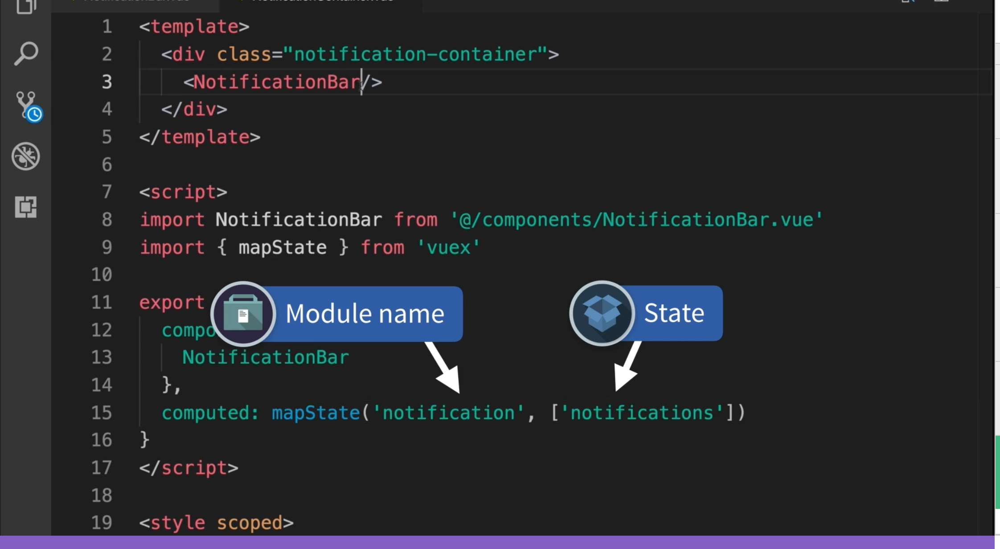
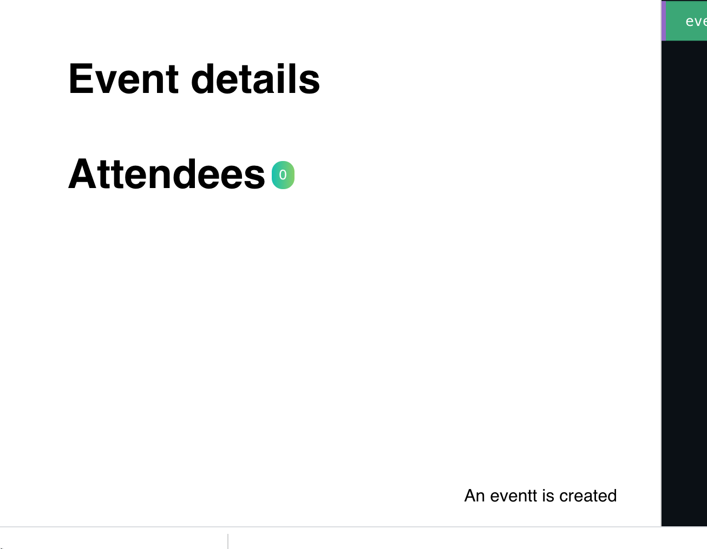
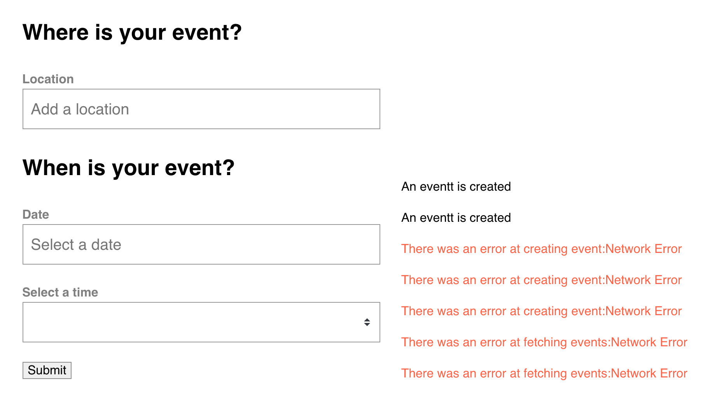

# 06 Notification dse `success` et des `error`

## Création d'un module de `notification` : `error`

`notification.js`

```js
export const namespaced = true;

let nextId = 1;

export const state = {
  notifications: [],
};

export const mutations = {
  PUSH(state, notification) {
    state.notifications.push({
      ...notification,
      id: nextId++,
    });
  },
  DELETE(state, notificationToRemove) {
    state.notifications = state.notifications.filter(
      (notification) => notification.id != notificationToRemove.id
    );
  },
};

export const actions = {
  add({ commit }, notification) {
    commit("PUSH", notification);
  },
  remove({ commit }, notificationToRemove) {
    commit("DELETE", notificationToRemove);
  },
};
```

On va maintenant remplacer les `console.log` dans le `module` `event`

```js
fetchEvents({ commit, dispatch }, { perPage, page }) {
        EventService.getEvents(perPage, page)
            .then(response => {
                commit('SET_EVENTS', response.data)
                commit('SET_EVENTS_COUNT', response.headers['x-total-count'])
            })
            .catch(error => {
                const notification = {
                    type: 'error',
                    message:
                        'There was an error at fetching events:' +
                        error.message,
                }

                dispatch('notification/add', notification, { root: true })
            })
    },
    fetchEvent({ commit, getters, dispatch }, id) {
        const event = getters.getEventById(id)
        if (event) {
            commit('SET_EVENT', event)
        } else {
            EventService.getEvent(id)
                .then(response => {
                    commit('SET_EVENT', response.data)
                })
                .catch(error => {
                    const notification = {
                        type: 'error',
                        message:
                            'There was an error at fetching event:' +
                            error.message,
                    }

                    dispatch('notification/add', notification, { root: true })
                })
        }
    },
```

On récupère `dispatch` du `context` et on a la notation :

#### `dispatch('moduleName/actionName', payload, { root: true })`



## Notification : `success`

Dans `event.js` pour la création d'`event` :

```js
export const actions = {
    createEvent({ commit, dispatch }, event) {
        return EventService.postEvent(event)
            .then(() => {
                commit('ADD_EVENT', event)
                const notification = {
                    type: 'success',
                    message: 'An eventt is created',
                }

                dispatch('notification/add', notification, { root: true })
            })
            .catch(error => {
                const notification = {
                    type: 'error',
                    message:
                        'There was an error at creating event:' + error.message,
                }

                dispatch('notification/add', notification, { root: true })
            	// je renvoie l'erreur au composant
            	throw error
            })
    },
```

## Afficher les `notifications`

`NotificationBar.vue`

```vue
<template>
  <div class="notification-bar" :class="notificationType">
    <p>{{ notification.message }}</p>
  </div>
</template>

<script>
export default {
  props: {
    notification: {
      type: Object,
      required: true,
    },
  },
  computed: {
    notificationType() {
      return `-text-${this.notification.type}`;
    },
  },
};
</script>

<style scoped>
.notification-bar {
  margin: 1em 0 1em;
}
</style>
```

On peut utiliser `class` et `:class` en même temps.

Les `props` on besoin d'un `type` et d'un `default` ou `required`.

`NotificationContainer.vue`

```vue
<template>
  <div class="notification-container">
    <NotificationBar
      v-for="notification in notifications"
      :key="notification.id"
      :notification="notification"
    />
  </div>
</template>

<script>
import NotificationBar from "@/components/NotificationBar.vue";
import { mapState } from "vuex";

export default {
  components: {
    NotificationBar,
  },
  computed: mapState("notification", ["notifications"]),
};
</script>

<style scoped>
.notification-container {
  position: fixed;
  bottom: 0;
  right: 0;
  padding-right: 40px;
}
</style>
```

`mapState` est utilisé avec `computed`.

#### `mapState('moduleName',['stateElement'])`





On voit en bas la `notification`.



## Supprimer une `notification`

Quand supprimer les notifications ?

Avec un `timer` !

On utilise `mapActions` pour obtenir la méthode `remove` :

Dans `NotificationBar.vue`

```vue
<template>
  <div class="notification-bar" :class="notificationType">
    <p>{{ notification.message }}</p>
  </div>
</template>

<script>
import { mapActions } from "vuex";
export default {
  props: {
    notification: {
      type: Object,
      required: true,
    },
  },
  data() {
    return {
      timeout: null,
    };
  },
  mounted() {
    this.timeout = setTimeout(() => this.remove(this.notification), 5000);
  },
  beforeDestroy() {
    clearTimeout(this.timeout);
  },
  computed: {
    notificationType() {
      return `-text-${this.notification.type}`;
    },
  },
  methods: mapActions("notification", ["remove"]),
};
</script>
```

On enregistre dans `data` l'`id` du timer dans `timeout`.

On fait cela pour éviter les fuites de mémoire si on implémentait aussi dans le futur une croix de fermeture.

Car le composant `NotificationBar` serait détruit mais sa référence persisterai dans la fonction du timer.

Le garbage collector ne pourrait plus supprimer l'objet en mémoire.

On utilise deux `hook` :

- `mounted` pour lancer le timer dès que le composant apparait dans le `DOM`
- `beforeDestroy` pour être sûr de finir le timer avant que le composant soit détruit (`memory leak`)
