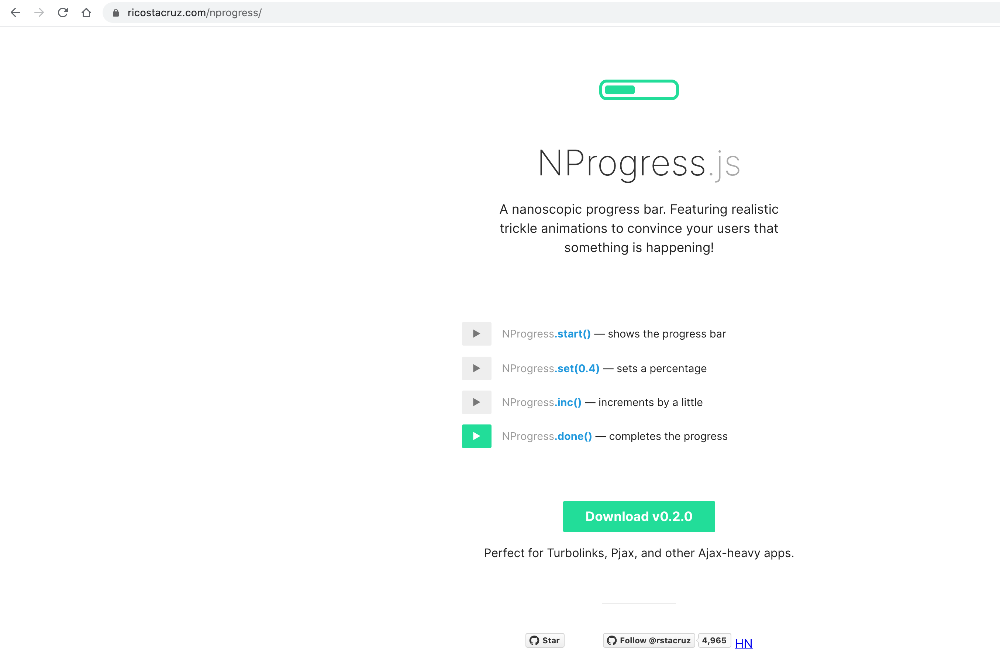
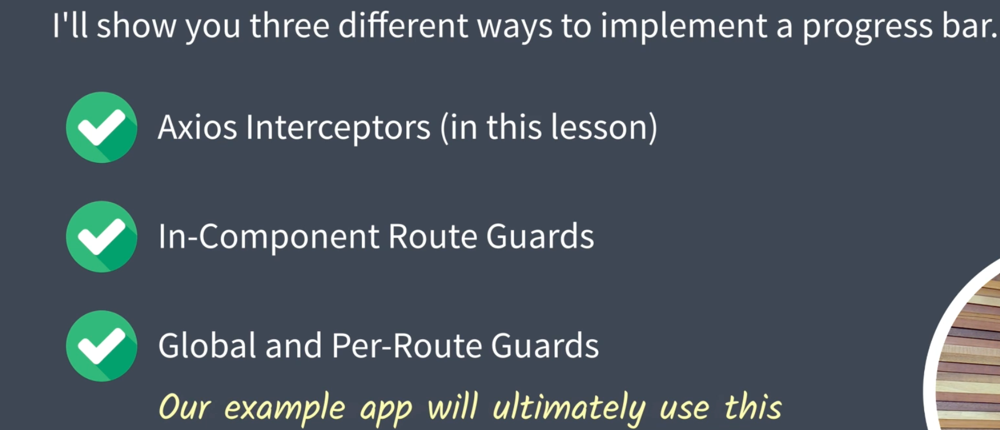
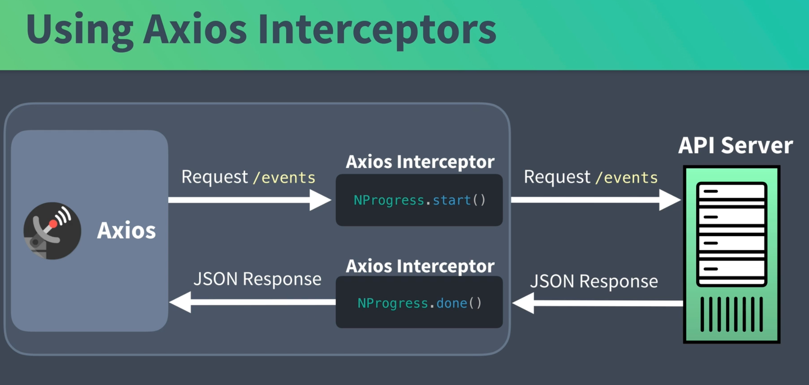
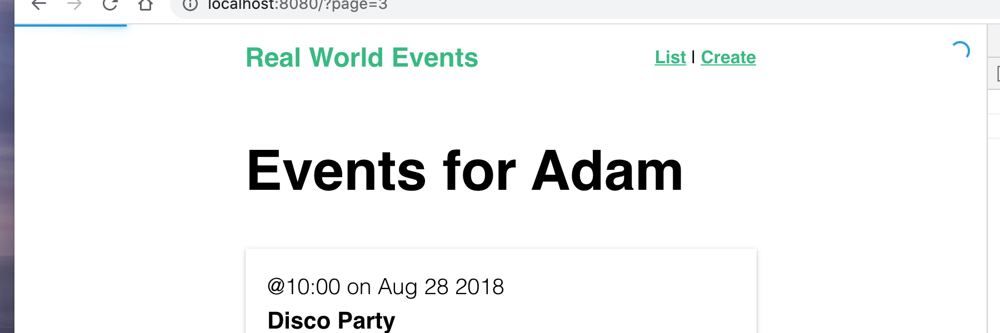
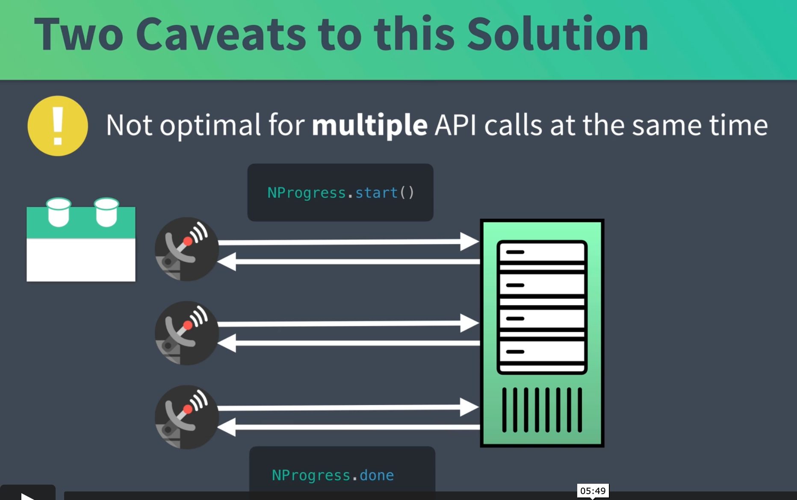

# 01 `Axios` interceptors

## Progress Bar `NProgress`

Utilisation de la librairie `NProgress`.

```bash
npm i nprogress
```



Dans `main.js` on importe les `css` de `nprogress`

```js
// ...
import "nprogress/nprogress.css";

// ...
```

## Implémentation

Il existe trois façons d'implémenter la progress bar :



## utiliser `Axios` interceptors



Dans `event.js`

```js
import axios from "axios";
import NProgress from "nprogress"; // on importe NProgress

const apiClient = axios.create({
  baseURL: `http://localhost:3000`,
  withCredentials: false, // This is the default
  headers: {
    Accept: "application/json",
    "Content-Type": "application/json",
  },
});

apiClient.interceptors.request.use((config) => {
  NProgress.start();
  return config;
});

apiClient.interceptors.response.use((response) => {
  NProgress.done();
  return response;
});

export default {
  getEvents(perPage, page) {
    return apiClient.get("/events?_limit=" + perPage + "&_page=" + page);
  },
  getEvent(id) {
    return apiClient.get("/events/" + id);
  },
  postEvent(event) {
    return apiClient.post("/events", event);
  },
};
```

`axios.interceptors.request.use` et `axios.interceptors.response.use` s'utilise comme des `middleware`.

Du coup il faut retourner soit la `config` soit la `response`.

On utilise simplement `NProgresse.start()` et `NProgress.done()`.

Pour simuler une attente réseau on a `-d` qui ajoute un délai (en ms) à la réponse de `json-server`

```bash
json-server -d 2500 db.json
```



On voit la barre et le loader circulaire en haut.

### Problèmes

Cette solution n'est pas optimale si il y a plusieurs `call` à l'`API`.



Le `template` est chargé avant que les données ne soit arrivées.

## Intérêts des `interceptors`

Les `interceptors` restent intéressant pour

- ajouter les token d'authorisation à la requête
- formatter les données de la réponse avant de les transmettre à l'application
- pour intercepter les réponse 401 non autorisé
