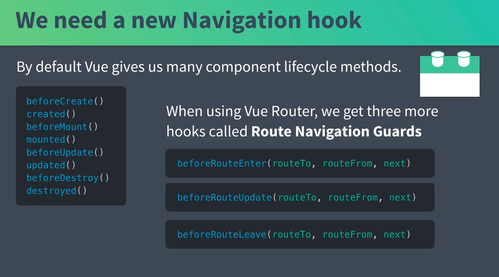
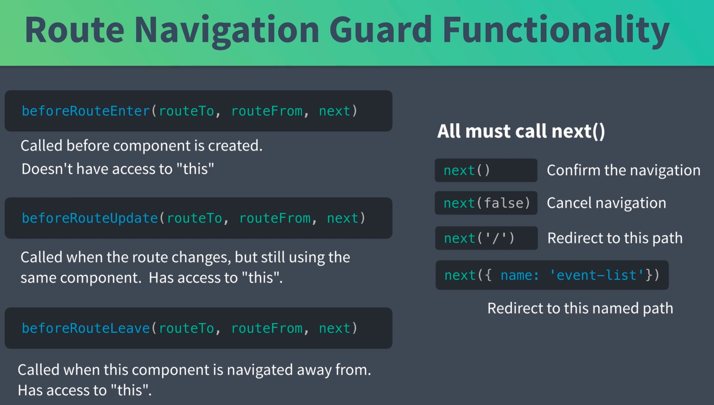
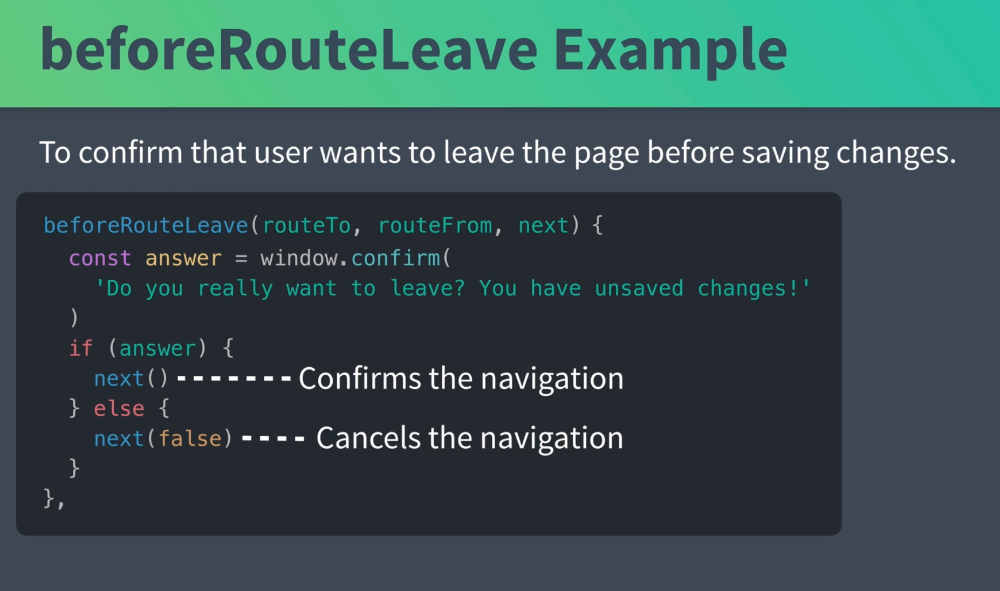

# 02 Route guard

## Navigation `hook`



Avec `Vue router` on a 3 `hook` en plus disponible :

- `beforeRouteEnter` pas de composant, pas d'accès à `this`
- `beforeRouteUpdate` le composant reste le même, par exemple lors d'une pagination `this` est disponible
- `beforeRouteLeave` `this` est disponible

`next` est une fonction a exécuté.



### Exemple



`next()` confirme la navigation

`next(false)` annule la navigation

## Utilisation de `beforeRouteEnter` pour la `NProgress bar`

Dans `EventShow.vue`

```vue
<script>
import { mapState } from "vuex";
import NProgress from "nprogress";
import store from "@/store/store";

export default {
  props: ["id"],
  beforeRouteEnter(routeTo, routeFrom, next) {
    NProgress.start();
    console.log(store);
    // il faut corriger fetchEvent pour qu'elle renvoie une promesse
    store.dispatch("event/fetchEvent", routeTo.params.id).then(() => {
      NProgress.done();
      next();
    });
  },
  //   created() {
  //     this.fetchEvent(this.id)
  //   },
  computed: mapState({
    event: (state) => state.event.event,
  }),
  // methods: mapActions('event', ['fetchEvent'])
};
</script>
```

Comme `this` n'est pas encore disponible, on ne peut pas avoir `this.$store`, il faut donc importer le `store`.

`next()` permet de continuer vers la route.

Ici le `template` en même temps que la `progress bar`, c'est qu'il faut modifier `fetchEvent` pour renvoyer une promesse :

`event.js`

```js
// ...
fetchEvent({ commit, getters, dispatch }, id) {
    var event = getters.getEventById(id)

    if (event) {
      commit('SET_EVENT', event)
    } else {
      return EventService.getEvent(id) // ici on ajooute return
        .then(response => {
          commit('SET_EVENT', response.data)
        })
        .catch(error => {
          const notification = {
            type: 'error',
            message: 'There was a problem fetching event: ' + error.message
          }
          dispatch('notification/add', notification, { root: true })
        })
    }
```
