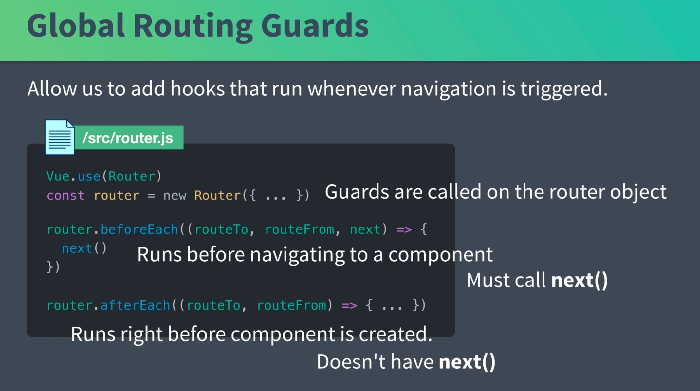
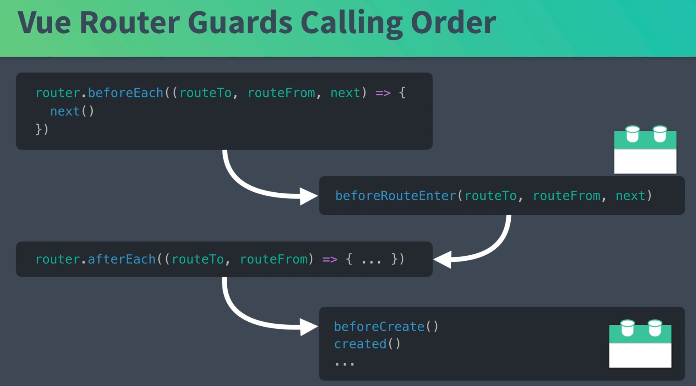
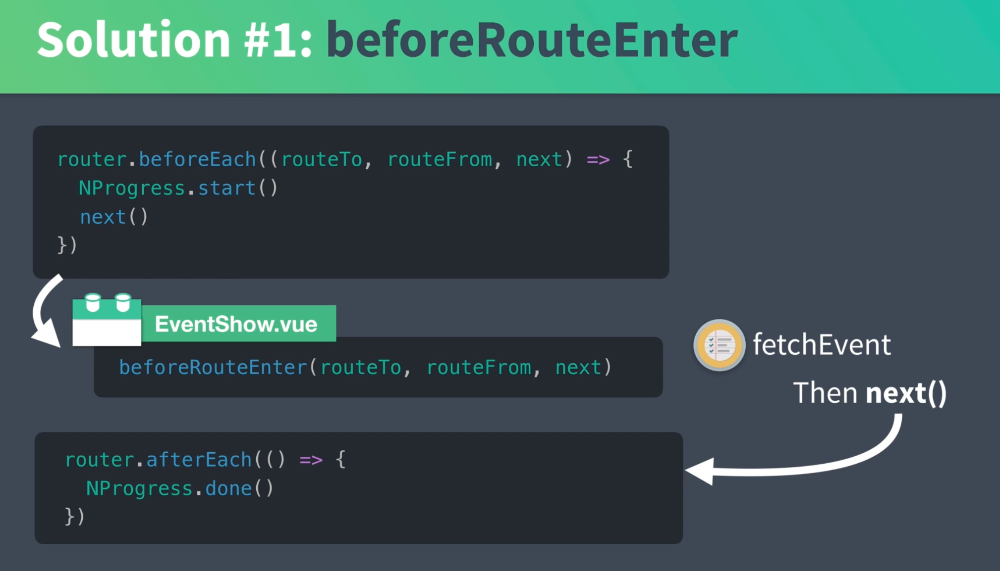
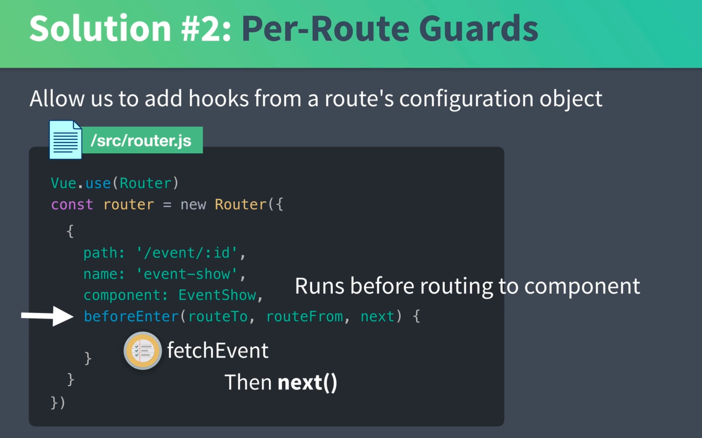

# 03 `global` et `per-route` `guard`

## `Global`



On a deux `hook` en plus avec l'objet `router` :

- `beforeEach`
- `afterEach`

Ces `hook` existe pour toutes les routes.

En paramètre on retrouve `routeTo` `routeFrom` pour les deux `hook` et `next` seulement pour le premier `hook`.

## Ordre d'appelle des `hook`



## Modification de `route.js`

```js
import Vue from "vue";
import Router from "vue-router";
import EventCreate from "./views/EventCreate.vue";
import EventList from "./views/EventList.vue";
import EventShow from "./views/EventShow.vue";
import NProgress from "nprogress"; // on importe la progress bar ici

Vue.use(Router);

const router = new Router({
  mode: "history",
  routes: [
    {
      path: "/",
      name: "event-list",
      component: EventList,
    },
    {
      path: "/event/create",
      name: "event-create",
      component: EventCreate,
    },
    {
      path: "/event/:id",
      name: "event-show",
      component: EventShow,
      props: true,
    },
  ],
});

router.beforeEach((routeTo, routeFrom, next) => {
  NProgress.start();

  next();
});

router.afterEach((routeTo, routeFrom) => {
  NProgress.done();
});

export default router;
```


La `progress bar` termine avant que les données ne soient arrivées.

Il faudrait faire le `call AJAX` entre les deux `hook`.

### Deux solutions

On peut faire ça dans le `hook` `beforeRouteEnter` :



Ou bien utiliser les `Per-Route Guard`.

## `Per-Route Guard`



Dans le `router` on peut ajouter des `guard` comme `beforeEnter`.


### Implémentation. dans `router.js`

```js
import Vue from "vue";
import Router from "vue-router";
import EventCreate from "./views/EventCreate.vue";
import EventList from "./views/EventList.vue";
import EventShow from "./views/EventShow.vue";
import NProgress from "nprogress";
import store from "@/store/store";

Vue.use(Router);

const router = new Router({
  mode: "history",
  routes: [
    // ...
    {
      path: "/event/:id",
      name: "event-show",
      component: EventShow,
      props: true,
      beforeEnter(routeTo, routeFrom, next) {
        store.dispatch("event/fetchEvent", routeTo.params.id).then(() => {
          NProgress.done();
          next();
        });
      },
    },
  ],
});

router.beforeEach((routeTo, routeFrom, next) => {
  NProgress.start();

  next();
});

router.afterEach((routeTo, routeFrom) => {
  //   NProgress.done()
});

export default router;
```

On doit importer `store` pour utiliser `dispatch('event/fetchEvent', id)`.

On retrouve l'`id` avec `routeTo.params.id`.

Il faut que `fetchEvent` retourne une promesse :

```js
fetchEvent({ commit, getters, dispatch }, id) {
    var event = getters.getEventById(id)

    if (event) {
      commit('SET_EVENT', event)
    } else {
        // ici ajout de return
      return EventService.getEvent(id)
        .then(response => {
          commit('SET_EVENT', response.data)
        })
        .catch(error => {
          const notification = {
            type: 'error',
            message: 'There was a problem fetching event: ' + error.message
          }
          dispatch('notification/add', notification, { root: true })
        })
    }
```

## défaire la dépendance de `EventShow` à `Vuex`

On retire toutes les dépendances à `Vuex` dans `EventShow.vue` :

```vue
<script>
export default {
  props: {
    event: {
      type: Object,
      required: true,
    },
  },
};
</script>
```

au lieu de

```vue
<script>
import { mapState /* , mapActions */ } from 'vuex'

export default {
  props: {['id']},
  //   created() {
  //     this.fetchEvent(this.id)
  //   },
  computed: mapState({
    event: state => state.event.event
  })
  //   methods: mapActions('event', ['fetchEvent'])
}
</script>
```

Dans `router.js` on va récupérer notre `event` et le passer comme propriété :

```js
// ...
const router = new Router({
  mode: "history",
  routes: [
    // ...
    {
      path: "/event/:id",
      name: "event-show",
      component: EventShow,
      props: true,
      beforeEnter(routeTo, routeFrom, next) {
        store.dispatch("event/fetchEvent", routeTo.params.id).then((event) => {
          // ici on passe l'event aux params
          routeTo.params.event = event;
          next();
        });
      },
    },
  ],
});

router.beforeEach((routeTo, routeFrom, next) => {
  NProgress.start();
  next();
});

router.afterEach((routeTo, routeFrom) => {
  NProgress.done();
});

export default router;
```

On passe l'`event` aux paramètres de la route, comme `props: true` , les paramètres sont transformés en propriétés.

dans `event.js` on doit modifier `fetchEvent` pour renvoyer un `event`:

```js
fetchEvent({ commit, getters, dispatch }, id) {
    var event = getters.getEventById(id)

    if (event) {
      commit('SET_EVENT', event)
        // On le renvoie ici
      return event
    } else {
      return EventService.getEvent(id)
        .then(response => {
          commit('SET_EVENT', response.data)
          // et là
          return response.data
        })
        .catch(error => {
          const notification = {
            type: 'error',
            message: 'There was a problem fetching event: ' + error.message
          }
          dispatch('notification/add', notification, { root: true })
        })
    }
```
