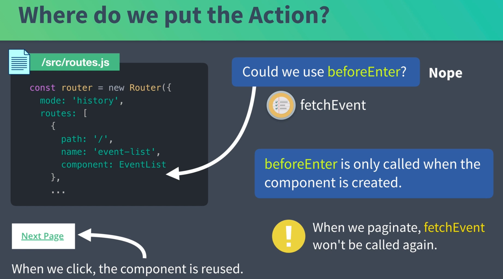
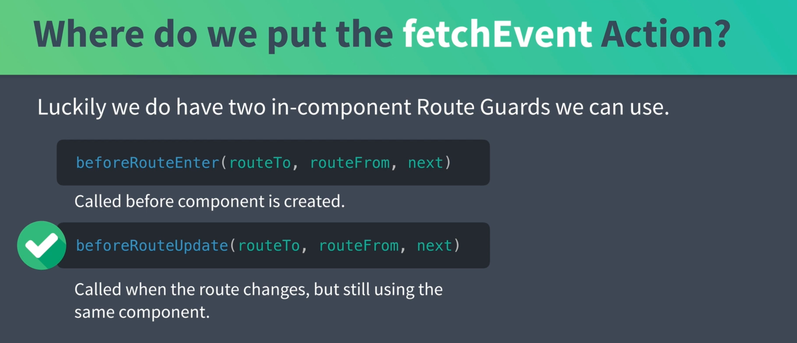

# 04 Compléments aux `Route guard`

Si on veut utiliser `beforeEnter` pour notre `view` `EventList`, cela ne fonctionne pas car on reste sur la même `url`.

Seul le paramètre de requête `page` change.



Le composant n'est pas rechargé et la liste reste la même de page en page (`fetchEvents` n'est plus appelé).



On a deux `route guard` dans notre composant.

`beforeRouteUpdate` est appelé quand la route change mais utilise le même composant, comme avec la pagination.

On peut utiliser notre `fetchEvents` à cet endroit et dans `beforeRouteEnter` aussi bien sûr.

`EventList.vue`

```vue
<script>
import EventCard from "@/components/EventCard.vue";
import { mapState } from "vuex";
import store from "@/store/store";

function getPageEvent(routeTo, next) {
  const currentPage = parseInt(routeTo.query.page) || 1;
  store.dispatch("event/fetchEvents", { page: currentPage }).then(() => {
    routeTo.params.page = currentPage;
    next();
  });
}

export default {
  props: {
    page: {
      type: Number,
      required: true,
    },
  },
  components: {
    EventCard,
  },
  beforeRouteEnter(routeTo, routeFrom, next) {
    getPageEvent(routeTo, next);
  },
  beforeRouteUpdate(routeTo, routeFrom, next) {
    getPageEvent(routeTo, next);
  },
  computed: {
    ...mapState(["event", "user"]),
    hasNextPage() {
      return this.event.eventsTotal > this.page * this.event.perPage;
    },
  },
};
</script>
```

On importe `store` car on factorise le code à l'extérieur de notre objet-composant.

`fetchEvents` doit retourner une promesse.

Il faut aussi mettre `props: true` dans le `router`:

```js
// ...
const router = new Router({
  mode: 'history',
  routes: [
    {
      path: '/',
      name: 'event-list',
      component: EventList,
      props: true
    },
```


Bientôt disponible : `beforeResolve`.

## Bonus pour `EventCreate.vue`

```js
// ...
methods: {
    createEvent() {
      NProgress.start()
      this.$store
        .dispatch('event/createEvent', this.event)
        .then(() => {
          this.$router.push({
            name: 'event-show',
            params: { id: this.event.id }
          })
          this.event = this.createFreshEventObject()
        })
        .catch(() => {
          NProgress.done()
        })
    },
```

Il suffit de commencer la `Progress Bar` au début et de l'arrêter en cas de problème.
