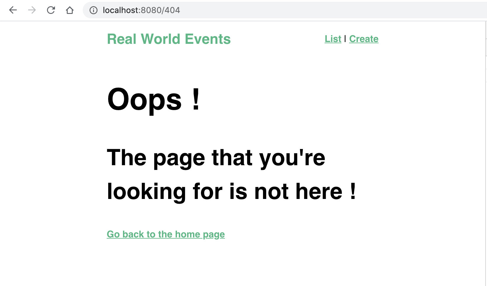
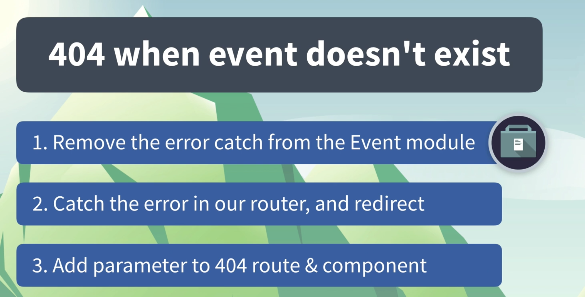
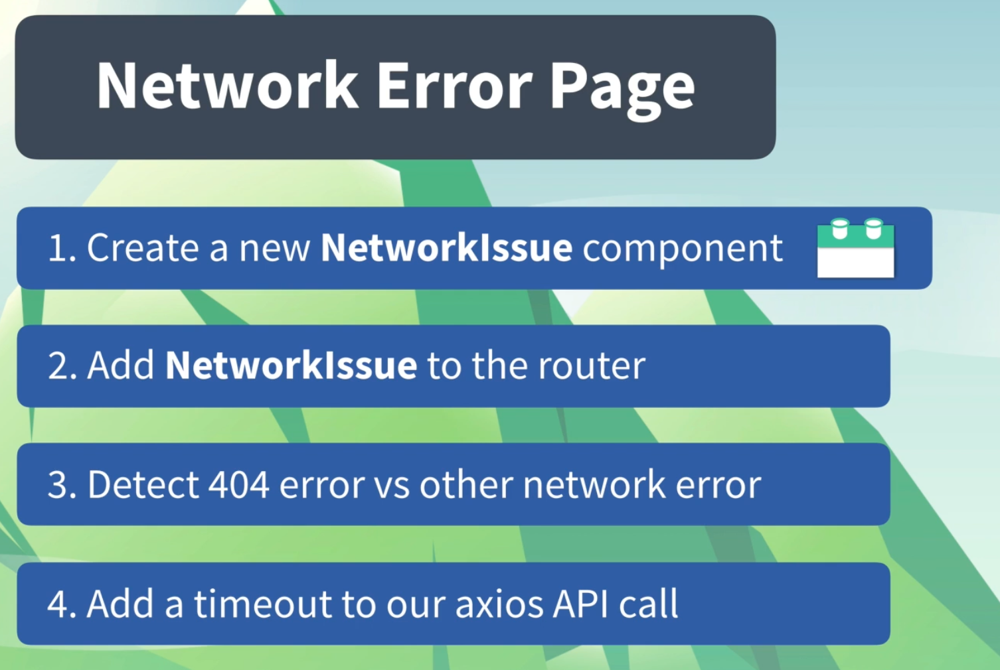
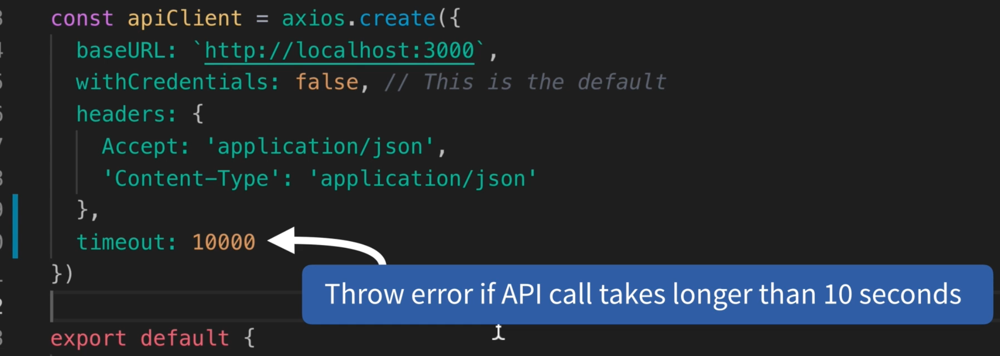
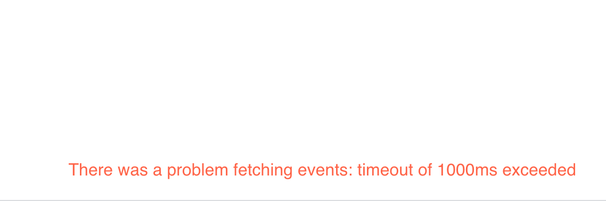
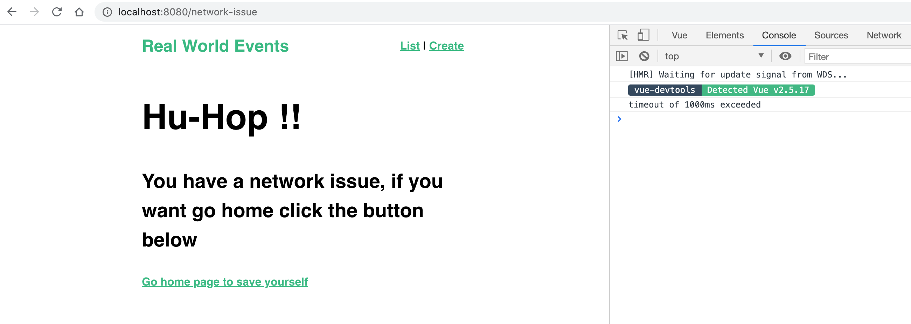

# 05 Gestion des erreurs

## Page `404`

On crée une vue `NotFound.vue`

```vue
<template>
  <div>
    <h1>Oops !</h1>
    <h2>The page that you're looking for is not here !</h2>
    <router-link :to="{ name: 'event-list' }"
      >Go back to the home page</router-link
    >
  </div>
</template>
```

On défini les routes dans `router.js`

```js
// ...
},
    {
      path: '/404',
      name: '404',
      component: NotFound
    },
    {
      path: '*',
      redirect: { name: '404' }
    }
  ]
})
```

`path: '*'` tous les chemins



Si maintenant on essaye d'avoir un `event` avec une `id` fausse :


On obtient en bas une notification et une page blanche.



Voici le `router` modifié :

```js
// ...
    {
      path: '/event/:id',
      name: 'event-show',
      component: EventShow,
      props: true,
      beforeEnter(routeTo, routeFrom, next) {
        store
          .dispatch('event/fetchEvent', routeTo.params.id)
          .then(event => {
            routeTo.params.event = event
            next()
          })
          .catch(() => next({ name: '404', params: { ressource: 'event' } }))
      }
    },
    {
      path: '/404',
      name: '404',
      beforeEnter(routeTo, routeFrom, next) {
        if (!routeTo.params.ressource) {
          routeTo.params.ressource = 'not-found-404'
        }
        next()
      },
      component: NotFound,
      props: true
    },
    {
      path: '*',
      redirect: { name: '404', params: { ressource: 'page' } }
    }
  ]
})
// ...
```

On gère l'erreur (le `catch`) dans le `router` afin de pouvoir rediriger vers la page `404`.

On passe le nom de la ressource en `params`.

On utilise `beforeEnter` pour passer la ressource `not-found-404` à la page `404` lorsqu'elle se recharge.

## gérer les erreur réseau : `network error`



`NetworkIssue.vue`

```vue
<template>
  <div>
    <h1>Hu-Hop !!</h1>
    <h3>
      You have a network issue, if you want go home click the button below
    </h3>
    <router-link :to="{ name: 'event-list' }"
      >Go home page to save yourself</router-link
    >
  </div>
</template>
```

Ajouter un timeout à `axios` dans `EventService.js`



```js
const apiClient = axios.create({
  baseURL: `http://localhost:3000`,
  withCredentials: false, // This is the default
  headers: {
    Accept: "application/json",
    "Content-Type": "application/json",
  },
  timeout: 1000, // 1s pour les tests
});
```

Permet de stopper les appels en cas de latence du réseau.

On reçoit une notification.

Modification dans `router.js`

```js
  {
      path: '/event/:id',
      name: 'event-show',
      component: EventShow,
      props: true,
      beforeEnter(routeTo, routeFrom, next) {
        store
          .dispatch('event/fetchEvent', routeTo.params.id)
          .then(event => {
            routeTo.params.event = event
            next()
          })
          .catch(error => {
            console.log(error.message)
            if (error.response && error.response.status == 404) {
              next({ name: '404', params: { ressource: 'event' } })
            } else {
              next({ name: 'network-issue' })
            }
          })
      }
    },
```


