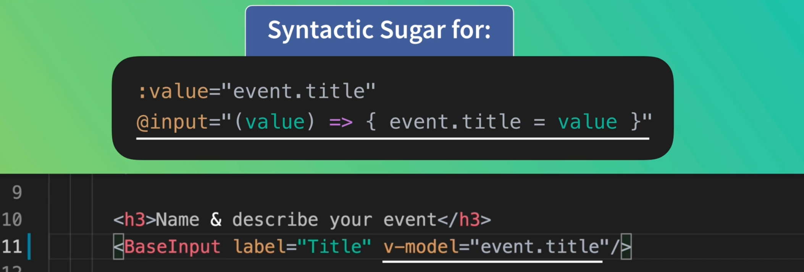
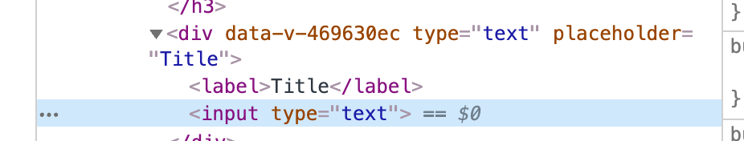
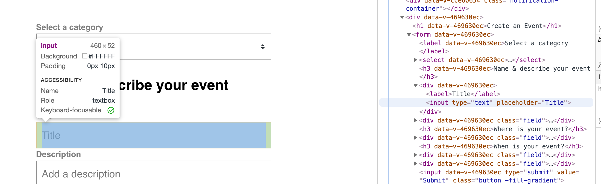

# 06 `BaseInput`

Les composant commençant par `Base` sont automatiquement enregistrés comme `global`.

## Création du composant

`BaseInput.vue`

```vue
<template>
  <div>
    <label v-if="label">{{ label }}</label>
    <input type="text" :value="value" @input="updateValue" />
  </div>
</template>

<script>
export default {
  props: {
    label: {
      type: String,
      default: ''
    }
      value: [String, Number]
  },
  methods: {
    updateValue(event) {
      this.$emit('input', event.target.value)
    }
  }
}
</script>
```

On écoute l'événement `@input` et on `$emit` sa valeur à l'événement `@input` du parent.

Dans le parent (ici `EventCreate.vue`)

```html
<h3>Name & describe your event</h3>
<BaseInput label="Title" v-model="event.title" />
```

`v-model` est un sucre syntaxique pour `@input` et `:value` :



## Héritage des attributs

Si on ajoute les attributs `type` et `placeholder` sur le composant :

```html
<h3>Name & describe your event</h3>
<BaseInput
  class="field"
  label="Title"
  v-model="event.title"
  type="text"
  placeholder="Title"
/>
```

Cela sera traduit dans le `DOM` comme ça :



On doit configurer les attributs hérités dans le composant :

```vue
<template>
  <div>
    <label v-if="label">{{ label }}</label>
    <input type="text" :value="value" @input="updateValue" v-bind="$attrs" />
  </div>
</template>

<script>
export default {
  inheritAttrs: false,
  props: {
    label: {
      type: String,
    // ...
</script>
```

On met `inheritAttrs` à `false` et dans le `template`, on ajoute `v-bind="$atttrs"`.



On voit que les attributs `html` sont bien appliqués à `input`.

La `class` continue d'être associée à `div`.
