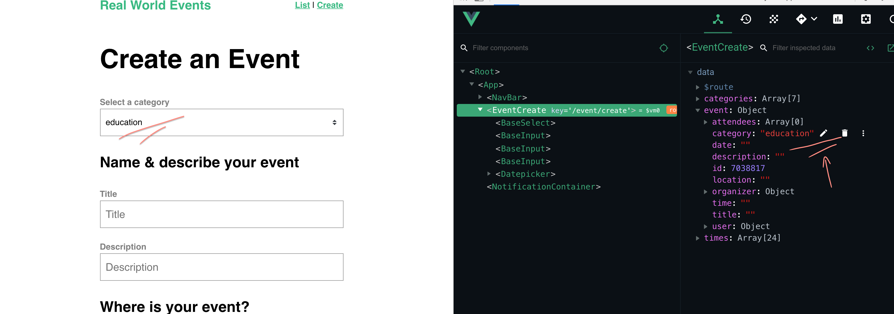
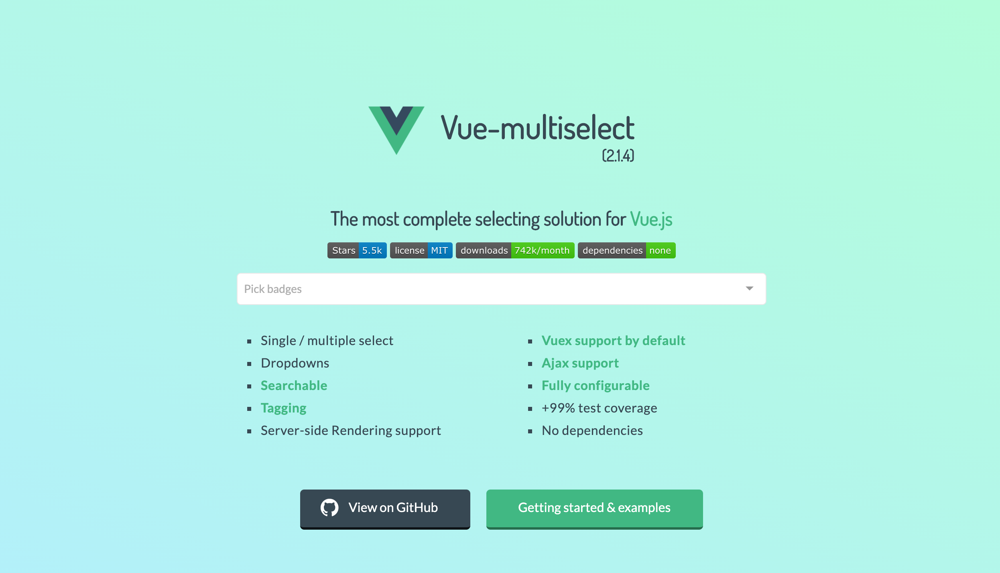
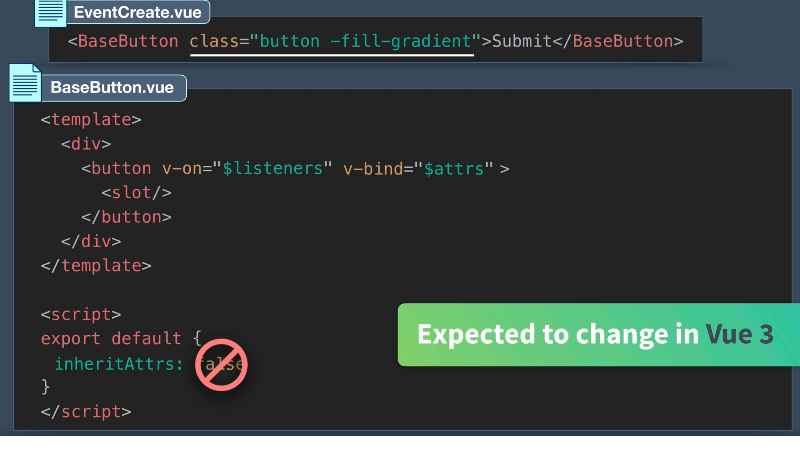
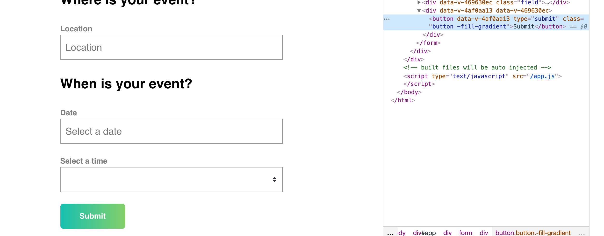

# 07 Création du composant `BaseSelect`

# et `BaseButton`

Les composants commençant par `Base` sont injectés automatiquement dans le `main.js`, pas besoin de les importer manuellement.

Ce sont des composants globaux.

https://fr.vuejs.org/v2/guide/forms.html

> `v-model` utilise en interne différentes propriétés et émetteurs d’évènement pour différents éléments de saisie :
>
> - Les éléments `text` et `textarea` utilisent la propriété `value` et évènement `input`;
> - Les éléments `checkboxes` et `radiobuttons` utilisent la propriété `checked` et l’évènement `change`;
> - Les éléments `select` utilisent `value` comme une prop et `change` comme un évènement.

## Composant de base

`BaseSelect.vue`

```vue
<template>
  <div>
    <label v-if="label">{{ label }}</label>
    <select @change="updateValue" :value="value">
      <option v-for="option in options" :key="option">{{ option }}</option>
    </select>
  </div>
</template>

<script>
export default {
  props: {
    label: {
      type: String,
      default: "",
    },
    options: {
      type: Array,
      required: true,
    },
    value: [String],
  },
  methods: {
    updateValue(event) {
      this.$emit("input", event.target.value);
    },
  },
};
</script>
```

ON va utiliser ce composant avec `v-model` dans le formulaire de `EventCreate` :

```html
<form @submit.prevent="createEvent">
  <BaseSelect
    label="Select a category"
    :options="categories"
    v-model="event.category"
  />
</form>
```

## Choisir une `option`

Si on charge un formulaire on veut que l'`option` du `select` corresponde à la valeur de l'objet `event` chargé :

modification de `BaseSelect.vue`

```html
<select @change="updateValue" :value="value">
  <option v-for="option in options" :key="option" :selected="option === value">
    {{option}}
  </option>
</select>
```

On utilise `:selected="option === value"` en d'autres termes, si la valeur du formulaire reçu (`value`) correspond à une `option`, celle-ci est `selected`.



On peut tester grace aux outils de `Vuejs`.

Pour les scénarios complexes :

https://vue-multiselect.js.org/



## `BaseButton`



On ne peux pas transférer dans `Vue 2` les attributs `class` et `style` avec la méthode ci-dessus.

On va donc utiliser une propriété :

`BaseButton.vue`

```vue
<template>
  <div>
    <button
      v-on="$listener"
      class="button"
      :class="classButton"
      v-bind="$attrs"
    >
      <slot />
    </button>
  </div>
</template>

<script>
export default {
  inheritAttrs: false,
  props: {
    classButton: [String],
  },
};
</script>

<style scoped>
.button {
  display: inline-flex;
  align-items: center;
  justify-content: space-between;
  height: 52px;
  padding: 0 40px;
  background: transparent;
  border: none;
  border-radius: 6px;
  text-align: center;
  font-weight: 600;
  white-space: nowrap;
  transition: all 0.2s linear;
}
.button:hover {
  -webkit-transform: scale(1.02);
  transform: scale(1.02);
  box-shadow: 0 7px 17px 0 rgba(0, 0, 0, 0.2), 0 6px 20px 0 rgba(0, 0, 0, 0.19);
}
.button:active {
  -webkit-transform: scale(1);
  transform: scale(1);
  box-shadow: none;
}
.button:focus {
  outline: 0;
}
.button.-fill-gradient {
  background: linear-gradient(to right, #16c0b0, #84cf6a);
  color: #ffffff;
}
.button:disabled {
  -webkit-transform: scale(1);
  transform: scale(1);
  box-shadow: none;
  background: #eeeeee;
}
.button + .button {
  margin-left: 1em;
}
.button.-fill-gray {
  background: rgba(0, 0, 0, 0.5);
  color: #ffffff;
}
.button.-size-small {
  height: 32px;
}
.button.-icon-right {
  text-align: left;
  padding: 0 20px;
}
.button.-icon-right > .icon {
  margin-left: 10px;
}
.button.-icon-left {
  text-align: right;
  padding: 0 20px;
}
.button.-icon-left > .icon {
  margin-right: 10px;
}
.button.-icon-center {
  padding: 0 20px;
}
</style>
```

`v-on="$listener"` pour récupérer les `listener` appliqués au composant.

`v-bind="$attrs"` avec `inheritAttrs: false` pour récupérer l'attribut `type` sur le bouton.

`<slot />` pour récupérer le texte entre les balises du composant.

`EventCreate.vue`

```html
<BaseButton type="submit" classButton="-fill-gradient">Submit</BaseButton>
```


