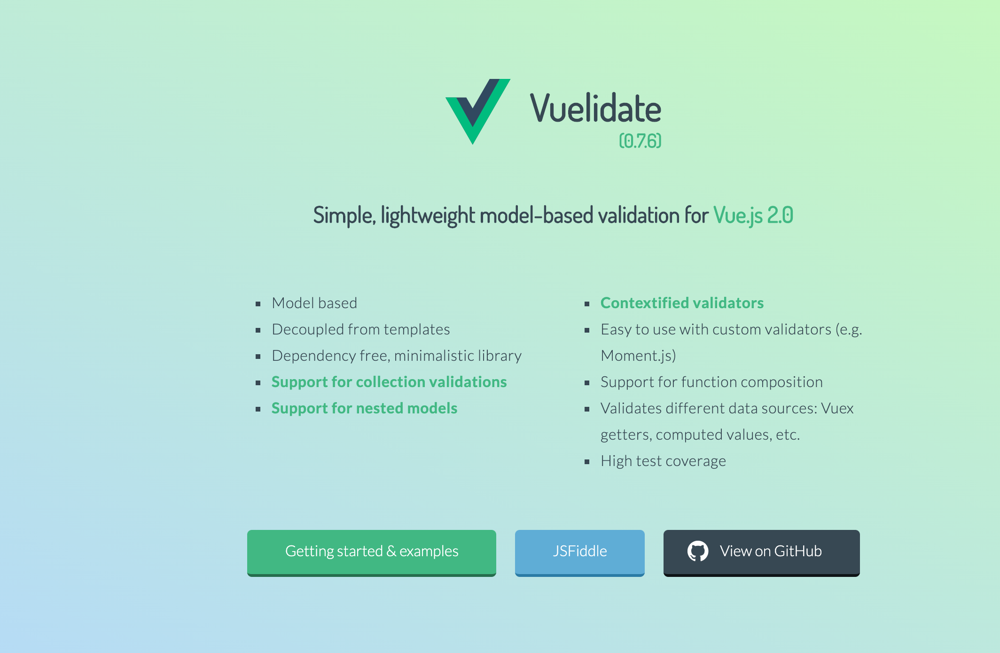
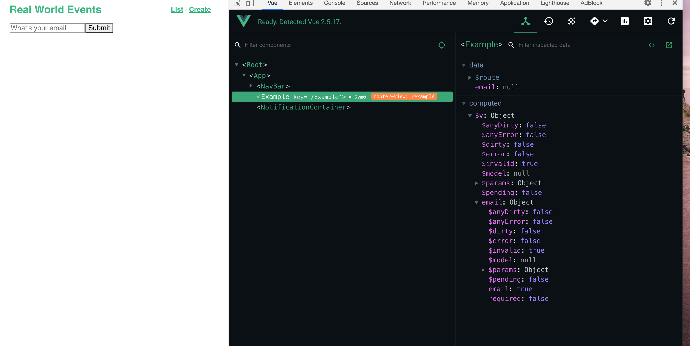
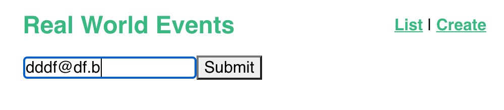
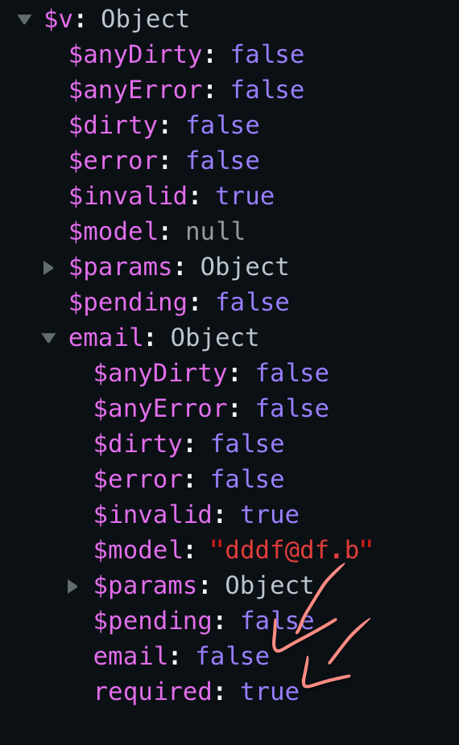
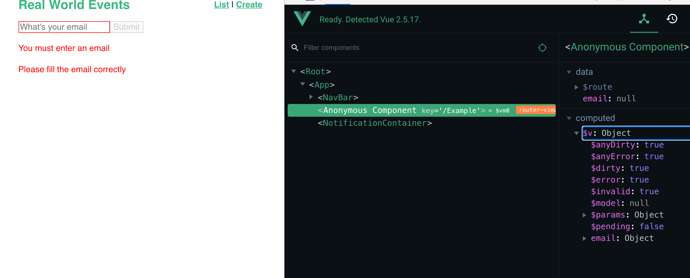

# 08 Form validation

## `vuelidate`

```bash
npm i vuelidate
```



Dans `main.js`

```js
// ...
import Vuelidate from "vuelidate";

vue.use(Vuelidate);

// ...
```

On rend ainsi `Vuelidate` accessible de n'importe où dans notre application.

## exemple avec un `email`

On crée un composant d'exemple : `Example.vue`

```vue
<template>
  <div>
    <input type="email" placeholder="What's your email" v-model="email" />
    <button type="submit">Submit</button>
  </div>
</template>

<script>
import { required, email } from "vuelidate/lib/validators";
export default {
  data() {
    return {
      email: null,
    };
  },
  validations: {
    email: {
      required,
      email,
    },
  },
};
</script>
```

On importe des `validators` : `required` et `email`.

On peut observer une propriété `computed` fourni par `vuelidate` dans les outils :







On voit que `required` est à `true` car le champ contient une chaine de caractères, mais `email` est à `false` car l'`email` n'est pas valide.

## Afficher les problèmes de validation

```vue
<template>
  <div>
    <input type="email" placeholder="What's your email" v-model="email" />
    <p v-if="!$v.email.email">Invalid email</p>
    <p v-if="!$v.email.required">You must enter an email</p>
    <button type="submit">Submit</button>
  </div>
</template>
```

Ainsi les problèmes s'affichent immédiatement.

On voudrait laisser une chance à l'utilisateur de remplir correctement le formulaire avant de lui afficher un message d'erreur.

## `$dirty` et `$invalid`

On veut utiliser l'événement `@blur` pour passer le formulaire à `$dirty` (touché).

On a la règle `$dirty + $invalid = $error`.

`vuelidate` fournit une méthode pour passer la valeur de `$dirty` à `true` : `$touch()`.

`$error` passe alors automatiquement à `true` si on passe `$dirty` à `true`.

```html
<div>
  <input
    type="email"
    placeholder="What's your email"
    v-model="email"
    :class="{ error: $v.email.$error }"
    @blur="$v.email.$touch()"
  />

  <div v-if="$v.email.$error">
    <p v-if="!$v.email.email" class="errorMessage">Invalid email</p>
    <p v-if="!$v.email.required" class="errorMessage">
      You must enter an email
    </p>
  </div>

  <button type="submit">Submit</button>
</div>
```

## bouton de soumission du formulaire : `disabled`

```vue
<button type="submit" :disabled="$v.$invalid">Submit</button>
<p v-if="$v.$anyError" class="errorMessage">Please fill the email correctly</p>
```

`$v.$invalid` est à `true` dès le départ et passe à `false` quand les champs sont valides.

`$v.$anyError` est à `fales` au début. Dès qu'un champs est `dirty` et `invalid`, `$v.$anyError` passe à `true`.



## Exemple de formulaire complet

```vue
<template>
  <form @submit.prevent="submit">
    <input
      type="email"
      placeholder="What's your email"
      v-model="email"
      :class="{ error: $v.email.$error }"
      @blur="$v.email.$touch()"
    />
    <button type="submit" :disabled="$v.$invalid">Submit</button>
    <div v-if="$v.email.$error">
      <p v-if="!$v.email.email" class="errorMessage">Invalid email</p>
      <p v-if="!$v.email.required" class="errorMessage">
        You must enter an email
      </p>
    </div>
    <p v-if="$v.$anyError" class="errorMessage">
      Please fill the email correctly
    </p>
  </form>
</template>

<script>
import { required, email } from "vuelidate/lib/validators";
export default {
  data() {
    return {
      email: null,
    };
  },
  validations: {
    email: {
      required,
      email,
    },
  },
  methods: {
    submit() {
      this.$v.$touch(); // passe tous les champs à dirty -> générer les erreurs possibles
      if (!this.$v.$invalid) {
        // si le formulaire est valide on le soumet
        console.log(`submit email :${this.email}`);
      }
    },
  },
};
</script>
```
