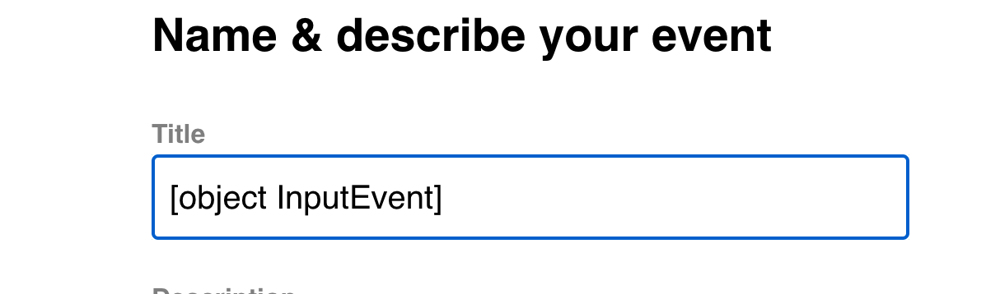
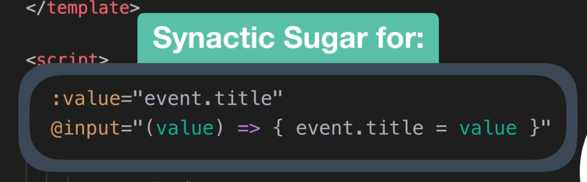

# 09 exemple de formulaire complet

## avec `BaseSelect`

```vue
// ...
    <form @submit.prevent="createEvent">

      <BaseSelect
        label="Select a category"
        :options="categories"
        v-model="event.category"
        :class="{ error: $v.event.category.$error}"
        @blur="$v.event.category.$touch()" />
        <template v-if="$v.event.category.$error">
            <p v-if="!$v.event.category.required" class="errorMessage">Category is required</p>
        </template>
      // ...
</template>


<script>
// ...
import { required } from 'vuelidate/lib/validators'

export default {
  // ...
  validations: {
    event: {
      category: { required },
      title: { required },
      description: { required },
      location: { required },
      date: { required },
      time: { required }
    }
  },
  // ...
```

sur l'événement `@blur` on passe le champ à `$dirty` grâce à la méthode `$v.event.category.touch()`.

On `bind` la classe (`:class`) sur `$v.event.category.$error`.

on utilise `<template v-if="$v.event.category.$error">` pour afficher le texte d'erreur.

À ce stade cela ne fonctionne pas car il faut passer les `listener` de `BaseSelect` au véritable `select` sous-jacent.

On utilise `v-on:"$listeners"` pour ça.

```html
<select @change="updateValue" :value="value" v-on="$listeners" v-bind="$attrs">
  <option v-for="option in options" :key="option" :selected="option === value">
    {{option}}
  </option>
</select>
```

## Problème avec `BaseInput`

Si on ajoute `v-on="$listeners"` dans notre `input ` de `BaseInput`, on a une erreur :



On a :

```html
<input
  type="text"
  :value="value"
  @input="updateValue"
  v-bind="$attrs"
  v-on="$listeners"
/>
```

mais avec `v-on` on reçoit les `listeners` du composant :

```html
<BaseInput
  label="Title"
  v-model="event.title"
  type="text"
  placeholder="Title"
  class="field"
  :class="{ error: $v.event.title.$error }"
  @blur="$v.event.title.$touch()"
/>
```

`v-model` peut se décomposer en :



C'est comme si on avait :

```html
<input type="text" :value="value" v-bind="$attrs" @input="updateValue"
@input="value => {event.title = value}" // ici value vaut event (javascript
native object) @blur="$v.event.title.$touch()>
```


On va re-définir les. `listeners` dans `BaseInput`:

```jsx
// on appelle listeners et non plus $listeners
<input type="text" :value="value" @input="updateValue" v-bind="$attrs" v-on="listeners">

// ...
computed: {
    listeners() {
      return {
        ...this.$listeners,
        input: this.updateValue
      }
    }
  },

```

On crée une propriété calculée `listeners` où on écrase l'entrée `input` avec `input: this.updateValue` qui est la bonne méthode à utiliser.

## Pour le `date-picker`

```html
<div class="field">
  <label>Date</label>
  <datepicker
    v-model="event.date"
    placeholder="Select a date"
    :input-class="{ error: $v.event.date.$error }"
    @opened="$v.event.date.$touch()"
  />
</div>
<template v-if="$v.event.date.$error">
  <p v-if="!$v.event.date.required" class="errorMessage">Date is required</p>
</template>
```

On utilise `:input-class` à la place de `:class` et `@opened` à la place de `@blur`.

## Le bouton `submit`

```html
<BaseButton type="submit" classButton="-fill-gradient" :disabled="$v.$anyError"
  >Submit</BaseButton
>
<p v-if="$v.$anyError" class="errorMessage">
  Please fill out the riquered field(s)
</p>
```

Il devient `:disabled` seulement s'il y a des erreurs.

On peut aussi le brancher à `$invalid`, ce qui permet qu'il soit `disabled` dès le début.

dans le cas où on utilise `$anyError`, on doit forcer les champs à être `dirty` pour pouvoir détecter les erreurs :

```js
 methods: {
    createEvent() {
      this.$v.$touch()
      if (!this.$v.$invalid) {
        NProgress.start()
        this.$store
          .dispatch('event/createEvent', this.event)
          .then(() => {
            this.$router.push({
              name: 'event-show',
              params: { id: this.event.id }
            })
            this.event = this.createFreshEventObject()
          })
          .catch(() => {
            NProgress.done()
          })
      }
    },
```

`this.$v.touch` pour mettre tout le formulaire à `dirty`.
