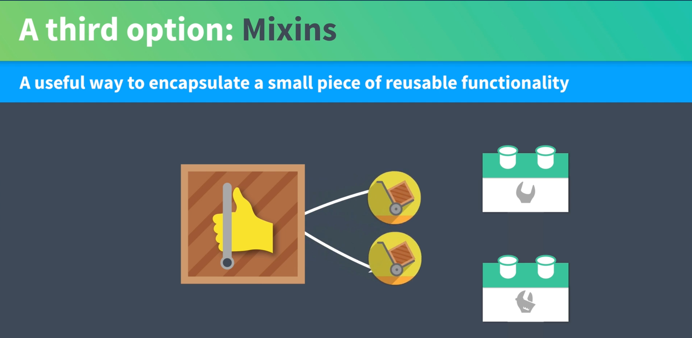
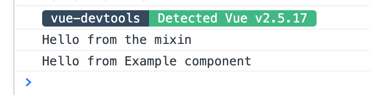
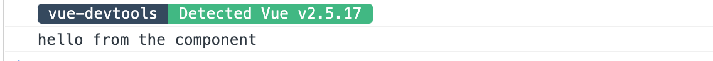
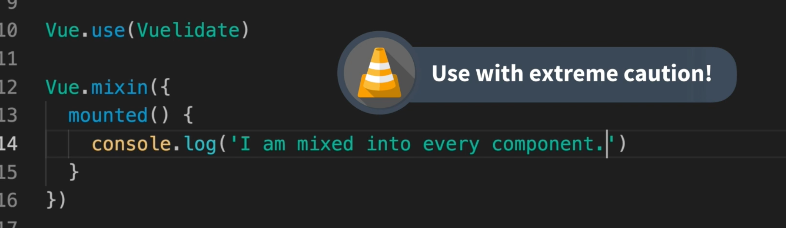
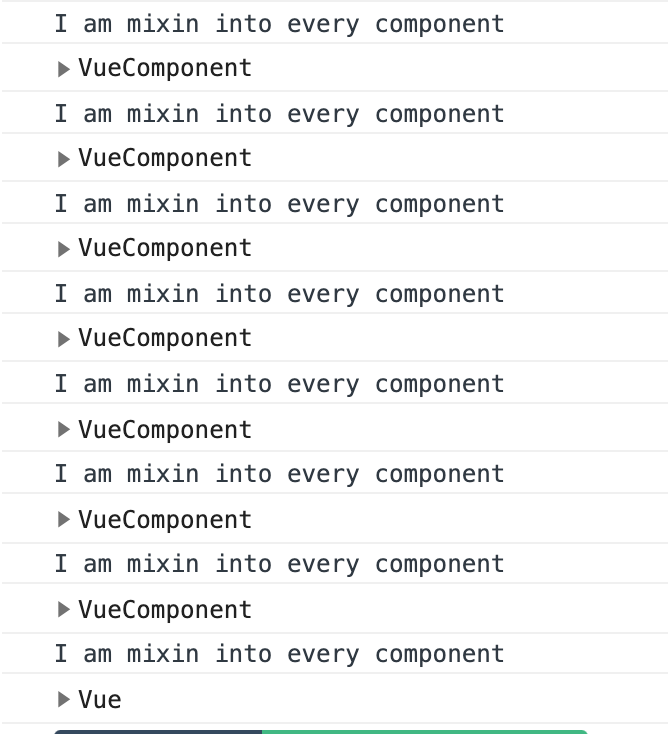

# 10 `mixins`

## Réutiliser son code

Si on a deux composants aux fonctionnalités très similaires, doit-on les fusionner ou les garder séparés.

### Une troisième option les `mixins`



Une solution pour encapsuler des fonctionnalités réutilisables.

## Une `mixin` simple

on va créer `src/mixins/exampleMixin.js`

```js
export const exampleMixin = {
  created() {
    console.log("Hello from mixin");
  },
};
```

Dans mon composant `Example.vue` :

```js
import { exampleMixin } from "@/mixins/exampleMixin";

export default {
  mixins: [exampleMixin],
  created() {
    console.log("Hello from Example component");
  },
  // ...
};
```

Le code du `Mixin` s'exécute avant celui du composant.



## Priorité des propriétés

Si une propriété se trouve dans le `mixin` et dans le `composant`, la priorité est donné à la valeur dans le composant.

`mixin`

```js
export const exampleMixin = {
  data() {
    return {
      message: `I'm in mixin`,
    };
  },
  created() {
    console.log("Hoey I'm in the mixin");
    console.log(this.message);
  },
};
```

`component`

```js
export default {
  mixins: [exampleMixin],
  data() {
    return {
      message: "Hey I'am in component",
    };
  },
  created() {
    console.log("Hello from Example component");
    console.log(this.message);
  },
};
```


C'est le message du `composant` qui est repris dans le `mixin` et dans le `composant`.

De même avec une méthode :

```js
// mixin
methods: {
    hello() {
      console.log('hello from the mixin')
    }
  }

// component
methods: {
    hello() {
        console.log('hello from the component')
    }
}
```



## `mixin global`

On peut définir un `mixin` de manière globale dans `main.js`



```js
// dans main.js
Vue.mixin({
  mounted() {
    console.log("I am mixin into every component");
    console.dir(this);
  },
});
```



On a tous les composants de la vue et un composant `Vue` (qui est le `$root` composant je pense).

## Exemple concret

On peut factoriser des propriétés redondantes dans `BaseInput` et `Baseselect`

`mixin/formFieldMixin.js`

```js
export const formFieldMixin = {
  inheritAttrs: false,
  props: {
    label: {
      type: String,
      default: "",
    },
    value: [String],
  },
  methods: {
    updateValue(event) {
      this.$emit("input", event.target.value);
    },
  },
};
```

On peut donc simplifier Nos composant `BaseSelect` par exemple :

```js
import { formFieldMixin } from "@/mixins/formFieldMixin";

export default {
  mixins: [formFieldMixin],
  props: {
    options: {
      type: Array,
      required: true,
    },
  },
};
```

`BaseInput`

```js
import { formFieldMixin } from "@/mixins/formFieldMixin";

export default {
  mixins: [formFieldMixin],
  computed: {
    listeners() {
      return {
        ...this.$listeners,
        input: this.updateValue,
      };
    },
  },
};
```
