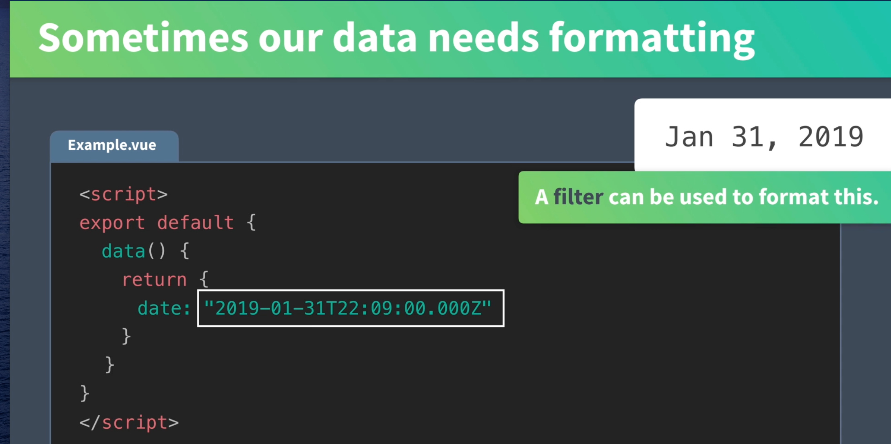
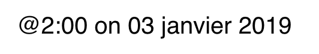
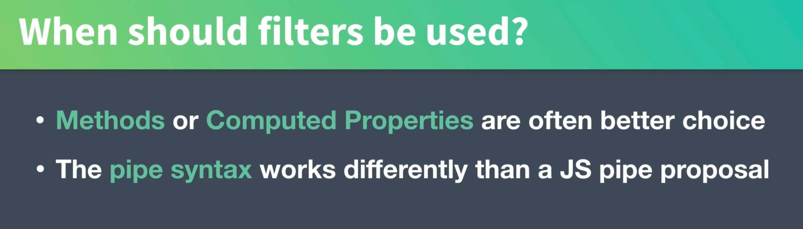

# 11 `filters`

Les filtres vont permettre de formater des données.



## Exemple

```vue
<template>
  <div>
    <p>{{ comment | shout | exclamation | reply("toto") }}</p>
  </div>
</template>

<script>
export default {
  data() {
    return {
      comment: "no one care",
    };
  },
  filters: {
    shout(value) {
      return value.toUpperCase();
    },
    exclamation(value) {
      return value + "!".repeat(3);
    },
    reply(value, name) {
      return value + ", " + name;
    },
  },
};
</script>
```

On chaîne les `filters` avec un pipe : `|`.

On peut les rendre paramétré `reply(value, name)`.

On peut les utiliser avec `v-bind` :

```html
<div :id="id | formetID">bla bla bla</div>
```

## Utilisation pour les `dates` d'un filtre `global`

On crée un dossier `src/filters`.

`src/filters/date.js`

```js
export default (value) => {
  const date = new Date(value);
  return date.toLocaleString("fr-FR", {
    month: "long",
    day: "2-digit",
    year: "numeric",
  });
};
```

On charge le filtre dans `main.js`

```js
import DateFilter from "@/filters/date";

Vue.filter("date", DateFilter);
```

Dans le template :

```html
<span class="eyebrow">@{{ event.time }} on {{ event.date | date }}</span>
```

On a :



## Pas toujours la meilleur option


