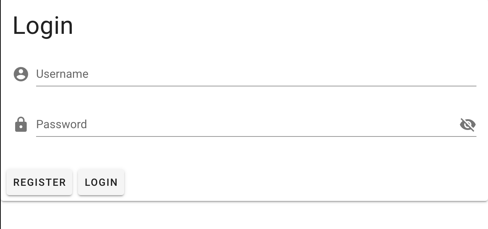
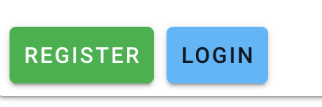
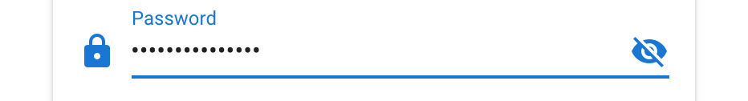
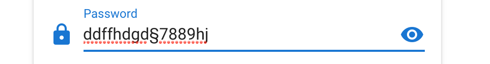
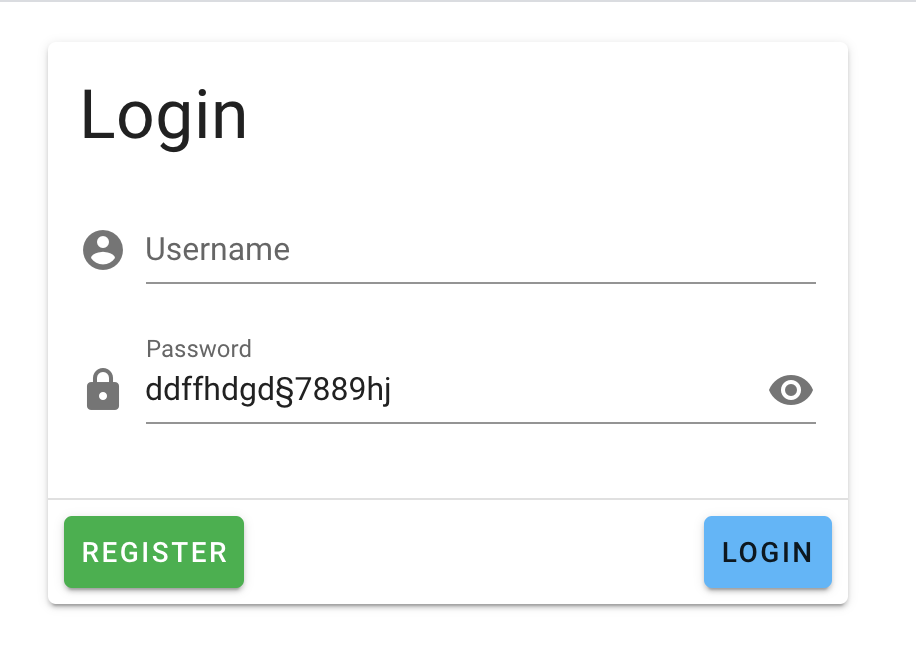

# 01 Getting started

```bash
vue create vm-vuetify-dashboard # default preset
cd vm-vuetify-dashboard
vue add vuetify # default preset

npm run serve
```


## Un système de login

```vue
<template>
  <v-app>
    <v-card>
      <v-card-title>
        <h1 class="display-1">Login</h1>
      </v-card-title>
      <v-card-text>
        <v-form>
          <v-text-field prepend-icon="mdi-account-circle" label="Username" />
          <v-text-field
            type="password"
            label="Password"
            prepend-icon="mdi-lock"
            append-icon="mdi-eye-off"
          />
        </v-form>
      </v-card-text>
      <v-card-actions>
        <v-btn>Register</v-btn>
        <v-btn>Login</v-btn>
      </v-card-actions>
    </v-card>
  </v-app>
</template>
```



### Ajouter des couleurs aux boutons

```vue
<v-btn color="success">Register</v-btn>
<v-btn color="blue lighten-2">Login</v-btn>
```



La couleur du texte change automatiquement.

### Classes Utilitaires

Pour ajouter des marges :

```vue
<v-card width="400" class="mx-auto mt-5">
```


`<v-spacer />` met un espace entre deux éléments.

`<v-divider />` affiche une ligne horizontale de séparation.

### Show password





```vue
<v-text-field
  :type="showPassword ? 'text' : 'password'"
  label="Password"
  prepend-icon="mdi-lock"
  :append-icon="showPassword ? 'mdi-eye' : 'mdi-eye-off'"
  @click:append="showPassword = !showPassword"
/>
```

`@click:append` permet de gérer les click sur l'icône `append`.

```js
export default {
  name: "App",

  components: {},

  data: () => ({
    showPassword: false,
  }),
};
```


