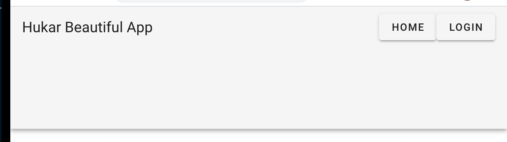
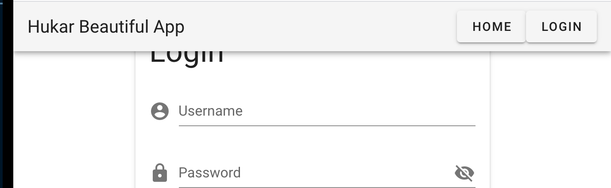
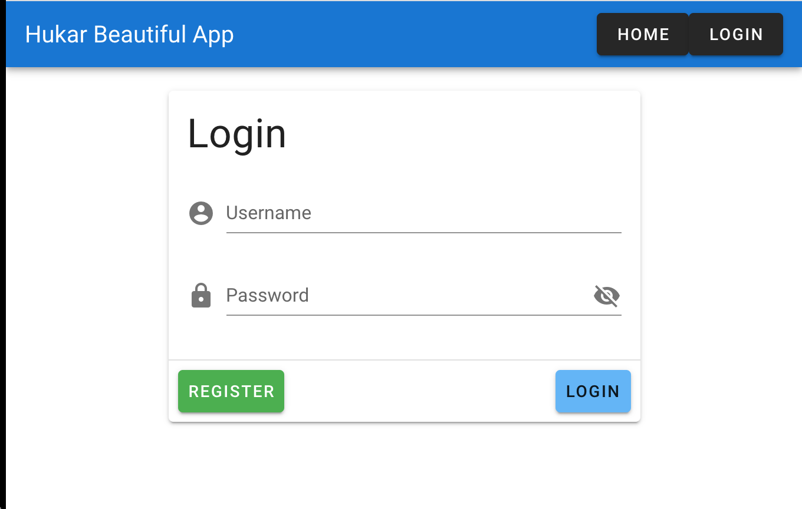

# 02 composant partie 1

## navigation bar `<v-app-bar>`

```html
<v-app-bar>
  <v-toolbar-title> Hukar Beautiful App </v-toolbar-title>
  <v-spacer></v-spacer>
  <v-btn>Home</v-btn>
  <v-btn>Login</v-btn>
</v-app-bar>
```

`v-tollbar-title` pour le titre.



Ici la hauteur est trop grande.

On va ajouter l'attribut `app` : ajuste la taille du contenu et ajoute `position: fixed`.



### Ajout de couleur et du mode `dark`

```html
<v-app-bar app color="primary" dark></v-app-bar>
```

`dark` permet d'avoir le texte en blanc pour un meilleur contraste.


On voit que les boutons sont impacté par le mode `dark`.

### Corriger le placement du Login

On va utiliser `v-content` pour que tous les élément soient dimensionnés correctement.

```html
<v-app>
  <v-app-bar app color="primary" dark>
    <v-toolbar-title> Hukar Beautiful App </v-toolbar-title>
    <v-spacer></v-spacer>
    <v-btn>Home</v-btn>
    <v-btn>Login</v-btn>
  </v-app-bar>
  <v-content>
    <v-card width="400" class="mx-auto mt-5">
      <!-- -->
    </v-card>
  </v-content>
</v-app>
```



## Footer

```html
<template>
  <v-footer color="primary lighten-1" padless>
    <v-row justify="center" no-gutters>
      <v-btn
        v-for="link in links"
        :key="link"
        color="white"
        text
        rounded
        class="my-2"
      >
        {{ link }}
      </v-btn>
      <v-col class="primary lighten-2 py-4 text-center white--text" cols="12">
        {{ new Date().getFullYear() }} — <strong>Vuetify</strong>
      </v-col>
    </v-row>
  </v-footer>
</template>
```

`v-layout` et `v-flex` sont utilisés dans l'ancienne version à la place de `v-row` et `v-col`.

`v-btn` a les attributs `text` pour être un bouton texte seulement et `rounded` pour avoir des arrondis au survol.
