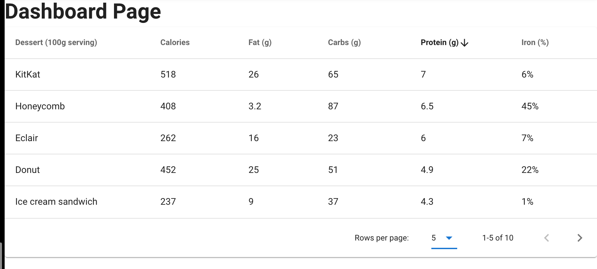
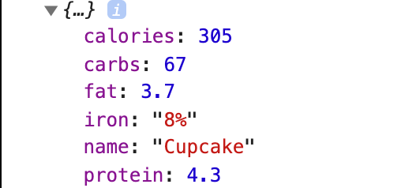
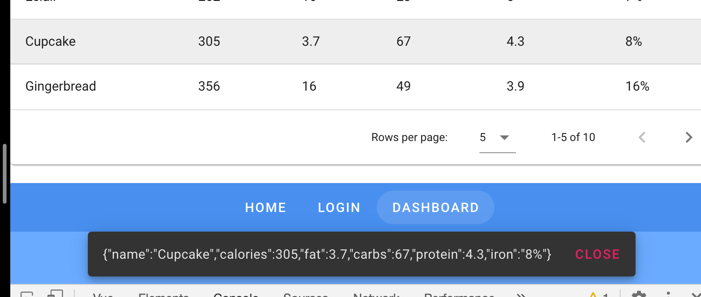
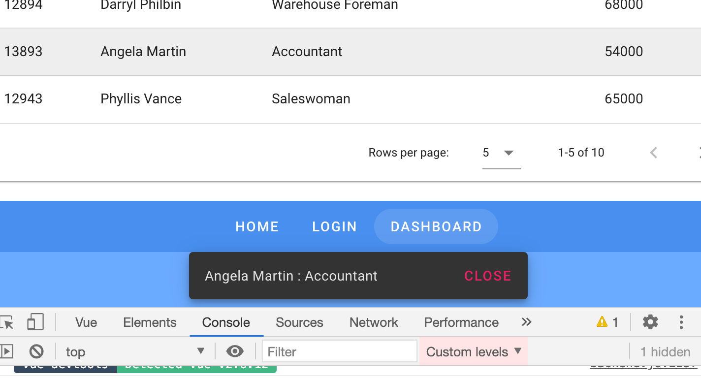

# 02 composant partie 2

## Utilisation des composants avec les routes

```bash
vue add router

? Use history mode for router? (Requires proper server setup for index fallback in production)
 Yes
```

`history mode` permet d'avoir des `url` sans le `#`.

### Utilisation du router

On configure une route pour `Login.vue` dans `router/index.js` :

```js
{
      path: '/login',
      name: 'login',
      component: () => import('@/views/Login.vue')
  }
```

L'utilisation d'une fonction comme `component` permet un `lazy loading` dudit composant.

On met dans le fichier `views/Login.vue` le composant `Login`.

Dans `App.vue` pour afficher la vue on utilise `<router-view>`.

## Rendre les `v-btn` fonctionnels

Les `v-btn` doivent pouvoir être rendu par un `<a>` ou un `<button>` suivant si on a un lien ou un réel bouton (exécution de code).

`href` : Désigne le composant comme ancre ( `<a>`) et applique l'attribut `href`

`to` : Désigne la route cible du lien (`vue-router`).

```html
<v-btn to="/" text rounded>Home</v-btn>
<v-btn to="/login" text rounded>Login</v-btn>
```

### Rendre les boutons dynamiques

```html
<v-btn
       v-for="link in links"
       :key="`${link.label}-bar-link`" // clé unique
       :to="link.url"
       text
       rounded>{{link.label}}</v-btn>
```

```js
data() {
    return {
        links: [
            {
                label: 'Home',
                url: '/'
            },
            {
                label:'Login',
                url: '/login'
            }]
    }
}
```

## `Table Data`

```html
<v-data-table
  :headers="headers"
  :items="desserts"
  :items-per-page="5"
  class="elevation-1"
></v-data-table>
```



Pour avoir les résultats d'une ligne on peut ajouter un `@click:row="dataClicked"` et

```js
methods: {
        dataClicked(datas) {
            console.log(datas)
        }
      },
```



## `Snack Bar`

```html
<v-snackbar v-model="snackbar"></v-snackbar>
```

`v-model` est _bindé_ avec une variable booléenne qui détermine l'affichage de la `snackbar`.

```html
<v-btn @click="snackbar = true"></v-btn>
```

Ce bouton affiche la `snackbar`.

```html
<v-btn @click="snackbar = false"></v-btn>
```

Ce bouton la ferme.

```html
<v-data-table
  :headers="headers"
  :items="desserts"
  :items-per-page="5"
  class="elevation-1"
  @click:row="dataSelected"
></v-data-table>

<v-snackbar v-model="snackbar">
  {{ text }}

  <template v-slot:action="{ attrs }">
    <v-btn color="pink" text v-bind="attrs" @click="snackbar = false">
      Close
    </v-btn>
  </template>
</v-snackbar>
```

```js
export default {
      methods: {
        dataSelected(dataRow) {
            console.log(dataRow)
            this.text = JSON.stringify(dataRow)
            this.snackbar = true
        }
      },
```



En cliquant une ligne on obtient ces données dans la `snackbar`.

## Importer des données `json`

```js
import employees from '@/data/employees.json'

// puis dans le composant

data () {
      return {
        snackbar: false,
        text:'',
        headers: [
          {
            text: 'Id',
            align: 'start',
            sortable: false,
            value: 'id',
          },
          { text: 'Name', value: 'name' },
          { text: 'Title (g)', value: 'title' },
          { text: 'Salary (g)', value: 'salary' },
        ],
        employees,  // on l'importe ici
      }
```


