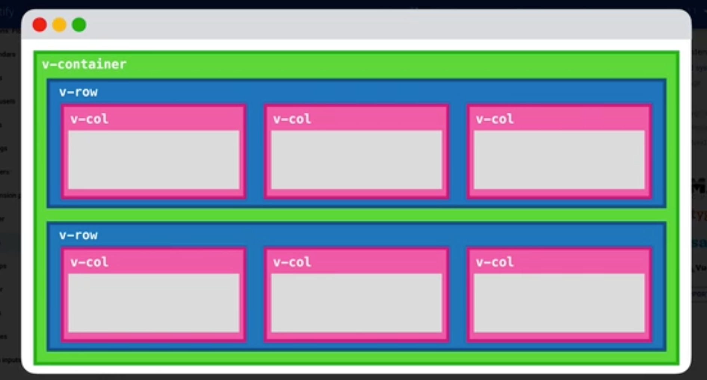
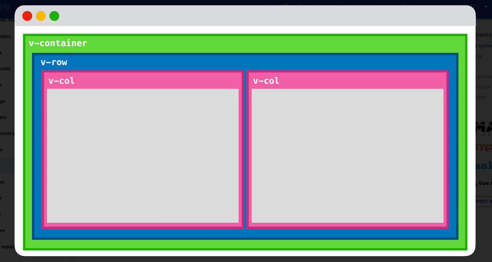
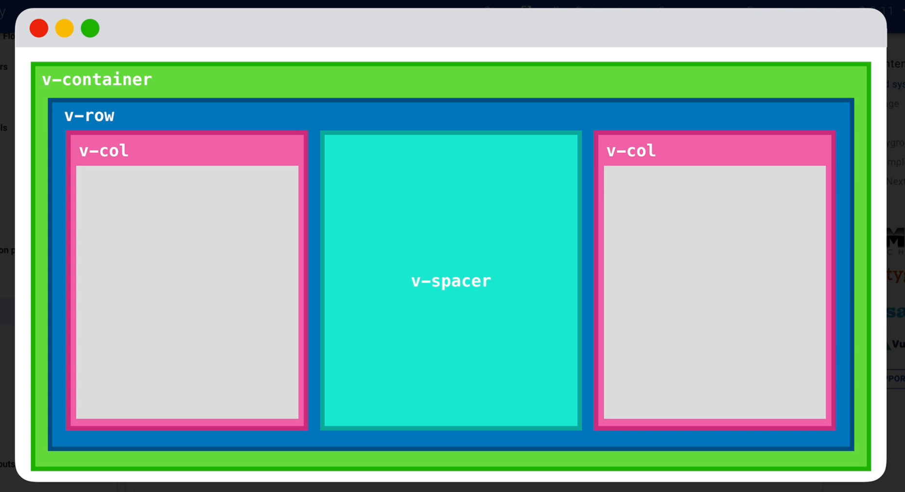
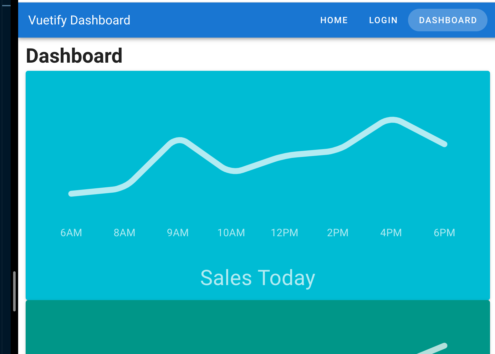
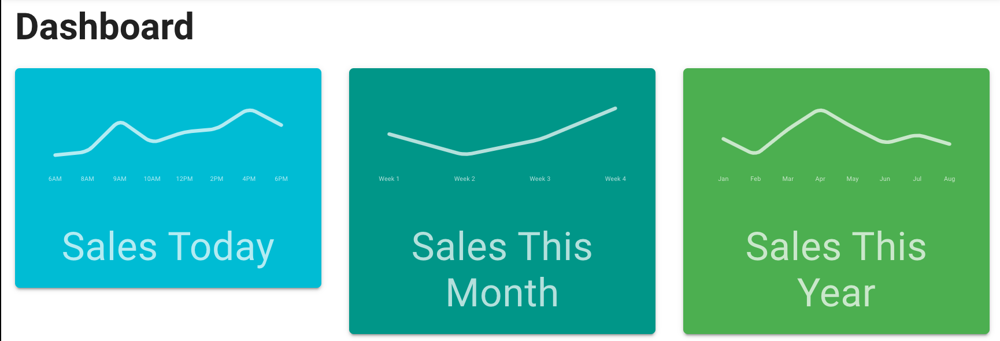
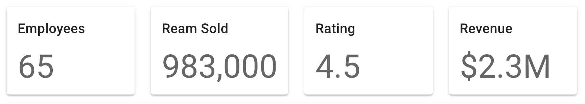
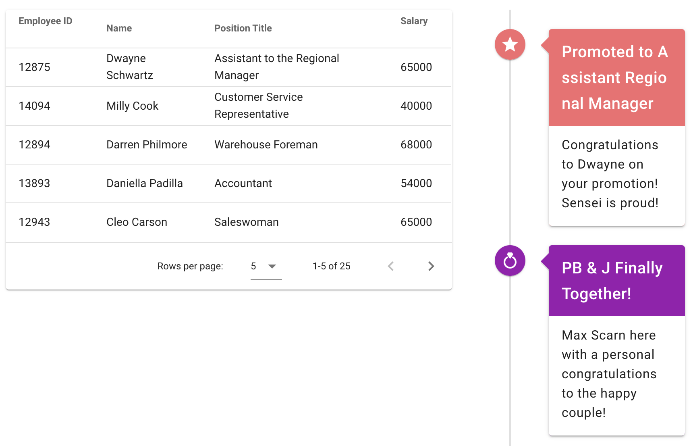
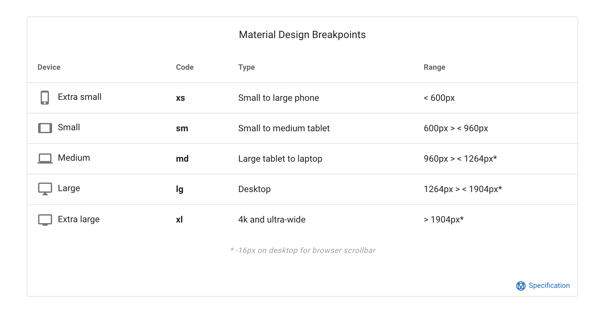
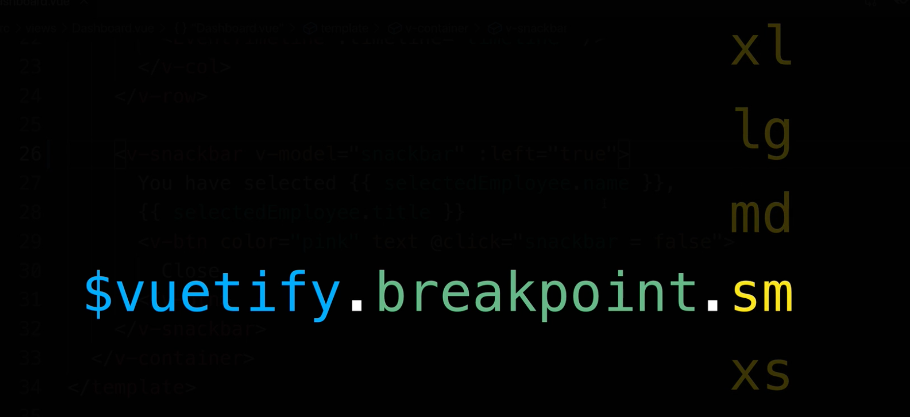

# 04 `Layout` : `Grid System`



Trois composant de base au `Grid System` :

- `v-container`
- `v-row`
- `v-col`

Comme ces blocks sont construits avec les `flex-bow`, si au lieu de trois colonnes on en a plus que deux, les deux colonnes restantes prennent toutes la place possible :

 

On doit utiliser `v-spacer` si on veut un espace au milieu :



## `Dashboard` Page

Tout les composant sont _wrappé_ par :

```html
<template>
  <v-container> // ... </v-container>
</template>
```

### Départ

```html
<SalesGraph v-for="sale in sales" :key="`${sale.title}`" :sale="sale" />
```



### Arrivé

```html
<v-row>
  <v-col v-for="sale in sales" :key="`${sale.title}`">
    <SalesGraph :sale="sale" />
  </v-col>
</v-row>
```



Le `v-for` passe dans la `v-col`.

### De même pour les `StatisticCard`

```html
<v-row>
  <v-col v-for="statistic in statistics" :key="`${statistic.title}`">
    <StatisticCard :statistic="statistic" />
  </v-col>
</v-row>
```



## Proportion

C'est un système de grille à `12` colonnes.

On utilise l'attribut `cols` pour spécifier la taille d'une colonne (de `1` à `12`).

```html
<v-row>
  <v-col cols="8">
    <EmployeesTable :employees="employees" @select-employee="setEmployee" />
  </v-col>

  <v-col cols="4">
    <EventTimeline :timeline="timeline" />
  </v-col>
</v-row>
```



## Responsive Design



Les attributs de `v-col` permettent de gérer le responsive design à l'aide de `break point` :

- `cols` : par défault correspond à `xs` téléphones.

- `sm` : `small` tablettes petites
- `md` : `medium` larges tablettes aux laptop
- `lg` : `large` desktop
- `xl` : `extra-large` grands écrans

### Exemple :

```html
<v-col v-for="sale in sales" :key="`${sale.title}`" cols="12" sm="4">
  <SalesGraph :sale="sale" />
</v-col>
```

## Programmatic Vuetify Breakpoint



```html
<v-snackbar v-model="snackbar" :left="$vuetify.breakpoint.md">
  You have selected {{ selectedEmployee.name }}, {{ selectedEmployee.title }}
  <v-btn color="pink" text @click="snackbar = false"> Close </v-btn>
</v-snackbar>
```

Ici on fait aller la `snackbar` à gauche seulement si on est à `md` ou plus :

#### `$vuetify.breakpoint.md`
