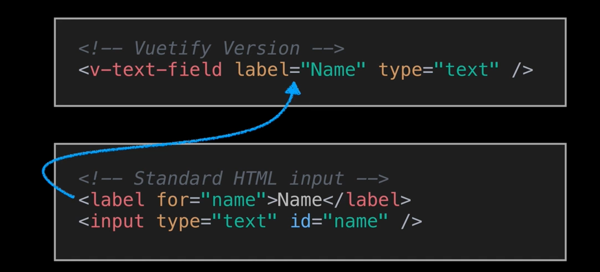
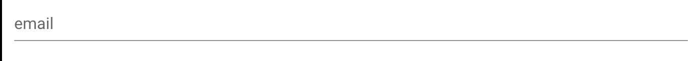
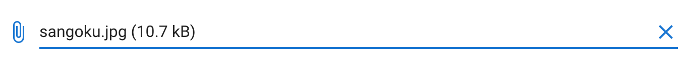
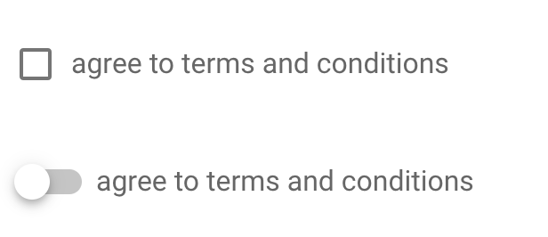

# 05 `Form`

`v-form` remplace `form`.

## Les champs

Le `label` est inclus dans le composant `field` :



## `signup` formulaire

### champ : `input`

`<v-text-field *label*="email" *type*="email">` champ de plusieurs types possible



### `autocomplete` : `select`

```html
<v-autocomplete
  label="wich browser do you use ?"
  :items="browsers"
></v-autocomplete>
```


### `File input`

```html
<v-file-input show-size truncate-length="15" v-model="file"></v-file-input>
```



### `date picker`

```html
<v-text-field label="birthday" v-model="birthday" readonly></v-text-field>
<v-date-picker v-model="birthday"></v-date-picker>
```

`readonly` attribut rendant le champ in-inscriptible.

## `checkbox` et `switch`

```html
<v-checkbox label="agree to terms and conditions"></v-checkbox>
<v-switch label="agree to terms and conditions"></v-switch>
```



### Bouton

```html
<v-btn type="submit" color="primary">Submit</v-btn>
```
