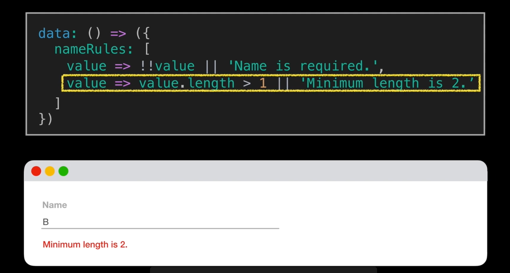
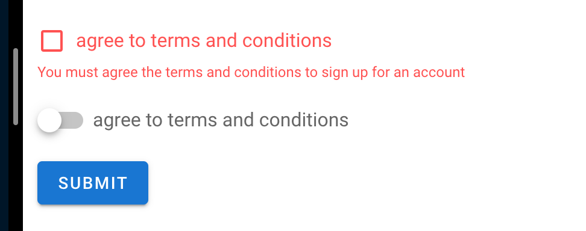
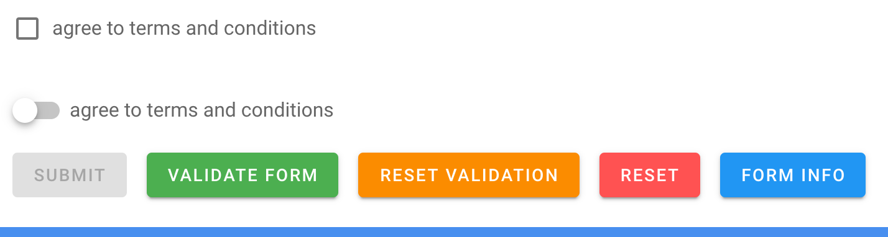
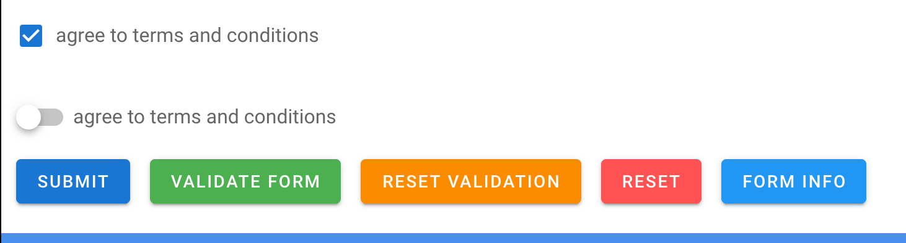

# 06 validation

Les règles de validation sont contenu dans un tableau passé à la valeur.

Chaque règle est une `arrow function` qui renvoie `true` ou un message d'erreur.



## Validation du `checkbox`

```html
<v-checkbox
  label="agree to terms and conditions"
  v-model="agreeToTerms"
  :rules="agreeToTermsRules"
></v-checkbox>
```

Sur `vue mastery` on ajoute un attribut `required`, mais j'observe que cela fonctionne sans.

Il est peut être utile de le mettre pour des raisons d'accessibilité, mettons-le par défaut.

```js
export default {
    data: () => ({
        agreeToTerms: false,
        agreeToTermsRules: [value => !!value || 'You must agree the terms and conditions to sign up for an account'],
```

Comme par magie sur le formulaire :



Et la validation ne s'enclenche que quand le formulaire est `dirty`.

`!!` en javascript transforme n'importe quelle variable en booléen.

## Validation de l'`email`

```html
<v-text-field
  label="email"
  type="email"
  v-model="email"
  :rules="emailRules"
  required
></v-text-field>
```

```js
email: '',
    emailRules: [
        value => !!value || "the email adress is required",
        value => value.indexOf('@') !== 0 || 'email should have a username',
        value => value.includes('@') || "the email address need @ to be valid",
        value => /.+@.+/.test(value) || 'the email should have a domain'

    ],
```

L'utilisation de plusieurs règles permet un message plus `user-friendly`.

L'expression régulière `/.+@.+/` simplifié peut être remplacée par celle du `W3C` :

```js
/^[a-zA-Z0-9.!#$%&'*+/=?^_`{|}~-]+@[a-zA-Z0-9](?:[a-zA-Z0-9-]{0,61}[a-zA-Z0-9])?(?:\.[a-zA-Z0-9](?:[a-zA-Z0-9-]{0,61}[a-zA-Z0-9])?)*$/;
```

Pour éviter d'avoir des espaces.

## `reset validation` et `reset`


```html
<v-form ref="signUpForm">
  <!-- ... -->
  <v-btn type="submit" color="primary">Submit</v-btn>
  <v-btn color="warning" @click="resetValidation">Reset Validation</v-btn>
  <v-btn color="error" @click="resetForm">Reset</v-btn>
</v-form>
```

```js
methods: {
    resetValidation() {
        this.$refs.signUpForm.resetValidation()
    },
        resetForm() {
            this.$refs.signUpForm.reset()
        }
}
```

`this.$refs` est un tableau de références vers des élément du `DOM`.

`resetValidation` efface tous les messages d'erreur de validation.

`reset` remet tous les champs de formulaire à zéro.

## validation du formulaire

```html
<v-form ref="signUpForm" v-model="formValidity">
  <!-- ... -->
  <v-btn type="submit" color="primary" :disabled="!formValidity"
    >Submit</v-btn
  ></v-form
>
```

```js
export default {
    data: () => ({
        formValidity: false,
```

Le formulaire `this.$refs.signUpForm` a une `value` (`false` ou `true`) qui est _bindée_ avec la propriété `formValidity`.



Si cette `value` est `false` alors le `v-btn` est `disabled`.

Dès que le formulaire est valide le `v-btn` n'est plus `disabled :`



La fonction `this.$refs.signUpForm.validate` va lancer la validation (passer tous les champs à `dirty`).

```html
<v-btn class="ml-4" color="success" @click="validateForm">Validate Form</v-btn>
```

```js
validateForm() {
    this.$refs.signUpForm.validate()
}
```
