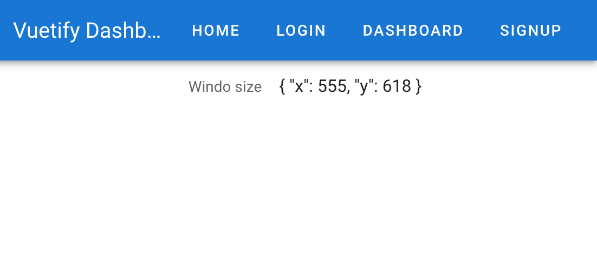
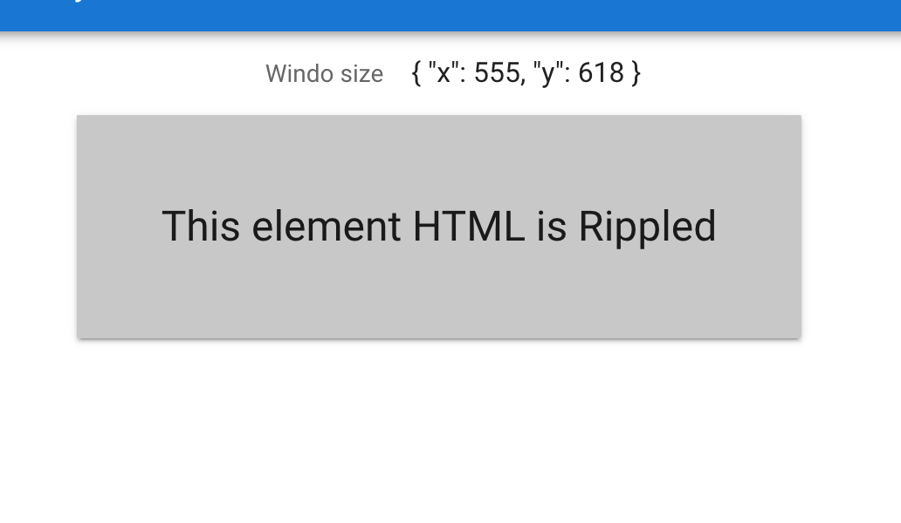
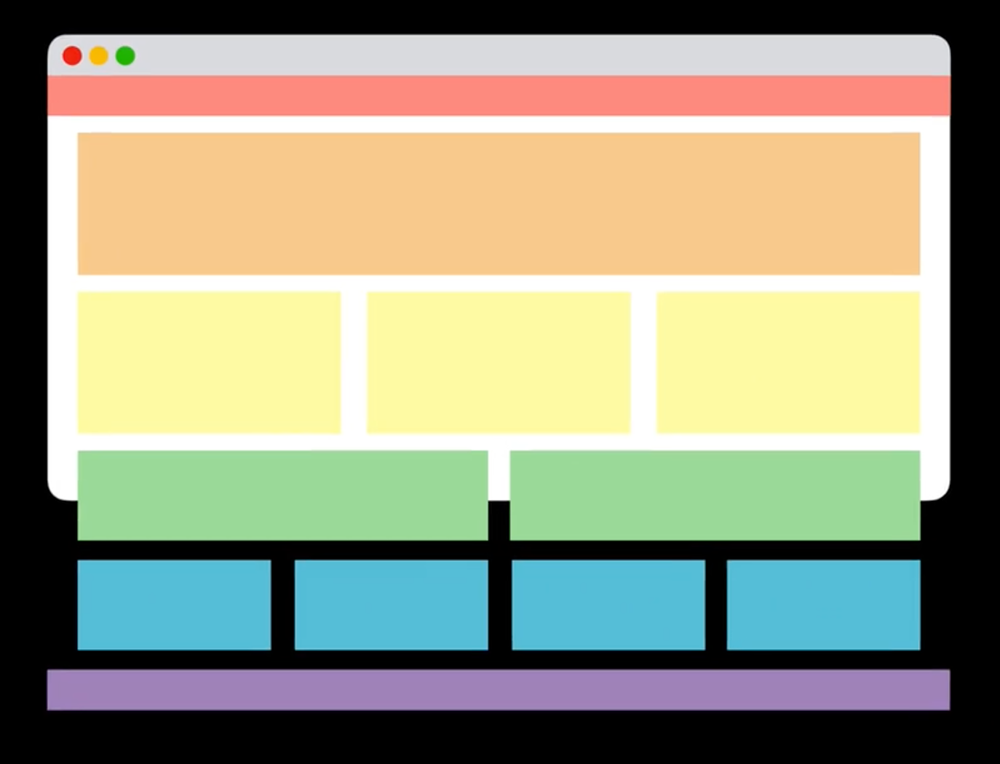
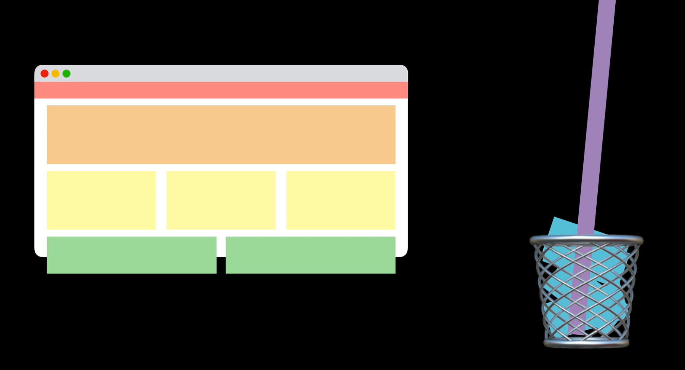
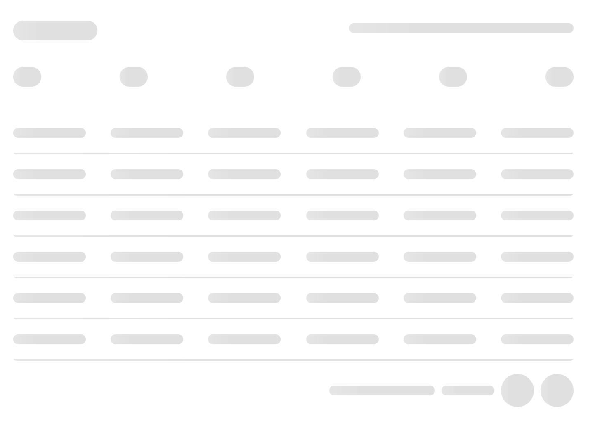
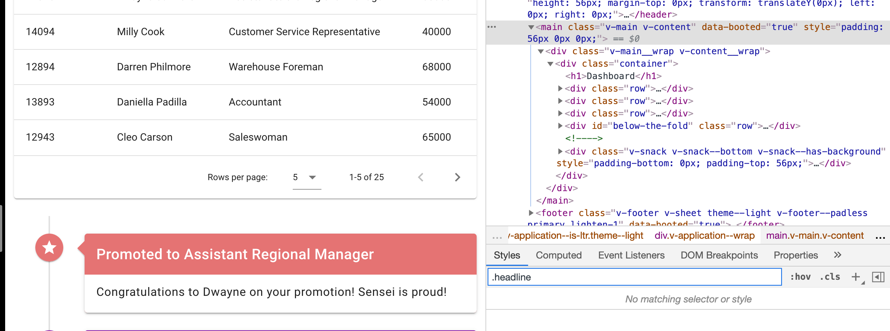
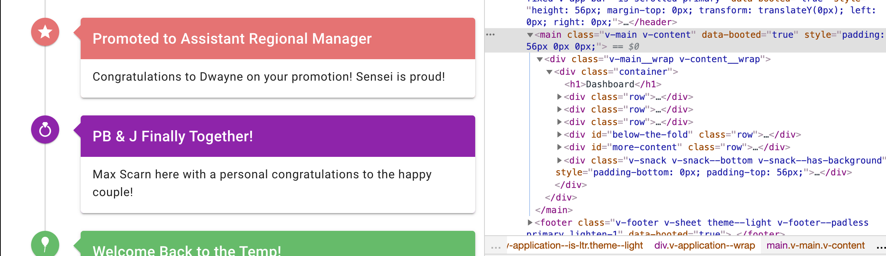

# 07 `Directives`

## `v-resize`

```vue
<template>
  <v-row v-resize="onResize" align="center" justify="center">
    <v-subheader> Windo size </v-subheader>
    {{ windowSize }}
  </v-row>
</template>
<script>
export default {
  data() {
    return {
      windowSize: {},
    };
  },
  methods: {
    onResize() {
      this.windowSize = { x: window.innerWidth, y: window.innerHeight };
    },
  },
};
</script>
```



## `v-ripple`



Ajoute l'effet `ripple` (vague).

```html
<div v-ripple class="elevation-2 pa-12 text-center headline">
  This element HTML is Rippled
</div>
```

`headline` :

```css
 {
  font-size: 1.5rem !important;
  font-weight: 400;
  line-height: 2rem;
  letter-spacing: normal !important;
  font-family: "Roboto", sans-serif !important;
}
```

## `v-intersect`



Souvent du contenu sort de la fenêtre visible.

On aimerait que le contenu non-visible ne soit pas rendu dans le `DOM` :



Cela impact les performances.

> ### Utilisation de `Intersection Observer API`
>
> https://developer.mozilla.org/fr/docs/Web/API/Intersection_Observer_API

### `Skeleton loader`

Cela remplace un `spinner` générique par un contenu visuel plus spécifique :



On va placer `v-intersect` sur un élément plus haut avec un `v-if` sur le `skeleton-loader`.

```html
<v-row id="below-the-fold" v-intersect="showMoreContent">
  <!-- ... -->
</v-row>

<v-row v-if="loadNewContent" id="more-content">
  <!-- ... -->
</v-row>
```

```js
showMoreContent(entries) {
    console.log(entries[0].isIntersecting)
    this.loadNewContent = entries[0].isIntersecting
}
```

Si la ligne `below-the-fold` est visible, alors `more-content` aussi, sinon `more-content` est retiré du `DOM`.



Et en remontant un peu la page :

