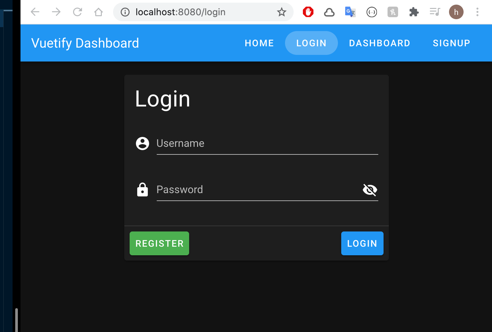
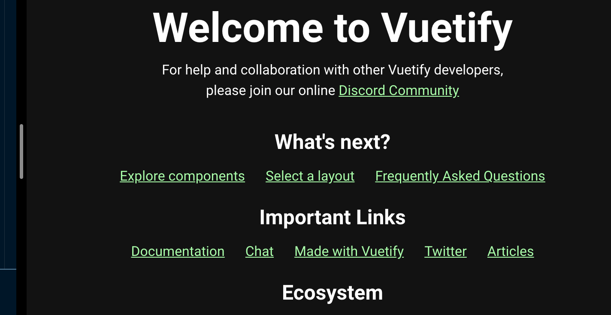
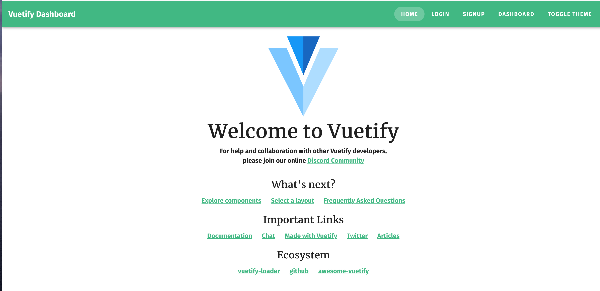

# 08-themes

## Passer le theme en `dark`

`plugins/vuetify.js`

```js
import Vue from "vue";
import Vuetify from "vuetify/lib";

Vue.use(Vuetify);

export default new Vuetify({
  icons: {
    iconfont: "mdi",
  },
  theme: {
    dark: true, // ici
  },
});
```



### Changer le thème `programmaticly`

```html
<v-btn text rounded @click="toggleTheme">Toggle Theme</v-btn>
```

```js
methods: {
    toggleTheme() {
        this.$vuetify.theme.dark = !this.$vuetify.theme.dark
    }
}
```

On a accès à la configuration de `vuetify` avec `this.$vuetify`.

## Configurer les couleurs

`plugins/vuetify.js`

```js
export default new Vuetify({
  icons: {
    iconfont: "mdi",
  },
  theme: {
    themes: {
      light: {
        primary: "#41b883",
      },
      dark: {
        primary: "#35493e",
      },
    },
  },
});
```

On peut ainsi configurer chaque couleur du thème `light` et du thème `dark`.


Le problème c'est que certain éléments, comme ici les liens, peuvent manquer de contraste.

On peut alors ajouter la couleur pour l'élément `anchor` (`<a>`) :

```js
theme: {
    themes: {
        light: {
            primary: '#41b883'
        },
            dark: {
                primary: '#35493e',
                    anchor: '#afa'
            }
    }
}
```



Ici le contraste est corrigé.

### Changer une couleur `programmaticly`

```js
// cette fois dans le composant App.vue
methods: {
    toggleTheme() {
        this.$vuetify.theme.themes.dark.anchor = '#f3a'
        this.$vuetify.theme.dark = !this.$vuetify.theme.dark
    }
}
```


## Theming `font`

On peut créer un dossier `scss` avec dedans un fichier `variables.css` pour customiser les variables `sass ` de base.

```scss
$body-font-family: "Fira Sans";
$heading-font-family: "Merriweather";
```

Pour importer de nouvelles polices : `google font` dans `public/index.html`

```html
<link
  href="https://fonts.googleapis.com/css?family=Fira+Sans:700|Merriweather&display=swap"
  rel="stylesheet"
/>
```

Il faut ensuite tout re-compiler.



Et voilà les polices sont modifiées.
