# Vue school - Router for every one

## Dans `main.js`

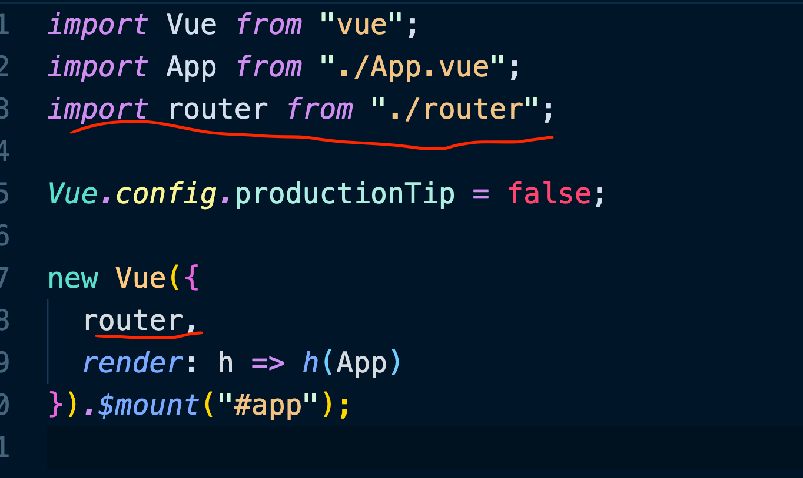

Le `router` est importer et passer au constructeur de l'instance de vue, dans son objet d'options.

##  Dans `router/index.js`

On importe `vue` et `vue-router`.

```js
import Vue from "vue"
import VueRouter from "vue-router" 
```

On importe les pages (`views`) vers lesquels on `route` de manière classique :

```js
import Home from "../views/Home.vue"
```

On passe le `router` à `Vue`

```js
Vue.use(VueRouter)
```

On crée les routes

```js
const routes = [
    {
        path: '/pathOfTheRoute',
        name: 'nameOfTheRoute',
        component: Home
    },
]
```

On crée un router et on lui passe les routes

```js
const router = new VueRouter({routes})
```

Et puis on export ce `router`

```js
export default router
```

## `router-link`

Permet de charger la page :

```html
<router-link to"/MyRoute">Go to my route</router-link>
```

### Différence avec un `<a href="#">link</a>`

En cliquant sur une balise `a`, la page est entièrement rafraîchie, on ne veut pas ça avec une `SPA`.

Les `router-link` eux ne rafraîchissent pas la page.

On utilise des micro-requête pour mettre à jour les données nécessaire.

L'application est ainsi plus reactive (rapide).

Les balises `a` sont seulement utilisées pour des liens en dehors de l'application.

Quand on clique sur un `router-link`, deux classes lui sont associées.

`router-link-active` et `router-link-exact-active`.

`router-link-active` s'ajoute si la route demandée *match* le début de la route de l'attribut `to` de `router-link`.

`router-link-exact-active` s'ajoute seulement si la route demandée est exactement celle de l'attribut `to` de `router-link`.

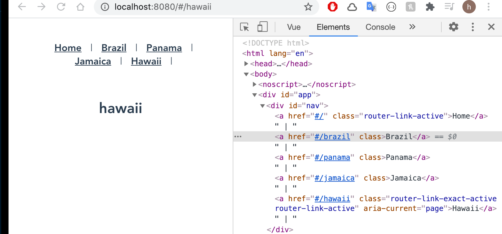

N'importe quelle route matchera avec `/` et donc la classe `router-link-active` sera toujours associée à un `router-link` ayant un attribut `to="/"`.

## `router-view`

L'endroit du template où est affiché la page

```html
<router-view /><template>
  <div id="app">
    <div id="nav">
      <router-link to="/">Home</router-link> |
      <router-link to="/about">About</router-link>
    </div>
    <router-view />
  </div>
</template>
```

## charger une image

### Si le chemin est statique mais pas dans `public`

```html

```

#### Statique et dans `public`

```html

```


### Si le chemin est dynamique mais pas dans `public`

```html

```

#### Dynamique et dans `public`

```html

```


## lazy-oading

Lazy-loading : la page ne sera chargée que si elle est visitée

```js
const routes = [
    {
        path: '/about',
        name: 'About',
        component: () => import('../views/About.vue')
    }
]
```

Sans le `lazy-loading`, l'application est chargé en une fois, c'est le `bundle` de l'application.

Avec une `arrow function` , `import` n'est exécuté que lorsque la route est appelée.

Les morceaux sont chargés au fur et à mesure qu'ils sont demandés on parle de `chunks` :


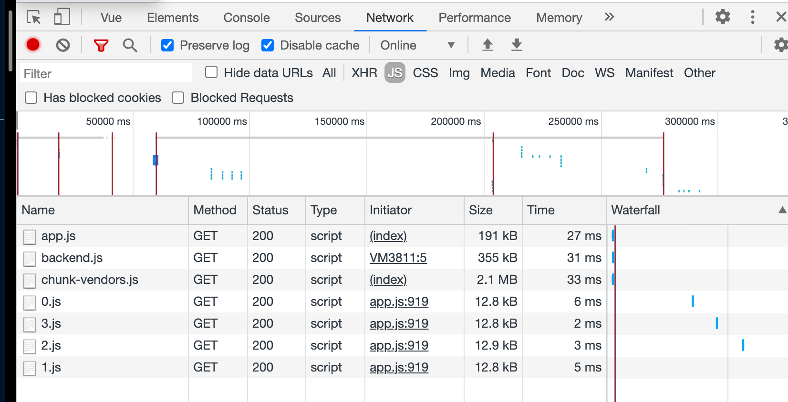

### `Webpack` magic comment

`Webpack` permet via les `magic comment` de définir le nom des morceaux crée par les routes `lazy-loading` :

```js
{
    path: "/jamaica",
    name: "Jamaica",
    component: () =>
      import(/* webpackChunkName: "jamaica" */ "../views/Jamaica.vue")
  }
```

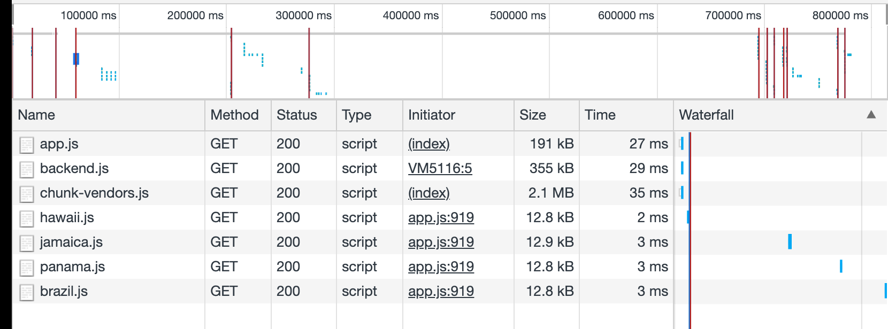

On voit que les `chunks` on maintenant le nom donné dans les `webpack magic comment`.

### ! les noms de composant doivent être multi-mot pour ne pas rentrer en conflit avec des balises `html` existante ou future.

## Changer le nom de la classe `router-link-exact-active`

```js
const router = new VueRouter({
  linkExactActiveClass: "vue-school-active-class",
  routes
});
```

## `$route`

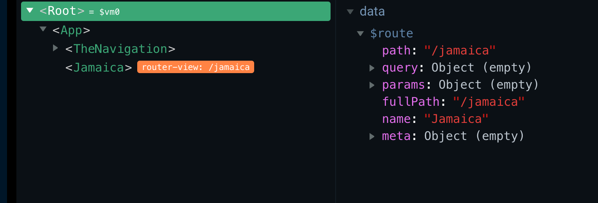

On voit que l'élément `Root` a une propriété `$route`

### Récupérer un `params` dans le `template`

```html
<div>
    <h1>Destination Details</h1>
    <p>{{ this.$route.params.id }}</p>
</div>
```

## On peut ainsi accéder aux routes dans le code `$route`

```js
export default {
  data() {
    return {
      destinationId: this.$route.params.id
    };
  },
```


## routes nommées

Il est recommandé d'utilisé les routes nommées :

```html
<router-link :to="{ name: 'DestinationDetails' }">
```

#### Ainsi on peut modifier l'`url` sans avoir à modifier le reste du code.


## `params` et route dynamique

Passage de paramètre dans l'`url`.

```html
<router-link
     :to="{ name: 'DestinationDetails', params: { id: destination.id } }"
 >
```

On va définir un segment du `path` dynamique dans notre `router`

```js
{
    path: "/details/:id",
    name: "DestinationDetails",
    component: () =>
      import(
        /* webpackChunkname: "destinationDetails" */ "../views/DestinationDetails"
      )
  }
```

## ! Recharger `router-view`

Si le paramètre de la route change, la page n'est pas mise à jour.

Il faut ajouter un attribut `key` à `router-view`

```html
<router-view :key="$route.path" />
```

On aurait pu aussi mettre `:key="$route.params.id"` du moment que `key` est unique pour chaque route.


## `#` mode, `history` mode

Par défaut `vue router` est en `# mode`.


La page n'est donc pas rechargée lors du routage.

#### Pour se débarasser du `#` dans notre `url`, on doit utiliser le `router's history mode`.

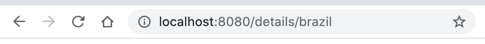

Le `#` a disparu de l'`url`

On règle cela dans le router :

```js
const router = new VueRouter({
  linkExactActiveClass: "vue-school-active-class",
  mode: "history",
  routes
});

export default router;
```


## Utiliser les `props` pour passer les `params`

Dans le `router`

```js
{
    path: "/details/:slug",
    name: "DestinationDetails",
    component: () =>
      import(
        /* webpackChunkname: "destinationDetails" */ "../views/DestinationDetails"
      ),
    props: true
}
```

et dans le composant

```js
export default {
  props: {
    slug: {
      type: String,
      required: true
    }
  },
```


## `Nested routes` : routes imbriquées

Dans le router

```js
{
    path: "/details/:slug",
    name: "DestinationDetails",
    component: () =>
      import(
        /* webpackChunkname: "destinationDetails" */ "../views/DestinationDetails"
      ),
    props: true,
    children: [
      {
        path: ":experienceSlug",
        name: "ExperienceDetails",
        props: true,
        component: () =>
          import(
            /* webpackChunkName: "ExperienceDetails" */ "../views/ExperienceDetails"
          )
      }
    ]
  }
```

Dans le composant de la route parente ici `DestinationDetails`

```html
<router-view :key="$route.path" />
```


## `Go Back` button

Un bouton pour aller à la dernière page visitée.

### `this.$router.go(<integer>)`

Cette fonction prends un entier qui représente le nombre d'étape où allez dans la pile de l'historique du routage.

```js
export default {
  methods: {
    goBack() {
      return this.$router.go(-1);
    }
  }
};
```


## Routes Transitions

`Vue js ` propose un mécanisme de transition avec des classes de transition :

https://fr.vuejs.org/v2/guide/transitions.html

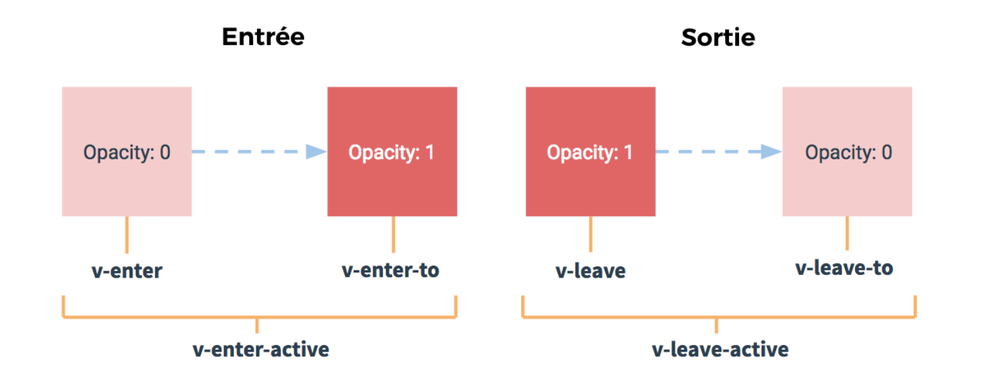

On peut aussi utiliser le composant `<transition>` faisant partie de `Vue` (pas d'`import`).

On entoure l'élément sur lequel on veut la transition

```html
<transition name="slide" mode="out-in">
    <router-view :key="$route.path" />
</transition>
```

On crée des classes `css` avec le nom qu'on a choisi, ici `slide`

```css
.slide-enter-active,
.slide-leave-active {
  transition: opacity 1s, transform 1s;
}

.slide-enter {
  opacity: 0;
  transform: translateX(-30%);
}

.slide-leave-to {
  transform: translateX(130%);
}
```

Un `moveUp`

```css
.moveUp-enter-active {
  animation: fadeIn 1s ease-in;
}
@keyframes fadeIn {
  0% {
    opacity: 0;
  }
  50% {
    opacity: 0.5;
  }
  100% {
    opacity: 1;
  }
}
.moveUp-leave-active {
  animation: moveUp 0.3s ease-in;
}
@keyframes moveUp {
  0% {
    transform: translateY(0);
  }
  100% {
    transform: translateY(-400px);
  }
}
```

Un simple `fade`

```css
.fade-enter-active,
.fade-leave-active {
  transition: opacity 0.3s;
}
.fade-enter,
.fade-leave-to {
  opacity: 0;
}
```

On se sert ici de quatre classes :

- `myName-enter-active`
- `myName-leave-active`
- `myName-enter`
- `myName-leave-to`


## page `404`

On crée une page `NotFound.vue`

```vue
<template>
  <div>
    <h1>404 Not Found</h1>
    <p>the path {{ $route.path }} doesn't already exist</p>
    <link-router :to="{ name: 'Home' }">Go Home</link-router>
  </div>
</template>
```

Dans le `router` on met en **dernier** le `path` `*` qui *match* toutes les routes

```js
},
  {
    path: "*",
    name: "NotFound",
    component: () =>
      import(/* WebpackChunkName: "NotFound" */ "../views/NotFound")
  }
];
```

Mais cela ne fonctionne que pour une route de premier niveau.

Si on a `http://localhost:8080/destination/Bruxelles`

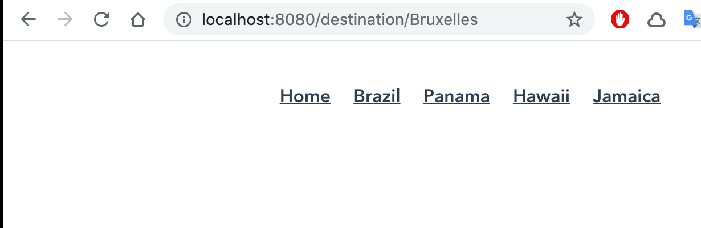

Le `router` va bien *matcher* la route `/destination/:something`.

Il faudrait pouvoir vérifier l'existence d'une destination avant d'afficher la page.


## `Navigation Guard`

`Vue Router` propose différents `hook` pour intercepter la navigation

### `beforeEnter` guard

On va l'utiliser directement dans nos routes :

```js
{
    path: "/destination/:slug",
    name: "DestinationDetails",
    component: () =>
      import(
        /* webpackChunkname: "destinationDetails" */ "../views/DestinationDetails"
      ),
    props: true,
    children: [
      {
        path: ":experienceSlug",
        name: "ExperienceDetails",
        props: true,
        component: () =>
          import(
            /* webpackChunkName: "ExperienceDetails" */ "../views/ExperienceDetails"
          )
      }
    ],
    beforeEnter: (to, from, next) => {
      const exist = store.destinations.find(
        destination => destination.slug === to.params.slug
      );

      if (exist) {
        next();
      } else {
        next({ name: "NotFound" });
      }
    }
  },
```

### `beforeEnter(to, from, next)`

`next` poursuis vers la route demandée ou redirige le `router` si on lui passe une `route`

 en paramètre.


## Créer une `url` `404` : utilsation d'un `alias`

```js
{
    path: "/404",
    alias: "*",
    name: "NotFound",
    component: () =>
      import(/* WebpackChunkName: "NotFound" */ "../views/NotFound"),
    props: true
  }
```

Cela ne fonctionne pas pour les routes de niveau 1 :

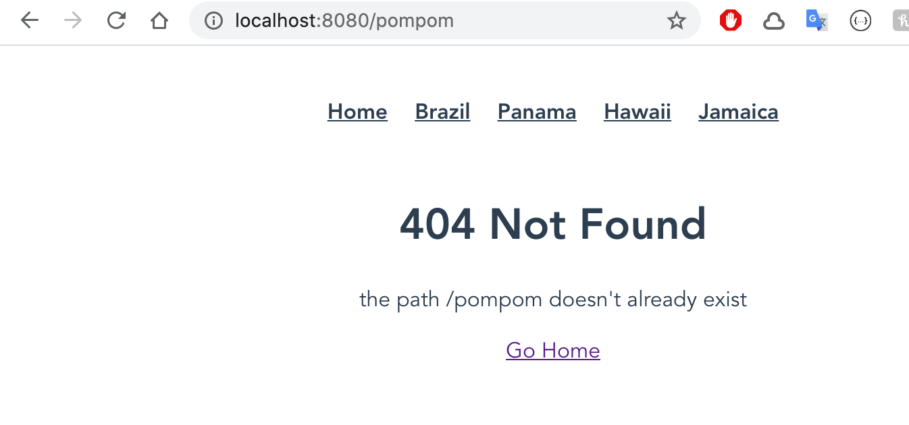

Par contre si le chemin est de niveau 2 (`/niv1/niv2`), cela fonctionne :


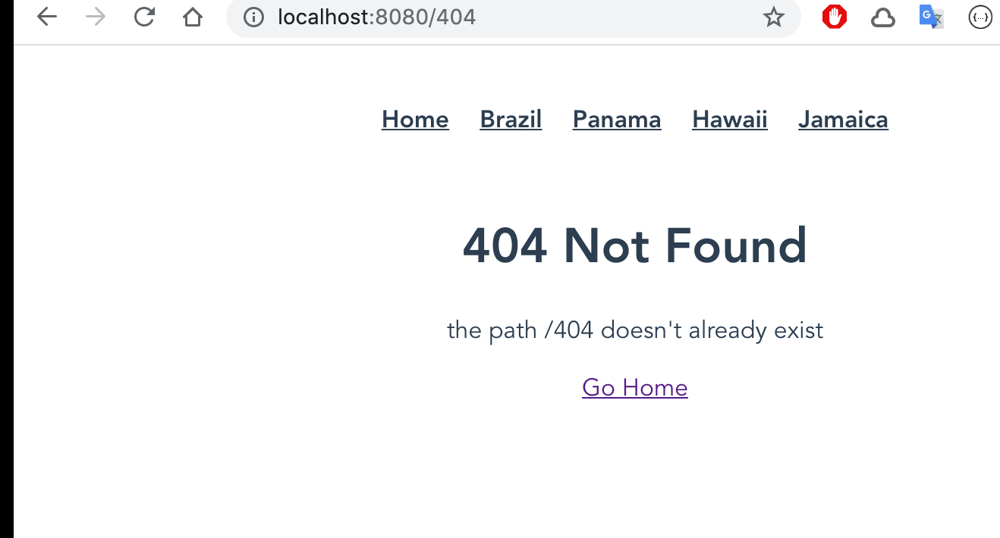


## Configurer un `middleware` : `route guard`

Pour définir un `global guard` on doit placer le `router` dans une variable et l'exporter :

```js
const router = new VueRouter({
  linkExactActiveClass: "vue-school-active-class",
  mode: "history",
  routes
});

export default router;
```

C'est déjà le cas dans mon code !

Avant l'`export` on va créer un `guard ` :

```js
router.beforeEach((to, from, next) => { /* ... */ });

export default router;
```


### propriété `meta`

attends un objet dans lequel on peut mettre les champs que l'on désire

```js
{
    path: "/user",
    name: "User",
    component: () => import(/* webpackChunkName: "User" */ "@/views/User"),
    meta: { requireAuth: true }
  },
```

On peut accéder à cette propriété dans une route, grace à elle on va pouvoir vérifier si une route nécessite une authorisation.

```js
router.beforeEach((to, from, next) => {
  if (to.meta.requireAuth) {
      // need to login
  } else {
    next();
  }
});
```


## Authentification

On crée une page `User` accessible seulement si on est authentifié et une page `Login`.

`Login.vue`

```vue
<template>
  <div class="login">
    <h1>Login</h1>
    <div class="form">
      <label for="username">Username</label>
      <input v-model="username" type="text" name="username" class="input" />
      <label for="password">Password</label>
      <input v-model="password" type="password" class="input" />
      <button @click="login" class="btn">Login</button>
    </div>
  </div>
</template>

<script>
import store from "@/store";

export default {
  data() {
    return {
      username: null,
      password: null
    };
  },
  methods: {
    login() {
      if (this.username) {
        store.user = this.username;
        this.$router.push("/user");
      }
    }
  }
};
</script>
```


Chaque objet du fichier de configuration des routes est un enregistrement.

Avec les routes imbriquées, un enregistrement peut en contenir d'autre, du coup le test avec `route.mete.quireAuth` pourrait impacter des routes non concernées.

On doit plutôt utiliser `route.matched.some()`

```js
router.beforeEach((to, from, next) => {
  if (to.matched.some(record => record.meta.requireAuth)) {
    if (!store.user) {
      next({ name: "Login" });
    } else {
      next();
    }
  } else {
    next();
  }
});

```

### bouton `log out`

Dans `user.vue`

```vue
<template>
  <div>
    <h1>User</h1>
    <p><button class="btn" @click="logOut">Log Out</button></p>
  </div>
</template>

<script>
import store from "@/store";

export default {
  methods: {
    logOut() {
      store.user = null;
      this.$router.push("/");
    }
  }
};
</script>
```

Pour *router* dans le code `this.$router.push(<path>)`.


## `Query Parameters`

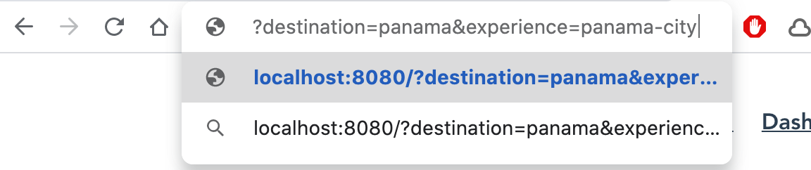

#### `?key1=value1&key2=value2`

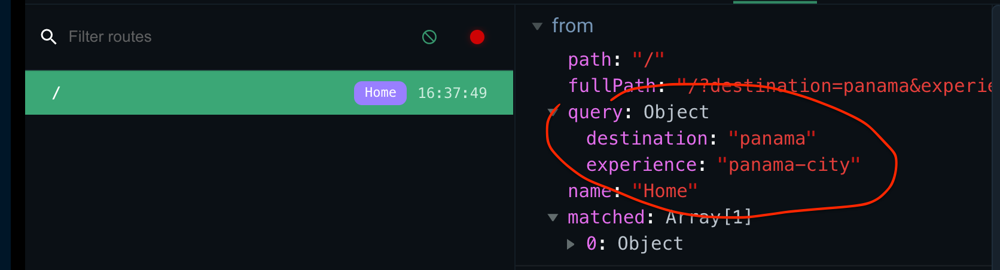

Cette fonctionnalité est utile pour les **recherches** ou les **filtre**.

### Exemple pour savoir où aller après le `login`

`Login.vue`

```js
methods: {
    login() {
      if (this.username) {
        store.user = this.username;
        const redirectPath = this.$route.query.redirect || '/';
        this.$router.push(redirectPath);
      }
    }
  }
```

#### `this.$route.query.redirect`

`redirect` est défini dans l'`url` :

On va passer cette valeur dans le `guard` de notre `router`

```js
router.beforeEach((to, from, next) => {
  console.log("before each");
  if (to.matched.some(record => record.meta.requireAuth)) {
    if (!store.user) {
      console.log("error here");
      next({
        name: "Login",
        query: {
          redirect: to.fullPath
        }
      });
    } else {
      next();
    }
  } else {
    next();
  }
});
```

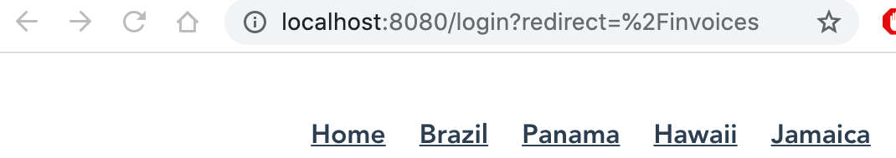

Si on essaye de venir de `/invoices`, le `guard` réécrit l'`url` avec une `query parameters`.

Après le `login`, on revient bien sur la page `Invoices`.

