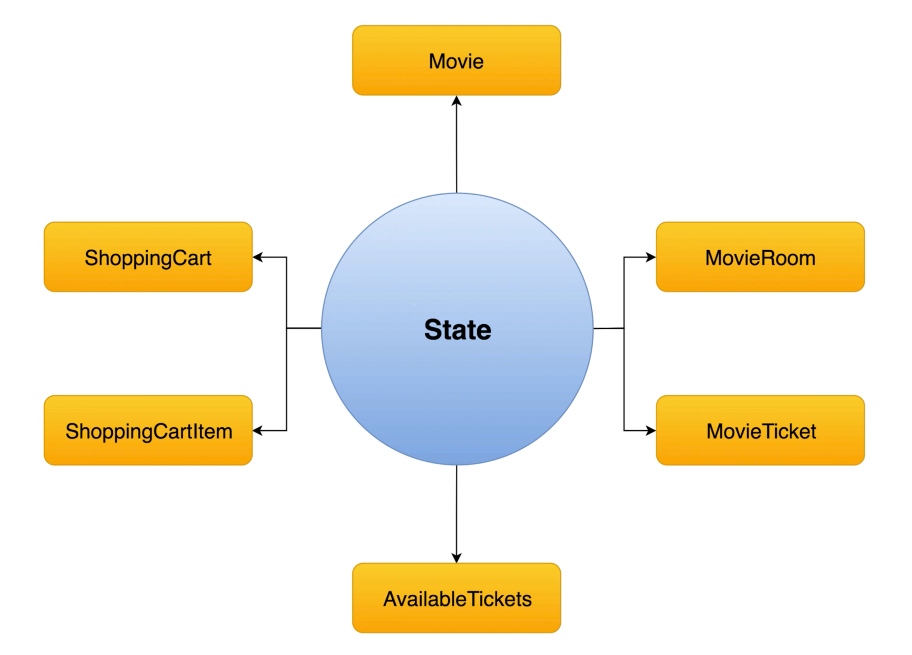

# 01 Introduction

####  **Dan Abramov** "`state management` c'est comme les lunettes, vous savez quand vous avez besoin"



Un état centralisé des données.

## Fichier de `Mock API`

`shop.js`

```js

/**
 * Mocking client-server processing
 */
const _products = [
  {"id": 1, "title": "iPad 4 Mini", "price": 500.01, "inventory": 2},
  {"id": 2, "title": "H&M T-Shirt White", "price": 10.99, "inventory": 10},
  {"id": 3, "title": "Charli XCX - Sucker CD", "price": 19.99, "inventory": 5}
]

export default {
  getProducts (cb) {
    setTimeout(() => cb(_products), 100)
  },

  buyProducts (products, cb, errorCb) {
    setTimeout(() => {
      // simulate random checkout failure.
      (Math.random() > 0.5 || navigator.webdriver)
        ? cb()
        : errorCb()
    }, 100)
  }
}
```


Ce fichier est fourni par l'équipe de `Vuex` :

https://github.com/vuejs/vuex/blob/dev/examples/shopping-cart/api/shop.js

##  `hook : `created`

Les appelles d'`API` sont effectués dans le `hook` `created` :

`ProductList.vue`

```vue
<template>
    <div>
        <h1>Product List</h1>
        <ul>
            <li v-for="product in products" :key="product.id">
                {{product.title}} - {{product.price}}				
    		</li>
        </ul>
    </div>
</template>

<script>
import shop from "@/api/shop"

    export default {
        data() {
            return {
                products: []
            }
        },
        created() {
            shop.getProducts(data => this.products = data)
        }
    }
</script>

<style scoped></style>
```

## `store/index.js`

```js
// import Vue from 'vue'
// import Vuex from 'vuex'

// Vue.use(Vuex)

// export default new Vuex.Store({
//   state: {
//   },
//   mutations: {
//   },
//   actions: {
//   },
//   modules: {
//   }
// })

import Vue from "vue"
import Vuex from "vuex"

Vue.use(Vuex)

export default new Vuex.Store({
    state: { // data
        products: []
    },
    getters: { // computed
        productsCount() {
            return // ...
        }
    },
    actions: {  // methods: perform ths API call
        fetchProducts() {

        }
    },
    mutations: {  // setting and updating the state
        setProducts() {
            
        }
    }
})
```

