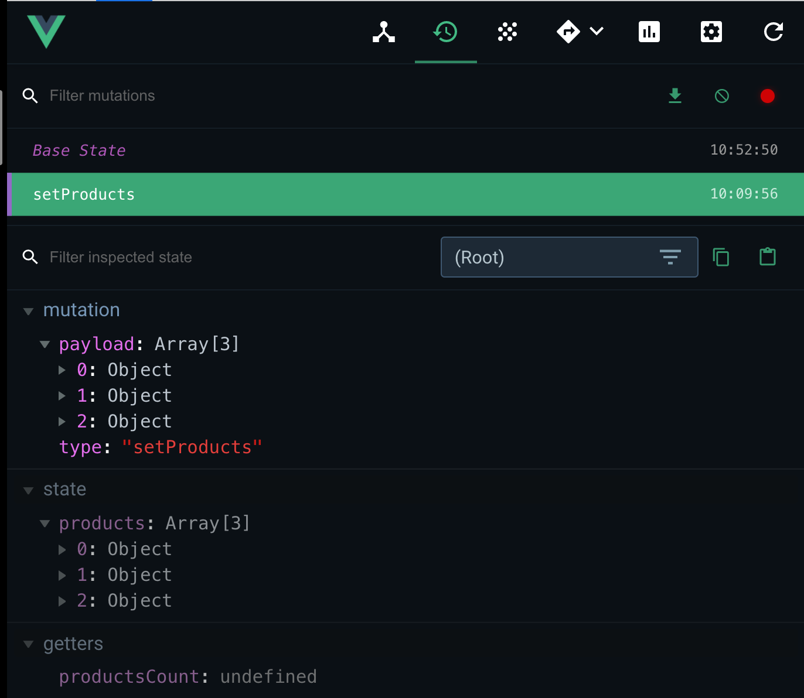

# 02 Options

## Vuex `Mutations` : `myMutation(state, payload)`

Les `mutations` doivent être les plus simple possible et changer une partie du `state`.

Les `actions` sont plus complexe mais n'altère pas le `state`.

C'est le seul endroit où le `state` doit -être changé.

### `Commit Mutation`

On ne change jamais directement le `state`, on utilise `store.commit('mutationName', payload)`.

On utilise `Vue dev tools` pour visualiser les `mutations` :



Dans le composant utilisant le `store` :

```js
// ProductsList.vue

import shop from "@/api/shop"
import store from "@/store"

    export default {
        // on a plus besoin de la propriété products
        // data() {
        //     return {
        //         products: []
        //     }
        // },
        computed: {
            products() {
                return store.state.products
            }
        },
        created() {
            shop.getProducts(products => store.commit('setProducts', products))
        }
    }
```

Dans le `store` :

```js
export default new Vuex.Store({
    state: { // data
        products: []
    },
    // ...
    mutations: {  // setting and updating the state
        setProducts(state, payload) {
            state.products = payload
        }
    }
})
```

### ! avec Vuex on utilise toujours `mutations` pour mettre à jour le `state`.


## Vuex `Getters`

`getters` est parfait pour calculer ou filtrer une données au `runtime`.

C'est l'equivalent du `hook` `computed`.

```js
getters: { // computed
        getAvailableProducts(state, getters) {
            return state.products.filter( product => product.inventory > 2)
        }
    },
```

Dans `ProductsList.vue` :

```js
computed: {
    products() {
        return store.getters.getAvailableProducts
    }
},
```

`getters` surveille ses dépendances et se mets à jour automatiquement lorsque ses dépendances changent.


## Vuex `Actions` : `myAction(context, payload)`

On peut dé-structurer l'objet `context`:

### `myAction({ commit, getters, state }, payload)`

> Les actions sont similaires aux mutations, à la différence que :
>
> - Au lieu de modifier l'état, les actions actent des mutations.
> - Les actions peuvent contenir des opérations asynchrones. (appelle à des API)

```js
actions: {  // methods: perform the API call
        fetchProducts(context) {
            shop.getProducts(products => context.commit('setProducts', products))
        }
    },
```

Les `actions` prennent en paramètre le `context` qui expose les même méthodes que l'objet `store` :

- `context.commit`
- `context.getters`
- `context.state`

`context` n'est pas l'objet `store`.

On utilise `dispatch(<actionName>, payload)` pour appeler une action depuis un composant :

```js
computed: {
    products() {
        return store.getters.getAvailableProducts
    }
},
created() {
    store.dispatch('fetchProducts')
}
```

### nature asynchrone de l'appelle d'`API`

`store`

```js
export default new Vuex.Store({
    state: { // data
        products: []
    },
    getters: { // computed
        getAvailableProducts(state, getters) {
            return state.products.filter( product => product.inventory > 2)
        }
    },
    actions: {  // methods: perform the API call
        fetchProducts({commit}) {
            return new Promise((resolve, reject) => {
                // appelle asynchrone
                    shop.getProducts(products => {
                        commit('setProducts', products)
                        resolve()
                    })
                }
            )
        } 
    },
    mutations: {  // setting and updating the state
        setProducts(state, payload) {
            state.products = payload
        }
    }
})
```

Dans le composant :

```js
export default {
    data() {
        return {
            loading: false
        }
    },
    // ...
    created() {
        this.loading = true
        store.dispatch('fetchProducts').then(() => this.loading = false)
    }
}
```

Dans le `template` du composant :

```html

<ul v-else>
    <li v-for="product in products" :key="product.id">{{product.title}} - {{product.price}}</li>
</ul>
```

#### ! On ne change jamais directement le `state` dans une `action`, on `commit` vers une `mutation`

### Seul les `mutations` peuvent modifier le `state`.

## L'accès du `store` dans tous les composants

`Vuex` propose un moyen élégant d'injecter le store dans le `main`  et de le rendre accessible à tous les composants.

`main.js`

```js
import Vue from 'vue'
import App from './App.vue'
import store from './store'

Vue.config.productionTip = false

new Vue({
  store, // on l'injecte ici
  render: h => h(App)
}).$mount('#app')
```

Dans un composant on a plus besoin de 

```js
import store from "@/store"
```

Mais à la place on utilise `this.$store`

```js
computed: {
    products() {
        return this.$store.getters.getAvailableProducts
    }
},
created() {
    this.loading = true
    this.$store.dispatch('fetchProducts').then(() => this.loading = false)
}
```

 