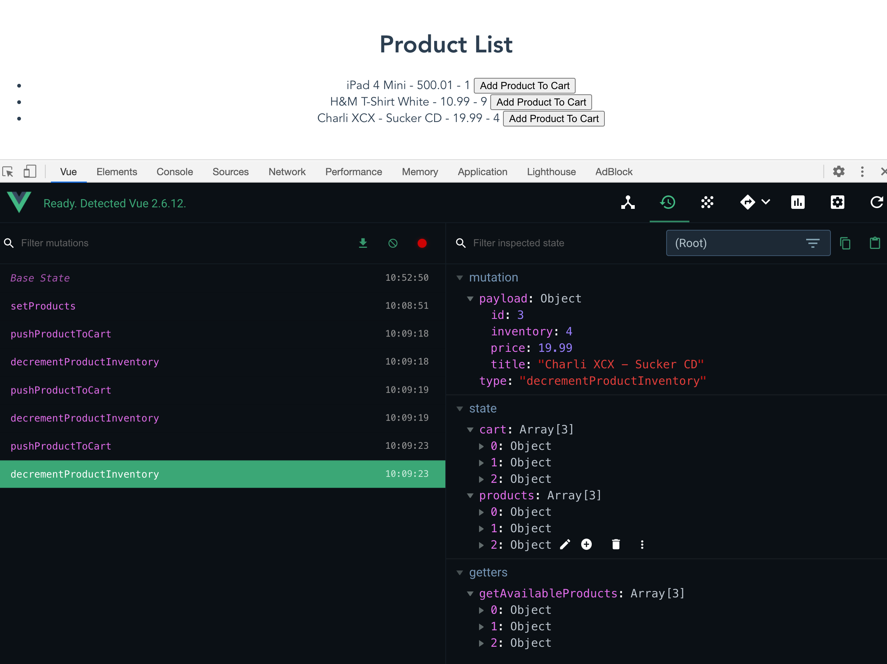
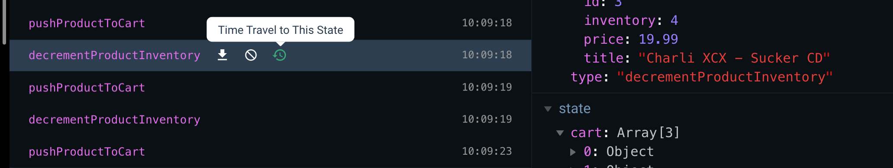
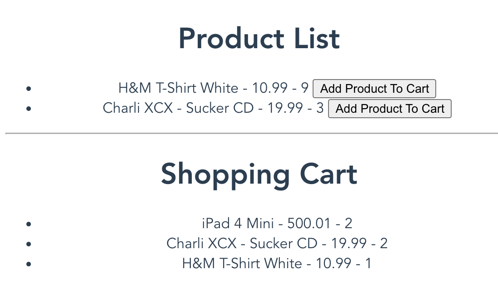

# 03 features

## Création d'un `cart`

### On ajoute `cart` au state

```js
state: { // data
        products: [],
        // {id, quantity}
        cart: [],
    },
```


### On ajoute une `action` : `addProductToCart`

```js
addProductToCart(context, product) {
    // on regarde si le produit est en stock
    if(product.inventory > 0) {
        // on récupère le produit dans le cart
        const cartItem = context.state.cart.find(item => item.id === product.id)
        // on regarde si le produit était dans le cart
        if(!cartItem) {
            // s'il n'y était pas on l'ajoute en appelant une mutation
            context.commit('pushProductToCart', product.id)
        } else {
            // s'il y était on appelle une mutation qui incrémente la quantité
            // on passe la référence au cartItem
            context.commit('incrementItemQuantity', cartItem)
        }
        
        // On appelle une mutation qui décrémente l'inventaire du produit
        context.commit('decrementProductInventory', product)
    }
}
```


### On va modifier le state : on crée des `mutations`

```js
pushProductToCart(state, productId) {
    state.cart.push({id: productId, quantity: 1})
},
incrementItemQuantity(state, cartItem) {
    cartItem.quantity++
},
decrementProductInventory(state, product) {
    product.inventory--
}    
```

Créer une mutation pour `incrementItemQuantity` et `decrementProductInventory` permet de mieux trace notre `state`.


### Créer les `methods` du composant `ProductList.vue`

```js
addProductToCart(product) {
    this.$store.dispatch('addProductToCart', product)
}
```

#### Dans le template

On crée un bouton `add to cart`

```html
<ul v-else>
    <li v-for="product in products" :key="product.id">
        {{product.title}} - {{product.price}}
        <button @click="addProductToCart(product)">
            Add Product To Cart
        </button>
    </li>
</ul>
```


## Vue Dev Tool

### Voyage dans le temps du `state`



On peut remonter dans le temps :



On peut ainsi voire facilement le `state` à des étapes antérieur.


## création du composant `ShoppingCart.vue` 

On doit créé un `getters` dans notre `store`

```js
cartProducts(state) {
    return state.cart.map(cartItem => {
        const product = state.products.find(product => product.id === cartItem.id)
        return {
            title: product.title,
            price: product.price,
            quantity: cartItem.quantity
        }
    })
}
```

Le composant `ShoppingCart.vue` : `this.$store.getters.myGetter`

```vue
<template>
    <div>
        <h1>Shopping Cart</h1>
        <ul>
            <li v-for="product in products" :key="product.id">
                {{product.title}} - {{product.price}} - {{product.quantity}}
            </li>
        </ul>
    </div>
</template>

<script>
    export default {
        computed: {
            products() {
                return this.$store.getters.cartProducts
            }
        }
    }
</script>
```


On l'insère dans `App.vue`

```vue
<template>
  <div id="app">
    <product-list />
    <shopping-cart />
  </div>
</template>

<script>
import ProductList from '@/components/ProductList'
import ShoppingCart from '@/components/ShoppingCart'

export default {
  name: 'App',
  components: {
    ProductList,
    ShoppingCart
  }
}
</script>
```

### ! remarque

Les six syntaxes suivantes sont correctes :

```html
// kebab-case
<shopping-cart />
<shopping-cart></shopping-cart>
// PascalCase
<ShoppingCart />
<ShoppingCart></ShoppingCart>
// camelCase
<shoppingCart />
<shoppingCart></shoppingCart>
```




## Calcul du `total`

### création d'un `getters`

```js
cartTotal(state, getters) {
    const products = getters.cartProducts
    console.log(products)
    return products.reduce((total, product) => total + product.price*product.quantity, 0)    
}
```

### `arr.reduce((acc, currentVal) => { return ... }, initVal)`


### Modification de `ShoppingCart`

```vue
<template>
    <div>
        <h1>Shopping Cart</h1>
        <ul>
            <li v-for="product in products" :key="product.id">
                {{product.title}} - {{product.price}} - {{product.quantity}}
            </li>
        </ul>
        <p>Total: {{total}}</p>
    </div>
</template>

<script>
    export default {
        computed: {
            products() {
                return this.$store.getters.cartProducts
            },
            total() {
                return this.$store.getters.cartTotal
            }
        }
    }
</script>
```


## Ajout d'un filtre pour la devise

On crée un fichier à la racine `src/currency.js`

```js
const digitsRE = /(\d{3})(?=\d)/g

export function currency (value, currency, decimals) {
  value = parseFloat(value)
  if (!isFinite(value) || (!value && value !== 0)) return ''
  currency = currency != null ? currency : '€'
  decimals = decimals != null ? decimals : 2
  var stringified = Math.abs(value).toFixed(decimals)
  var _int = decimals
    ? stringified.slice(0, -1 - decimals)
    : stringified
  var i = _int.length % 3
  var head = i > 0
    ? (_int.slice(0, i) + (_int.length > 3 ? ',' : ''))
    : ''
  var _float = decimals
    ? stringified.slice(-1 - decimals)
    : ''
  var sign = value < 0 ? '-' : ''
  return sign + head +
    _int.slice(i).replace(digitsRE, '$1,') +
    _float + " " + currency
}
```

On passe le filtre à l'instance de `Vue`:

`main.js`

```js
import Vue from 'vue'
import App from './App.vue'
import store from './store'
import { currency } from '@/currency'  // ici ...

Vue.config.productionTip = false

Vue.filter('currency', currency) // ... et là

new Vue({
  store,
  render: h => h(App)
}).$mount('#app')
```

Dans les `templates` :

```html
{{product.price | currency}}
```

`|` le pipe est utilisé pour appliquer un filtre dans le template.

## Checkout

Notre `fake API` accepte aléatoirement le paiement.

Pour gérer les appelle asynchrone on utilise les `actions` du `store`.

On va créer une `action` `checkout` :

#### On dé-structure l'objet `context` : `context <=> { commit, state, getters }`

```js
checkout({ commit, state }) {
    shop.buyProducts(state.cart, () => {
        commit('emptyCart')
        commit('setCheckoutStatus', 'succes')
    }, () => {
        commit('setCheckoutStatus', 'failed')
    })
}
```

Maintenant on crée les `mutations` `emptyCart` et `setCheckoutSatus` :

```js
emptyCart(state) {
    state.cart = []
},
setCheckoutStatus(state, status) {
    state.checkoutStatus = status
} 
```


On va créer un bouton `checkout` dans le `template` de `ShoppingCart`:

```html
<p>
    <button @click="$store.dispatch('checkout')" :disabled="products.length === 0">
        Checkout
    </button>
</p>
<p v-if="$store.state.checkoutStatus">
    {{$store.state.checkoutStatus}}
</p>
```

On accède ici directement à `$store` dans le `template`.


