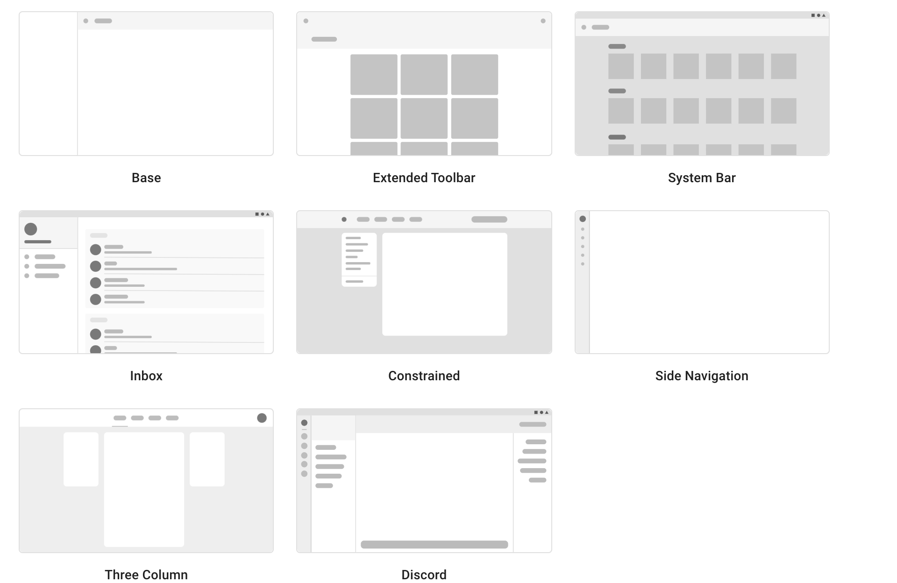
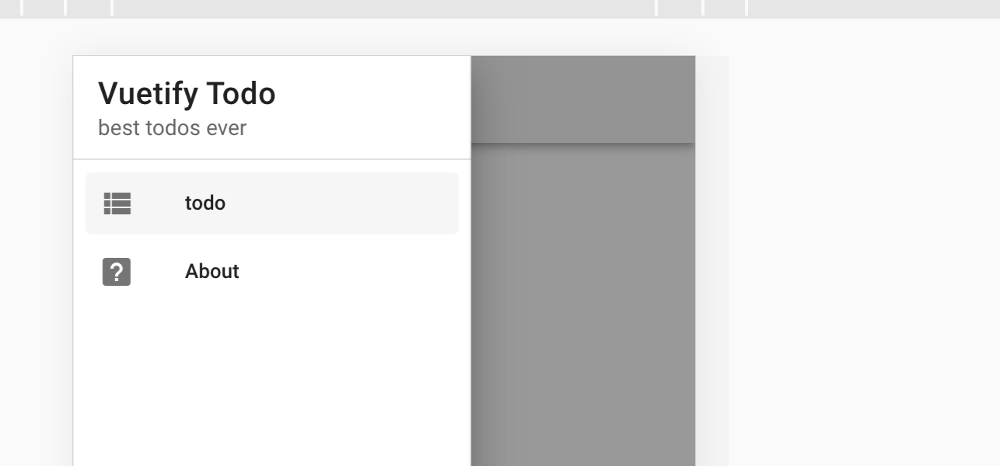
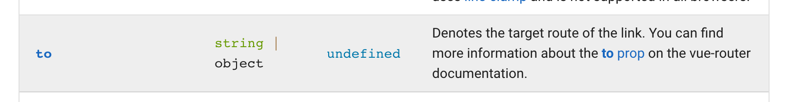
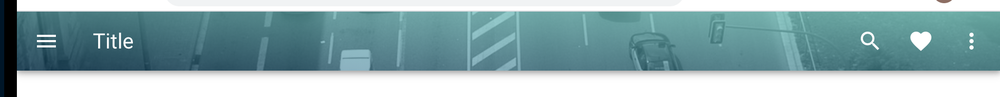
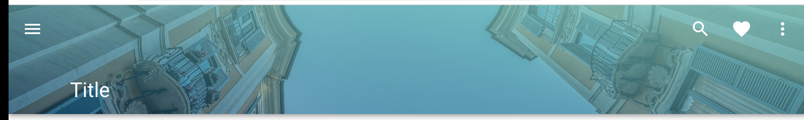
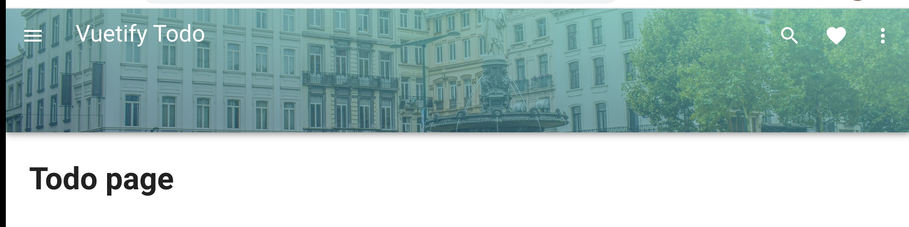

# 02 Layout

`Vuetify` propose plusieurs wireframe :



On copie le code grace au lien `github` et on le colle dans `App.vue` : ici on prends le premier wireframe.

```vue
<template>
  <v-app id="inspire">
    <v-navigation-drawer
      v-model="drawer"
      app
    >
      <!--  -->
    </v-navigation-drawer>

    <v-app-bar app>
      <v-app-bar-nav-icon @click="drawer = !drawer"></v-app-bar-nav-icon>

      <v-toolbar-title>Application</v-toolbar-title>
    </v-app-bar>

    <v-main>
      <!--  -->
    </v-main>
  </v-app>
</template>

<script>
  export default {
    data: () => ({ drawer: null }),
  }
</script>
```

## Ajout d'un `navigation drawer`

On copie le `template` ainsi que la partie script.




Ne pas oublier d'ajouter les attributs `app` pour dire que cela fait partie du layout de base et `v-model` relier au data `drawer`.

```html
<v-navigation-drawer 
        app
        v-model="drawer">
      <v-list-item>
        <v-list-item-content>
          <v-list-item-title class="title">
            Vuetify Todo
          </v-list-item-title>
          <v-list-item-subtitle>
            best todos ever
          </v-list-item-subtitle>
        </v-list-item-content>
      </v-list-item>

      <v-divider></v-divider>

      <v-list
        dense
        nav
      >
        <v-list-item
          v-for="item in items"
          :key="item.title"
          :to="item.to"
          link
        >
          <v-list-item-icon>
            <v-icon>{{ item.icon }}</v-icon>
          </v-list-item-icon>

          <v-list-item-content>
            <v-list-item-title>{{ item.title }}</v-list-item-title>
          </v-list-item-content>
        </v-list-item>
      </v-list>
    </v-navigation-drawer>
```


## Ajouter la navigation

Il faut placer un `router-view` dans notre `template` :

```html
 <!-- ... -->
</v-app-bar>

    <v-main>
      <router-view></router-view>
    </v-main>
  </v-app>
</template>
```

###  `v-list-item`



Les `v-list-item` on une propriété `to` fonctionnant avec `Vue router`.

```html
<v-list
        dense
        nav
        >
    <v-list-item
        v-for="item in items"
        :key="item.title"
        :to="item.to"
        link>
                 
        <v-list-item-icon>
            <v-icon>{{ item.icon }}</v-icon>
        </v-list-item-icon>

        <v-list-item-content>
            <v-list-item-title>{{ item.title }}</v-list-item-title>
        </v-list-item-content>
    </v-list-item>
</v-list>
```

On doit juste mettre la route dans les `data` :

```js
data: () => ({ 
    drawer: null,
    items: [
        { title: 'todo', icon: 'mdi-view-list', to: { name: 'Todo'} },
        { title: 'About', icon: 'mdi-help-box', to: { name: 'About'} },
    ], 
}),
```


## `margin` et `padding`

valeur de `0` à `16`

négatif : `n1` à `n16`

`auto`

`a` : all

```html
<div class="about pa-6 text-left">
    <h1 class="mb-9">Vuetify about todo</h1>
```


## Header style

On va choisir une plus jolie `navbar`.

On doit ajouter `app` et `@*click*="drawer = !drawer"` :

```html
<v-app-bar
      app
      absolute
      color="#fcb69f"
      dark
      shrink-on-scroll
      src="https://picsum.photos/1920/1080?random"
      scroll-target="#scrolling-techniques-2"
    >
      <template v-slot:img="{ props }">
        <v-img
          v-bind="props"
          gradient="to top right, rgba(19,84,122,.5), rgba(128,208,199,.8)"
        ></v-img>
      </template>

      <v-app-bar-nav-icon @click="drawer = !drawer"></v-app-bar-nav-icon>

      <v-toolbar-title>Title</v-toolbar-title>
      <!-- ... -->
    </v-app-bar>
```

Pour avoir un effet `shrink-on-scroll` il faut ajouter un élément en dessous :

```html
<v-sheet
      id="scrolling-techniques-2"
      class="overflow-y-auto"
      max-height="600"
    >
      <v-container style="height: 1000px;"></v-container>
    </v-sheet>
```

On va la simplifier :

```html
<v-app-bar
      app
      color="#fcb69f"
      dark
      src="https://picsum.photos/1920/1080?random"
    >
```

maintenant la `app bar` est petite :



Il faut ajouter l'attribut `prominent` :



```html
<v-app-bar
      app
      prominent
      color="#fcb69f"
      dark
      src="https://picsum.photos/1920/1080?random"
    >
```

mettre une photo personnalisée: https://pixabay.com/fr/photos/rond-point-fontaine-rue-4005260/

#### Deux façon

Dans `public`

```html
<v-app-bar
      app
      prominent
      color="primary"
      dark
      src="/brussels-view.jpg"
    >
```

Dans `assets/images`

```html
<v-app-bar
      app
      prominent
      color="primary"
      dark
      :src="require('@/assets/images/brussels-view.jpg')"
    >
```

Ici l'image va être traitée par `Webpack`.

### Remettre le titre vers le haut `class="align-self-start"`

```html
<v-toolbar-title class="align-self-start mt-1">Vuetify Todo</v-toolbar-title>
```

`mt-1` pour corriger un petit décalage :



