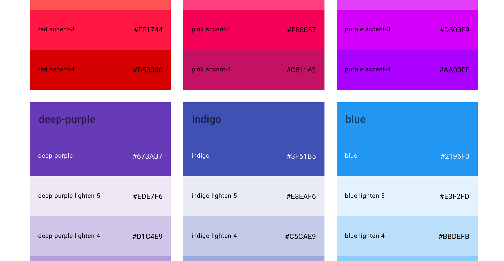
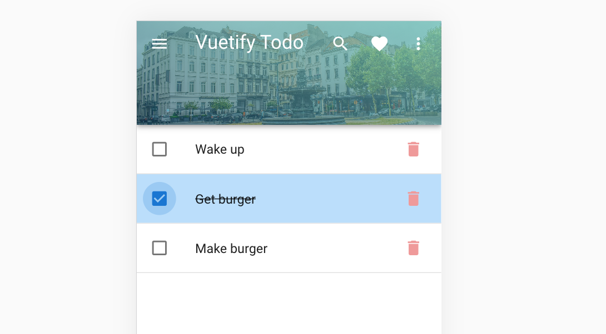
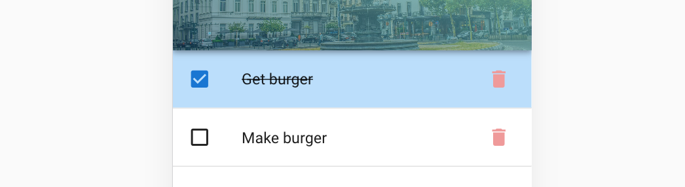
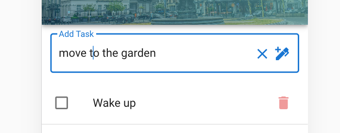

# 03 Todo page

## UI `v-list`

On va utiliser une `v-list`

```html
<v-list
    flat
    subheader
    >
    <v-list-item>
        <template v-slot:default="{ active }">
            <v-list-item-action>
                <v-checkbox :input-value="active"></v-checkbox>
            </v-list-item-action>

            <v-list-item-content>
                <v-list-item-title>Notifications</v-list-item-title>
            </v-list-item-content>
        </template>
    </v-list-item>

</v-list>
```


## Tasks `data`

On va ajouter les `tasks` aux `data` du composant.

```js
data() {
      return {
          tasks: [
              {
                  id: 1,
                  title: 'Wake up'
              },
              {
                  id: 2,
                  title: 'Get burger'
              },
              // ...
```

Pour ajouter un `divider` et séparer chaque item, on va encapsuler notre `v-list-item` dans un `template`, et déplacer le `v-for` sur le template.

```html
<v-list
      flat
      subheader
    >
        <template v-for="task in tasks">
            <v-list-item :key="task.id">
                <!-- ... -->
            </v-list-item>
            <v-divider></v-divider>
        </template>
    </v-list>
```


## Marquer la tâche comme accomplie

```html
<template v-for="task in tasks">
                <v-list-item :key="task.id" @click="doneTask(task.id)">
                    <template>
                        <v-list-item-action>
                        <v-checkbox
                            :input-value="task.done"
                            color="primary"
                        ></v-checkbox>
                        </v-list-item-action>

                        <v-list-item-content>
                        <v-list-item-title>{{task.title}}</v-list-item-title>
                        
                        </v-list-item-content>
                    </template>
                </v-list-item>
                <v-divider></v-divider>
            </template>
```

```js
methods: {
      doneTask(taskId) {
          const task = this.tasks.find(task => task.id === taskId)
          task.done = !task.done
      }
  }
```

On ajoute un écouteur `@click` qui modifie la propriété `done`.

Avec `v-model` j'ai un bug quand on click pile sur la `checkbox`.

### Modifier les couleurs quand la tâche est accomplie.

On a le pattern `color`  `color lighten-{1-5}` `color darken-{1-4}` ou encore `color accent-{1-4}`



### barrer le texte `text-decoration-line-through`


## delete task

On ajoute un bouton `delete` :

```html
<v-list-item-action @click="deleteTask(task.id)">
    <v-btn icon>
        <v-icon color="red lighten-3">mdi-delete</v-icon>
    </v-btn>
</v-list-item-action>
```

### `<v-icon>mdi-icon-name</icon`

On trouve toutes les icône ici :

https://materialdesignicons.com/

```js
methods: {
      deleteTask(taskId) {
          const newTasks = this.tasks.filter(task => task.id != taskId)
          this.tasks = newTasks

      }
  }
```



Si on clique sur la poubelle :




## Add Task

On ajoute un élément texte : `v-text-field` :

```html
<v-text-field
        v-model="newTaskTitle"
        @click:append="addTask"
        @keyup.enter="addTask"
        outlined
        label="Add Task"
        append-icon="mdi-pen-plus"
        class="ma-3"
        hide-details
        clearable
        ></v-text-field>
```

`@click:append` associe un gestionnaire d'événement à `append-icon`

`@keyup.enter` permet d'enregistrer la tâche quand on appuie sur `enter`

`append-icon` affiche une icône à la fin du champs de texte

`hide-details` supprime l'espace lié à la validation en bas de `v-text-field`

`clearable` ajoute une crois pour effacer le texte introduis

```js
addTask() {
    if(this.newTaskTitle) {
        this.tasks = [...this.tasks, {id: Date.now(),title: this.newTaskTitle, done: false }]
        this.newTaskTitle = ''
    }
}
```



### Styliser le texte

```html
<div v-else class="text-h4 primary--text text--lighten-3 d-flex flex-column align-center height-100">

    <v-icon color="primary lighten-3" size="100">mdi-check</v-icon>
    <div>
        No task
    </div>
</div>
```

`text-h4` pour les tailles.

`primary--text` et `text--lighten-3` attention la logique du placement de `text` s'inverse (?)

#### Jouer avec `d-flex`

`flex-column` met les éléments en colonne.

`align-center` centre les éléments, équivalent de `justify-center` si on était en `flex-row`.

`v-icon` permet d'utiliser les icônes. on peut modifier la taille avec `size=56`.


